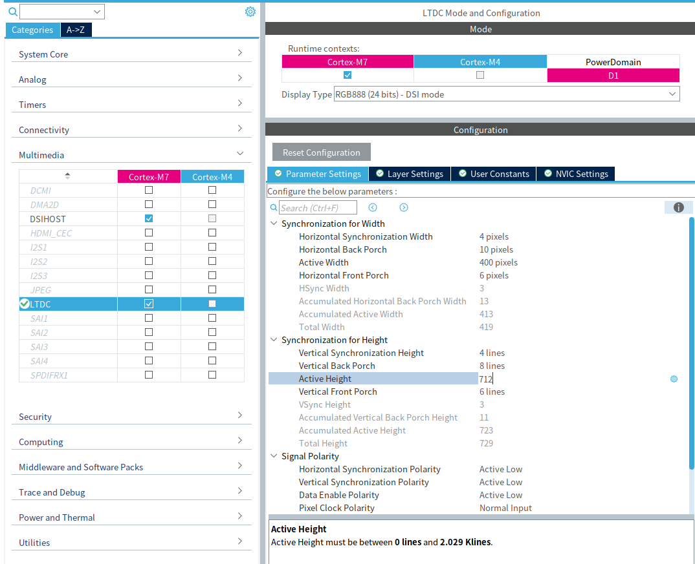
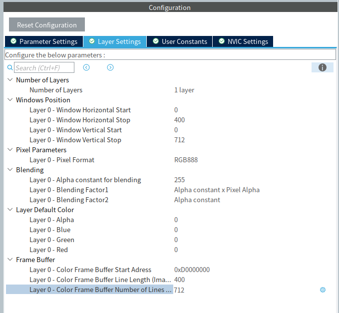
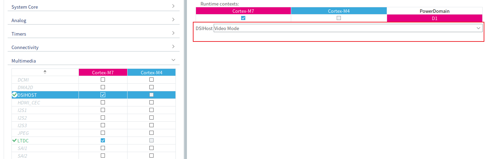
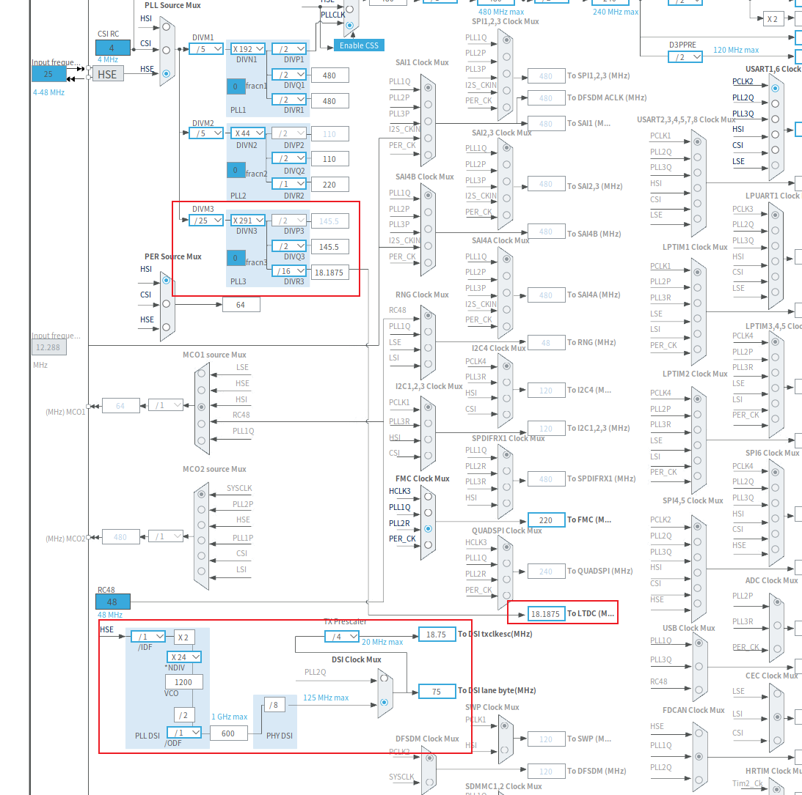
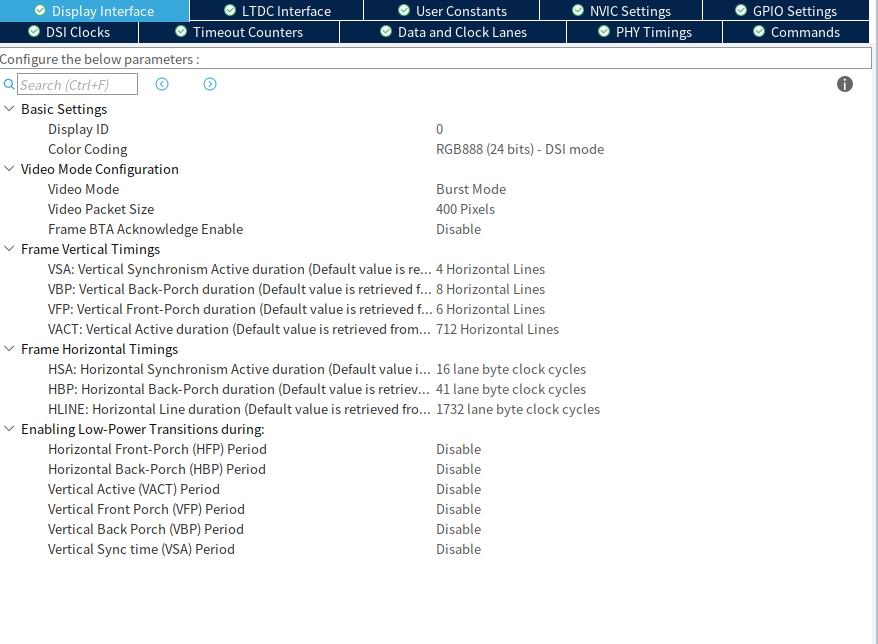
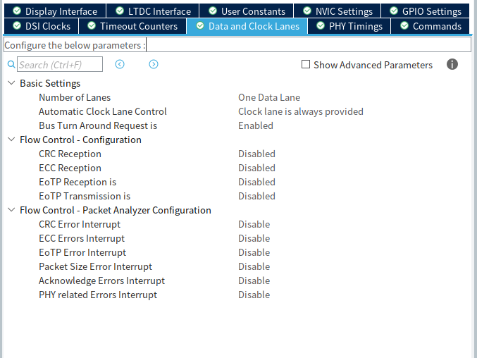
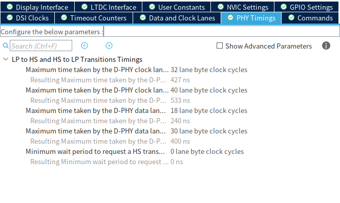
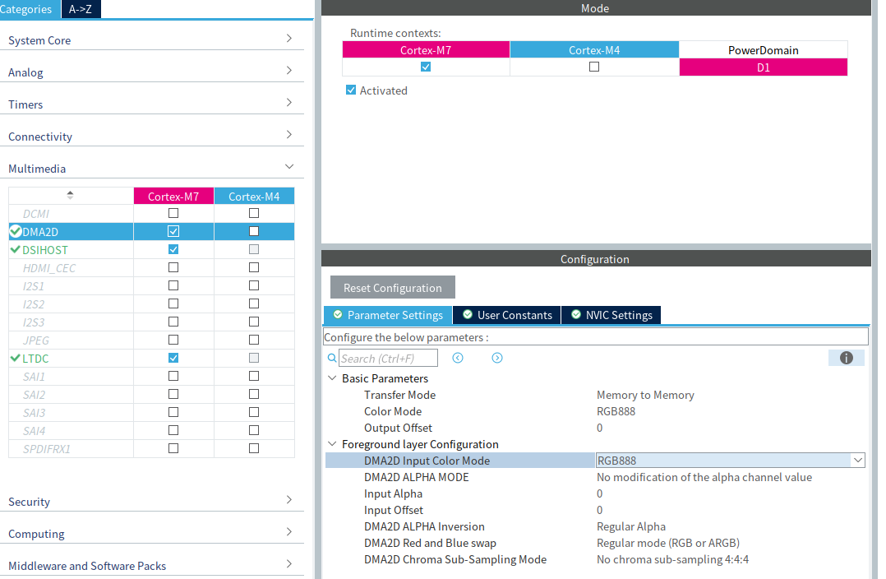
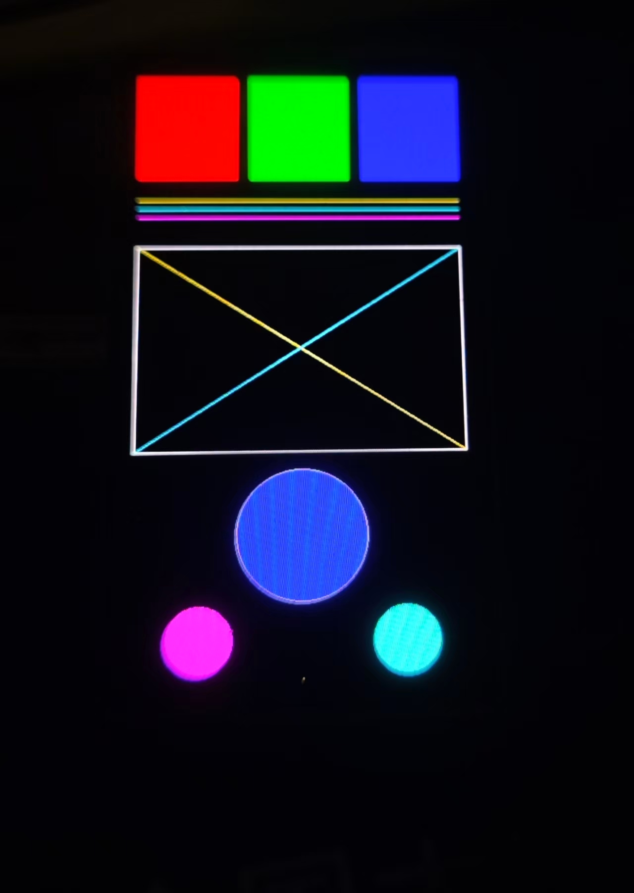

# 第一部分：MIPI 协议基础

## 1. MIPI 与 MIPI DSI

MIPI 是 **Mobile Industry Processor Interface** 的缩写。它不是一种单独的协议，而是 MIPI Alliance 制定的一系列芯片间接口标准，主要用于连接处理器、显示屏、摄像头和传感器等器件。

常见接口包括：

- **MIPI DSI**：连接显示屏
- **MIPI CSI-2**：连接摄像头
- **MIPI D-PHY**：DSI、CSI-2 常用的物理层

MIPI DSI 全称为 **Display Serial Interface**，用于在主控和屏幕之间传输屏幕初始化命令、寄存器参数、图像像素数据以及屏幕状态和同步信息。

DSI 和 D-PHY 的关系可以简单理解为：

```text
DSI：规定命令和图像数据如何组织
D-PHY：负责将这些数据转换成物理电信号
```

因此，常见的“MIPI 屏幕”通常指采用 **DSI 协议和 D-PHY 物理层**的显示屏。

典型 DSI 接口由一组时钟 Lane 和若干组数据 Lane 组成：

```text
CLK_P / CLK_N       Clock Lane
D0_P  / D0_N        Data Lane 0
D1_P  / D1_N        Data Lane 1
```

Clock Lane 用于提供高速同步时钟，Data Lane 用于传输命令和图像数据。DSI 可以使用一条或多条 Data Lane，Lane 数量越多，总传输能力越强。

## 2. LP 与 HS 模式

MIPI D-PHY 支持两种主要工作模式：

- **LP（Low-Power）模式**
- **HS（High-Speed）模式**

LP 模式速度较低，传输速率通常不超过约 `10 Mbit/s`，主要用于发送初始化命令、配置寄存器和读取屏幕状态。LP 通信通常使用 Data Lane 0，不需要 Clock Lane 提供高速同步时钟。

在 LP 模式下，Data Lane 的 P、N 两根线分别表示高低电平，可以组成：

```text
LP-00、LP-01、LP-10、LP-11
```

其中 `LP-11` 通常表示 Lane 处于空闲状态。Clock Lane 自身也具有 LP 状态，但 LP 命令数据一般只在 Data Lane 0 上传输。

HS 模式用于传输图像数据，单条 Data Lane 的速率通常可达数百 `Mbit/s`，更高版本的 D-PHY 还可以达到数 `Gbit/s`。此时 Data Lane 使用低摆幅差分信号，Clock Lane 提供高速同步时钟。配置多条 Data Lane 后，它们可以同时传输，以提高总带宽。

| 项目    | LP 模式          | HS 模式               |
| ----- | -------------- | ------------------- |
| 主要用途  | 命令和寄存器读写       | 图像数据                |
| 典型速率  | 不超过约 10 Mbit/s | 数百 Mbit/s 至数 Gbit/s |
| 信号形式  | 单端信号           | 低摆幅差分信号             |
| 常用数据线 | Data Lane 0    | 所有已配置的 Data Lane    |
| 高速时钟  | 不需要            | 由 Clock Lane 提供     |

简单来说：

```text
LP：主要传输控制命令
HS：主要传输图像数据
```

> HS 信号速度快、摆幅低，普通低带宽示波器通常无法观察到准确的波形细节，最多只能看到线路上存在高频活动。要检查上升沿、抖动和信号完整性，需要使用足够带宽的高速示波器、差分探头或专用 MIPI 分析设备。低速示波器仍可用于观察 RESET、背光、TE 等普通控制信号。

## 3. DSI 的传输内容和工作方式

MIPI DSI 会将命令和像素封装成数据包，主要分为：

- **短包**：用于无参数或少量参数的命令、读取请求和同步信息。
- **长包**：用于多参数命令、厂商配置和大量像素数据。

从数据包和命令语义的角度看，常见的写入方式包括：

- **DCS（Display Command Set）命令**：MIPI DCS 定义了显示设备常用的标准命令及其语义。
- **Generic Read/Write**：DSI 定义的通用读写数据包，可承载不属于标准 DCS 的数据。屏幕厂家的私有寄存器配置经常通过这类数据包传输，但 Generic 数据包本身并不是一套厂家命令集。

常见的 DCS 命令包括：

| 命令     | 作用     |
| ------:| ------ |
| `0x11` | 退出睡眠模式 |
| `0x29` | 开启显示   |
| `0x2A` | 设置列地址  |
| `0x2B` | 设置行地址  |
| `0x2C` | 写入像素数据 |
| `0x3A` | 设置像素格式 |

实际屏幕通常还需要大量厂家私有命令，用于配置电源、Gamma、扫描方式等参数，因此点屏时必须获得厂家提供的初始化序列。

DSI 屏幕主要有两种工作方式：

- **Command Mode**：主控通过命令将像素写入屏幕内部显存，支持局部刷新。
- **Video Mode**：主控按照显示时序持续发送一帧帧图像，适合与 STM32 的 LTDC 配合。

一个常见的视频模式启动过程是：

```text
屏幕上电并复位
        ↓
通常通过 LP 模式发送初始化命令
        ↓
发送退出睡眠和开启显示命令
        ↓
开始视频模式传输
        ↓
主要通过 HS 模式持续发送图像数据
```

因此，MIPI DSI 可以概括为：

**主控通常先通过 LP 模式配置屏幕，再通过 HS 模式高速传输图像数据。**

> 这是常见的配置方式，并不是协议对所有传输阶段的强制划分。命令也可以配置为通过 HS 模式发送；在 Video Mode 运行期间，DSI Host 还可以根据配置在部分消隐区进入 LP 模式。因此，开始传输图像后并不意味着链路永久停留在 HS 状态。

# 第二部分：STM32H747 的 MIPI 显示系统

## 1. 整体传输流程

STM32H747 内部集成了 LTDC、DSI Host 和 D-PHY。显示数据的基本传输过程是：

```text
CPU / DMA2D
      ↓
Framebuffer
      ↓
LTDC
      ↓
DSI Host
      ↓
D-PHY
      ↓
MIPI DSI 屏幕
```

这些模块分工如下：

- **Framebuffer**：保存需要显示的像素。
- **LTDC**：按照显示时序读取像素，并完成图层混合。
- **DSI Host**：将像素、同步信息和命令封装成 DSI 数据包。
- **D-PHY**：将数据转换成 LP 或 HS 电信号。
- **DMA2D**：快速修改 Framebuffer，不直接向屏幕传输数据。

STM32H747 的 DSI 外设最多支持两条 Data Lane：

```text
Clock Lane
Data Lane 0
Data Lane 1
```

在 HS 模式下，STM32H747 的每条 Data Lane 最高速率可达到 `1 Gbit/s`，两条 Lane 的理论总链路速率最高为 `2 Gbit/s`。

## 2. LTDC 与 DSI Host

LTDC 是 STM32 的液晶显示控制器，其主要作用是从 Framebuffer 中持续读取像素。

> Framebuffer 是用于保存整帧图像的内存区域。由于高分辨率图像占用空间较大，在 STM32H747 的显示项目中，Framebuffer 通常放在外部 SDRAM 中；分辨率较低或内存充足时，也可以放在片内 SRAM 中。

LTDC 需要配置：

- 显示分辨率
- 水平和垂直同步参数
- 像素时钟
- Framebuffer 地址
- 像素格式
- 图层大小和位置

在视频模式下，LTDC 产生类似传统 RGB 屏幕的显示数据：

```text
同步信号 + 消隐区域 + 有效像素
```

这些数据不会直接输出到普通 RGB 引脚，而是传给 DSI Host。DSI Host 再将它们封装成 MIPI DSI 数据包，通过 D-PHY 发送给屏幕。

```text
Framebuffer
     ↓ 读取像素
LTDC
     ↓ RGB 数据和同步信息
DSI Host
     ↓ DSI 数据包
D-PHY
     ↓ 差分信号
屏幕
```

> LTDC 负责产生显示内容和显示时序，DSI Host 负责将这些内容转换成 DSI 数据流。DSI Host 本身不会主动从 Framebuffer 中读取图像。

除了接收 LTDC 的视频流，DSI Host 还可以由 CPU 直接操作，用来发送屏幕初始化命令：

```text
CPU
 ↓
DSI Host
 ↓ LP 模式
屏幕寄存器
```

因此，STM32H747 的 DSI 通常同时承担两项任务：

- 通过 LP 模式发送初始化命令。
- 通过 HS 模式传输 LTDC 产生的图像。

## 3. 显示时钟和带宽

屏幕并不是只传输分辨率范围内的有效像素。每扫描一行时，有效显示区域的前后还需要保留同步和消隐时间；扫描完一帧后，同样需要保留垂直同步和消隐时间。

一行的完整时序可以表示为：

```text
| HSA | HBP |             有效显示区域              | HFP |
            |<----------- 有效宽度 -------------->|
```

- **HSA（Horizontal Synchronization Active）**：水平同步脉冲宽度，表示新的一行即将开始。
- **HBP（Horizontal Back Porch）**：水平后沿，从同步结束到有效像素开始之间的等待时间。
- **有效宽度**：一行中真正显示的像素数量，例如 800 像素。
- **HFP（Horizontal Front Porch）**：水平前沿，从有效像素结束到下一次水平同步之间的等待时间。

因此，扫描完整一行所需的像素时钟周期为：

```text
水平总周期 = HSA + HBP + 有效宽度 + HFP
```

一帧的垂直时序与水平方向类似，只是它以“行”为单位：

```text
| VSA | VBP |             有效显示区域              | VFP |
            |<----------- 有效高度 -------------->|
```

- **VSA（Vertical Synchronization Active）**：垂直同步脉冲宽度，表示新的一帧即将开始。
- **VBP（Vertical Back Porch）**：垂直后沿，从垂直同步结束到第一行有效图像之间的等待行数。
- **有效高度**：一帧中真正显示的行数，例如 480 行。
- **VFP（Vertical Front Porch）**：垂直前沿，从最后一行有效图像到下一次垂直同步之间的等待行数。

因此，扫描完整一帧包含的总行数为：

```text
垂直总周期 = VSA + VBP + 有效高度 + VFP
```

**Pixel Clock** 是 LTDC 的像素时钟，表示 LTDC 每秒需要输出多少个像素周期：

```text
Pixel Clock = 水平总周期 × 垂直总周期 × 刷新率
```

例如，假设一块 `800 × 480`、`60 Hz` 的屏幕给出以下时序参数：

```text
HSA = 10，HBP = 20，HFP = 10
VSA = 2， VBP = 8， VFP = 8
```

那么：

```text
水平总周期 = 10 + 20 + 800 + 10 = 840
垂直总周期 = 2 + 8 + 480 + 8 = 498
Pixel Clock = 840 × 498 × 60 ≈ 25.1 MHz
```

也就是说，虽然屏幕的有效分辨率只有 `800 × 480`，LTDC 仍然需要为同步区和消隐区保留时间。

> HSA、HBP、HFP、VSA、VBP 和 VFP 由屏幕的扫描时序决定，不同型号的屏幕通常并不一致。实际配置时应以屏幕规格书或屏幕厂家提供的初始化参数为准，不能直接照搬其他同分辨率屏幕的参数。

**Lane Bit Rate** 是每条 DSI Data Lane 在 HS 模式下的串行数据速率。不考虑协议开销时，可以粗略估算为：

```text
Lane Bit Rate ≈ Pixel Clock × 每像素位数 ÷ Data Lane 数量
```

例如使用 RGB888 和两条 Data Lane：

```text
Lane Bit Rate ≈ Pixel Clock × 24 ÷ 2
```

这里使用的 Pixel Clock 已由水平、垂直总周期计算得到，因此已经包含扫描所需的同步区和消隐区，不应再次重复加入消隐比例。不过，这个公式仍然只是链路带宽的近似估算：实际传输还会受到 Video Mode 类型、数据包包头和校验、LP/HS 状态切换等因素影响，因此配置时仍应留出一定余量。

**Byte Clock** 是 DSI Host 内部以字节为单位处理高速数据时使用的时钟。由于一个字节包含 8 bit，所以它与单条 Lane 的 Lane Bit Rate 之间存在固定关系：

```text
Byte Clock = Lane Bit Rate ÷ 8
```

例如：

```text
Lane Bit Rate = 400 Mbit/s
Byte Clock = 400 ÷ 8 = 50 MHz
```

这里的 Byte Clock 表示一条 Lane 每秒可以传输多少个字节，并不会因为使用两条 Lane 就再乘以 2。两条 Lane 的总传输带宽则为：

```text
总传输带宽 = Lane Bit Rate × Data Lane 数量
```

因此，需要区分 LTDC 使用的 Pixel Clock、DSI PHY 使用的 Lane Bit Rate，以及 DSI Host 部分参数使用的 Byte Clock。这些时钟或时序参数配置错误时，可能出现黑屏、闪烁、丢行或花屏。

## 4. DMA2D 的作用

DMA2D 是 STM32 中专门用于二维图像处理的硬件加速器，可以完成：

- 矩形区域填充
- 图像复制
- 像素格式转换
- Alpha 混合
- 图层合成

DMA2D 与 MIPI DSI 没有直接连接。它只是帮助 CPU 更快地生成或修改 Framebuffer：

```text
DMA2D 修改 Framebuffer
          ↓
LTDC 读取 Framebuffer
          ↓
DSI Host 发送图像
```

例如，要让屏幕显示纯蓝色，可以让 DMA2D 将整个 Framebuffer 填充为蓝色。填充完成后，LTDC 会自动读取这些像素，再由 DSI Host 发送到屏幕。

因此，可以这样理解各个模块：

```text
CPU / DMA2D：绘制画面
Framebuffer：保存画面
LTDC：读取和组织画面
DSI Host：封装和发送画面
D-PHY：完成物理传输
```

# 第三部分：实际配置

## 1. 配置前提

本节以 KD025EGOIN001 为例，默认已经完成：

- FMC SDRAM 初始化和读写测试
- MPU 与 Cortex-M7 Cache 配置
- Framebuffer 地址规划

屏幕参数如下：

| 参数              | 数值                   |
| --------------- | --------------------:|
| 分辨率             | 400 × 712            |
| 像素格式            | RGB888（24 bit/pixel） |
| Data Lane       | 1 Lane               |
| 目标刷新率           | 60 Hz                |
| HSA / HBP / HFP | 4 / 10 / 6 pixels    |
| VSA / VBP / VFP | 4 / 8 / 6 lines      |

总时序和目标像素时钟为：

```text
水平总周期 = 4 + 10 + 400 + 6 = 420
垂直总周期 = 4 + 8 + 712 + 6 = 730
Pixel Clock = 420 × 730 × 60 ≈ 18.396 MHz
```

> 以下时序、Lane 数量和时钟只适用于本示例。更换屏幕后，必须按新屏幕的规格书重新计算。

## 2. LTDC 配置



在 CubeMX 的 **Multimedia** 中把 LTDC 分配给 Cortex-M7，并选择：

```text
RGB888 (24 bits) - DSI mode
```

该模式把 LTDC 的 RGB888 数据送入芯片内部的 DSI Host，不使用普通 RGB 并行引脚。

### 时序和极性

填写屏幕原始时序：

```text
HSA = 4    HBP = 10    Active Width  = 400    HFP = 6
VSA = 4    VBP = 8     Active Height = 712    VFP = 6
```

CubeMX 灰色的累计值按“实际周期减 1”生成。例如 HSA 为 4 时，HSync Width 为 3；水平总周期为 420 时，Total Width 为 419。

| 参数                                  | 配置             |
| ----------------------------------- | -------------- |
| Horizontal Synchronization Polarity | Active Low     |
| Vertical Synchronization Polarity   | Active Low     |
| Data Enable Polarity                | Active Low     |
| Pixel Clock Polarity                | Inverted Input |

LTDC 与 DSI Host 的 HSYNC、VSYNC、DE 必须在逻辑上对应，但两侧配置项的文字不一定相同，应结合生成代码和屏幕规格书确认。

### 图层和 Framebuffer



只使用 Layer 0：

```text
Number of Layers = 1 layer
Horizontal Start / Stop = 0 / 400
Vertical Start / Stop   = 0 / 712
Pixel Format            = RGB888
Constant Alpha          = 255
Framebuffer Address     = 0xD0000000
```

RGB888 每像素占 3 byte，因此：

```text
Framebuffer 大小 = 400 × 712 × 3 = 854400 byte
```

CubeMX 只会把地址写入 LTDC 配置。程序必须先初始化 SDRAM，再启动 LTDC。

## 3. 显示时钟配置

配置时钟前，先在 **Multimedia** 中把 DSIHOST 分配给 Cortex-M7，并选择 **Video Mode**，否则 Clock Configuration 页面不会开放 DSI PLL 等选项。



然后按图配置 LTDC 和 DSI 时钟：



### LTDC Pixel Clock

```text
HSE   = 25 MHz
DIVM3 = 25
DIVN3 = 291
DIVR3 = 16

PLL3 输入 = 25 ÷ 25 = 1 MHz
PLL3 VCO  = 1 × 291 = 291 MHz
Pixel Clock = 291 ÷ 16 = 18.1875 MHz
```

实际刷新率为：

```text
18,187,500 ÷ 420 ÷ 730 ≈ 59.32 Hz
```

理论上 60 Hz 需要约 18.396 MHz Pixel Clock，但本屏幕在实际测试中使用 18.1875 MHz 更稳定，因此采用约 59.32 Hz 的刷新率。

### DSI PHY 时钟

```text
HSE  = 25 MHz
IDF  = 1
NDIV = 24
ODF  = 1

DSI PLL VCO    = 25 ÷ 1 × 2 × 24 = 1200 MHz
DSI HS Clock   = 1200 ÷ 2 ÷ 1 = 600 MHz
Lane Bit Rate  = 600 Mbit/s
Lane Byte Clock = 600 ÷ 8 = 75 MHz
```

单 Lane RGB888 的估算需求为：

```text
18.1875 MHz × 24 = 436.5 Mbit/s
```

实际 600 Mbit/s 高于 436.5 Mbit/s，能够覆盖视频数据和协议开销。

TX Escape Clock 用于 LP 通信：

```text
TXECKDIV = 4
TX Escape Clock = 75 ÷ 4 = 18.75 MHz
```

18.75 MHz 低于 20 MHz 上限，配置正确。

## 4. DSI Host 配置

### 显示接口



关键参数如下：

| 参数                             | 配置              |
| ------------------------------ | --------------- |
| Display ID（Virtual Channel ID） | 0               |
| Color Coding                   | RGB888          |
| Video Mode                     | Burst Mode      |
| Video Packet Size              | 400 Pixels      |
| Number of Chunks               | 0               |
| Null Packet Size               | 0 Bytes         |
| Frame BTA Acknowledge          | Disable         |
| VSA / VBP / VFP / VACT         | 4 / 8 / 6 / 712 |
| HSA / HBP / HLINE              | 16 / 41 / 1732  |

Burst Mode 将一行有效像素放入一个视频包，并以较高的 DSI Lane 速率发送；剩余行时间用于同步、消隐或链路空闲。这里每行正好发送 400 个 RGB888 像素：

```text
Video Packet Size = Active Width = 400 Pixels
Number of Chunks  = 0
Null Packet Size  = 0 Bytes
```

Burst Mode 不需要用多个 Chunk 和 Null Packet 平衡 LTDC 与 DSI 的瞬时速度；DSI Lane Bit Rate 只需具有足够的总带宽余量。

垂直参数仍以行为单位，直接使用屏幕时序。水平参数则以 Lane Byte Clock 周期为单位：

```text
HSA   = 4 × 75 ÷ 18.1875 ≈ 16
HBP   = 10 × 75 ÷ 18.1875 ≈ 41
HLINE = 420 × 75 ÷ 18.1875 ≈ 1732
```

HFP 没有独立配置项，已经包含在 HLINE 中。初次点屏时，将 HFP、HBP、VACT、VFP、VBP、VSA 区域的 LP Transition 全部设为 **Disable**，减少状态切换带来的干扰。

### Data and Clock Lanes



```text
Number of Lanes              = One Data Lane
Automatic Clock Lane Control = Clock lane is always provided
Bus Turn Around Request      = Enabled
```

连续提供 Clock Lane 更便于初次点屏。BTA 用于通过 HAL_DSI_Read() 读取屏幕 ID 或状态；如果程序只写不读，可以关闭。

BTA 与 **Frame BTA Acknowledge** 不同：前者允许软件发起读操作，后者决定是否在每帧结束时自动要求屏幕确认。

初次调试暂时关闭 CRC、ECC、EoTP 流控制及所有 Packet Analyzer 错误中断。显示稳定并实现中断处理后，再按需要开启错误监测。

### PHY Timings



这些参数用于等待 D-PHY 完成 HS 与 LP 状态切换，不是显示扫描时序。75 MHz Lane Byte Clock 的一个周期约为 13.33 ns：

| 参数                 | 周期数 | 对应时间   |
| ------------------ | ---:| ------:|
| Clock Lane HS → LP | 32  | 427 ns |
| Clock Lane LP → HS | 40  | 533 ns |
| Data Lane HS → LP  | 18  | 240 ns |
| Data Lane LP → HS  | 30  | 400 ns |
| StopWaitTime       | 0   | 0 ns   |

初次点屏保留 CubeMX 的这些值，不要随意缩短。若出现偶发的 HS 启动失败，可尝试适当增大 StopWaitTime。

## 5. DMA2D 配置



在 **Multimedia** 中把 DMA2D 分配给 Cortex-M7。LTDC Framebuffer 使用 RGB888，因此默认配置为同格式复制：

```text
Transfer Mode                 = Memory to Memory
Output Color Mode             = RGB888
Output Offset                 = 0
Input Color Mode              = RGB888
Alpha Mode                    = No modification
Input Alpha                   = 0
Input Offset                  = 0
Alpha Inversion               = Regular Alpha
Red and Blue Swap             = Regular mode
Chroma Sub-Sampling Mode      = 4:4:4
```

当前没有 Alpha 混合，Input Alpha 不参与结果。全屏连续复制时，Input Offset 和 Output Offset 都为 0；复制局部矩形时：

```text
Output Offset = Framebuffer 每行像素数 - 矩形宽度
Input Offset  = 源图像每行像素数 - 矩形宽度
```

CubeMX 设置的只是默认模式。程序可以按操作重新配置 DMA2D：

| 操作       | 模式                             |
| -------- | ------------------------------ |
| 同格式复制    | Memory to Memory               |
| 像素格式转换   | Memory to Memory with PFC      |
| Alpha 混合 | Memory to Memory with Blending |
| 纯色填充     | Register to Memory             |

> Cortex-M7 开启 Data Cache 后，CPU 写入 DMA2D 源缓冲区时应在传输前清理对应 Cache；CPU 读取 DMA2D 输出前应使对应 Cache 失效。地址和长度需要按 Cache Line 对齐。

## 6. 引脚配置

在 **System Core → GPIO** 中，将屏幕的电源、偏压控制和复位引脚分配给 Cortex-M7：

| 引脚   | 用途                                  | GPIO 配置                            | 初始电平 |
| ---- | ----------------------------------- | ---------------------------------- | ---- |
| PI11 | 屏幕主电源及 IOVCC 使能                     | Output Push-Pull、No Pull、Low Speed | Low  |
| PI12 | SGM3836A CTRL，用于使能 OLED 偏压并设置 ELVSS | Output Push-Pull、No Pull、Low Speed | Low  |
| PH5  | 屏幕复位，低电平有效                          | Output Push-Pull、No Pull、Low Speed | Low  |

三个控制引脚上电时先保持低电平。初始化屏幕时，先拉高 PI11 并等待电源稳定，再对 PH5 执行高—低—高复位；完成 DSI 初始化、退出休眠并打开显示后，最后通过 PI12 使能 OLED 偏压。不要在屏幕逻辑电源尚未稳定时提前打开偏压。

启用 **DSIHOST → Video Mode** 后，CubeMX 会自动占用 DSI 专用差分引脚：

| DSI 信号            | 作用                                            |
| ----------------- | --------------------------------------------- |
| DSI_CKP / DSI_CKN | 差分时钟 Lane                                     |
| DSI_D0P / DSI_D0N | Data Lane 0                                   |
| DSI_D1P / DSI_D1N | Data Lane 1；本工程配置为 One Data Lane，传输时不使用该 Lane |

DSI 差分引脚由 DSI PHY 驱动，不要再配置成普通 GPIO。实际启用的数据 Lane 数由 **Data and Clock Lanes → Number of Lanes** 决定，本工程保持 **One Data Lane**。

## 7. 完整工程

本文不再粘贴初始化和绘图代码。可直接参考完整工程：[STM32H747/screen](https://github.com/fazhehy/STM32-HAL-Drivers/tree/main/STM32H747/screen)。工程中包含 CubeMX 配置、KD025EGOIN001 BSP 驱动、SDRAM Framebuffer、LTDC、DSI Host 和 DMA2D 的初始化及测试程序。

## 8. 预期现象

烧录并运行测试程序后，屏幕应显示如下测试图：


