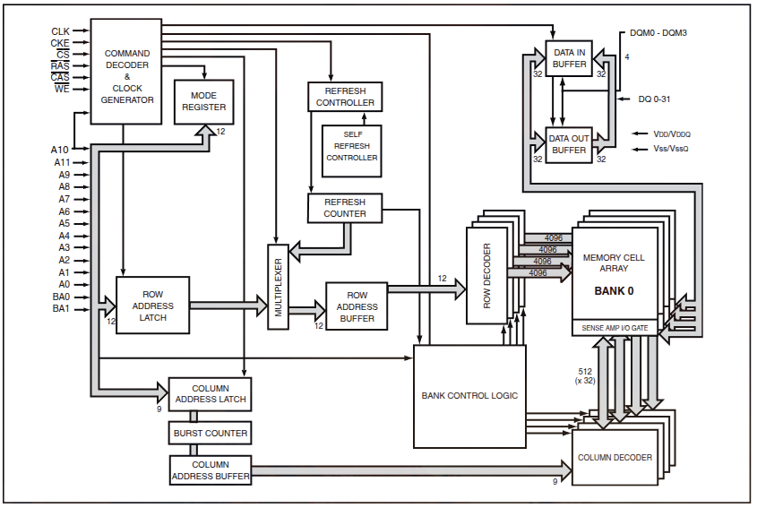
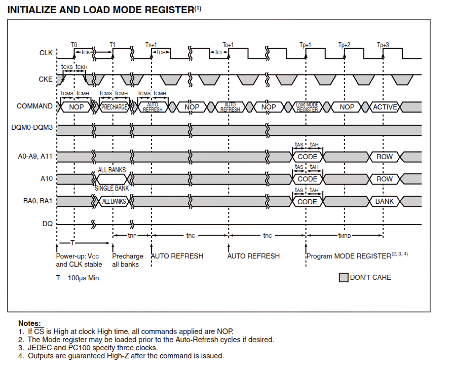
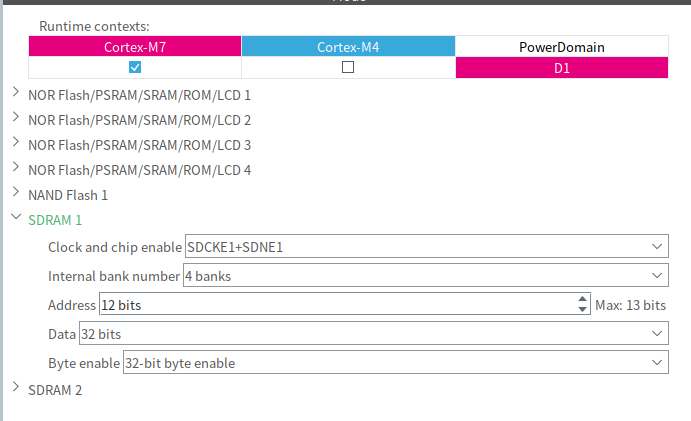
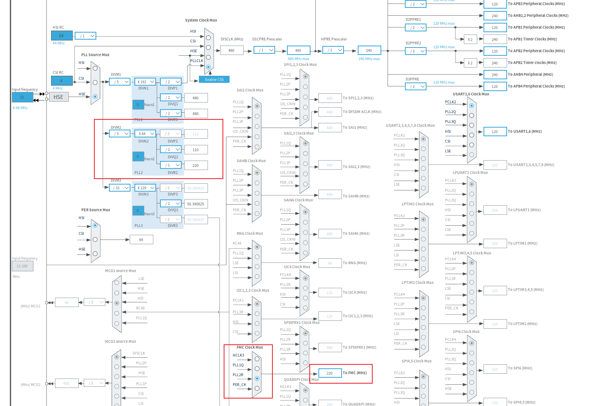
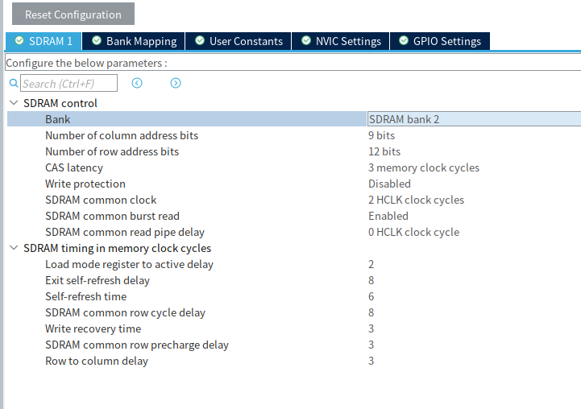

# SDRAM应用
## SDRAM介绍
SDRAM (Synchronous Dynamic Random Access Memory, 同步动态随机存取存储器) 是一种易失性半导体存储器, 属于 DRAM 的一种. 其名称中的三个词分别代表了关键特性:

- **Synchronous (同步)**: SDRAM 的工作时钟与系统总线时钟同步, 所有操作 (读写/刷新) 都在时钟的上升沿触发. 这使其相比于早期的异步 DRAM (如 FPM/EDO DRAM) 有更高的数据传输效率.
- **Dynamic (动态)**: 数据以电荷形式存储在由 1 个晶体管 + 1 个电容构成的存储单元中. 电容会缓慢漏电, 因此需要周期性刷新 (Refresh) 来维持数据, 通常在 64ms 内必须完成一次对所有行的刷新.
- **Random Access (随机存取)**: 可以按任意顺序读写任意地址, 而不像磁带或 FIFO 那样必须顺序访问.

与 SRAM 相比, SDRAM 的存储单元仅为 1 个晶体管 + 1 个电容, 远少于 SRAM 的 6 个晶体管, 因此 SDRAM 成本更低, 容量可以做到 MB~GB 级; 但 SDRAM 需要周期性刷新且访问有延迟, 速度远不及 SRAM. 在嵌入式系统中, SRAM 通常用作 CPU Cache 或 TCM, 而 SDRAM 则用于大容量数据缓存与帧缓冲.

我实际使用的芯片是IS42S32800J,容量大小为32MB.后续进行相关介绍,将以此为例.

### 内部结构

SDRAM 内部以 **Bank (存储体)** 为单位组织. 每个 Bank 是一个二维矩阵, 由 **行地址 (Row Address)** 和 **列地址 (Column Address)** 定位具体的存储单元.



访问流程如下:

1. **ACTIVE 命令**: 激活某个 Bank 的某一行, 将该行数据加载到行缓冲 (Row Buffer) 中.
2. **READ/WRITE 命令**: 指定列地址和突发长度, 从行缓冲中读取或写入数据.
3. **PRECHARGE 命令**: 关闭当前行, 将行缓冲数据写回存储单元 (如果是写操作).

同 Bank 内同时只能打开一行; 切换行必须先执行预充电关闭当前行.

### 关键时序参数

SDRAM 的控制需要满足一系列严格的时序要求. 常见参数如下:

| 参数             | 含义                                            | 典型值 (@143MHz, CL=3, tck=7ns) |
| ---------------- | ----------------------------------------------- | ------------------------------- |
| CL (CAS Latency) | 列选通到数据输出的延迟                          | 3 cycles                        |
| tRCD             | RAS to CAS Delay, 行激活到列选通延迟            | 20ns (3 cycles)                 |
| tRP              | Row Precharge Time, 预充电周期                  | 20ns (3 cycles)                 |
| tRAS             | Active to Precharge Delay, 激活到预充电最小时间 | 49ns (7 cycles)                 |
| tRC              | Row Cycle Time, 同 Bank 行周期 (tRAS + tRP)     | 70ns (10 cycles)                |
| tWR              | Write Recovery Time, 写恢复时间                 | 14ns (2 cycles)                 |
| tREF             | Refresh Interval, 4096 次刷新周期               | 64ms                            |

以下为读/写操作的时序关系图, 标注了各参数在访问流程中的位置.

#### 初始化时序

SDRAM 上电后不能立即进行读写, 必须按照固定流程完成初始化:



初始化流程分为以下阶段:

1. **上电等待 (tPU, 100us)**: 上电后时钟 (CLK) 需稳定, CKE 置高, 期间发送 NOP 或 DESELECT 命令. 此阶段至少持续 100us.
2. **PRECHARGE ALL (PALL)**: 发送预充电所有 Bank 命令, 将所有 Bank 置于空闲状态. 之后需等待 tRP 时间.
3. **AUTO REFRESH x2**: 执行至少 2 次自动刷新, 每次刷新之间需间隔 tRC. 上电后 SDRAM 内部状态不确定, 刷新确保所有行被正确初始化.
4. **LOAD MODE REGISTER (MRS)**: 通过地址线 A0-A11 写入模式寄存器, 配置 CAS Latency (CL), 突发长度 (Burst Length), 突发类型 (Sequential / Interleave) 等参数. 写入后需等待 tMRD (14ns / 2 cycles) 才能发出后续命令.
5. **初始化完成**: MRS 之后即可发送 ACTIVE 命令, 开始正常的读写操作.

读时序和写时序,就不多介绍了,了解即可.

## CubeMX配置

### FMC介绍

FMC (Flexible Memory Controller, 可变存储控制器) 是 STM32 用于连接外部存储器的外设, 支持 SRAM, NOR Flash, NAND Flash 和 SDRAM 等多种存储器类型. STM32H747 内置 两个 FMC 控制器 (FMC1 和 FMC2), 每个控制器包含独立的 SDRAM 控制器.

FMC 通过并行总线与 SDRAM 芯片连接, 将外部 SDRAM 映射到 MCU 的地址空间 (0xC0000000 或 0xD0000000), CPU 可以像访问片内 SRAM 一样直接通过指针读写 SDRAM.

主要信号线:

| 信号         | 方向         | 说明                   |
| ------------ | ------------ | ---------------------- |
| CLK (SDCLK)  | MCU -> SDRAM | 同步时钟, 最高 200MHz  |
| CKE (SDCKE)  | MCU -> SDRAM | 时钟使能               |
| CS (SDNE)    | MCU -> SDRAM | 片选, 每个 Bank 一根   |
| RAS (SDNRAS) | MCU -> SDRAM | 行地址选通             |
| CAS (SDNCAS) | MCU -> SDRAM | 列地址选通             |
| WE (SDNWE)   | MCU -> SDRAM | 写使能                 |
| A[0:12]      | MCU -> SDRAM | 地址线, 行列复用       |
| BA[0:1]      | MCU -> SDRAM | Bank 地址线            |
| DQ[0:31]     | 双向         | 数据线                 |
| DQM[0:3]     | MCU -> SDRAM | 字节掩码 (每 8 位一组) |

CubeMX 中配置 FMC 连接 SDRAM 的主要步骤: 使能 FMC 外设 -> 选择 SDRAM 控制器区域 -> 配置时序参数 -> 配置引脚复用 -> 生成初始化代码. H7 系列还需要确保 FMC 相关的内核时钟 (HCLK3) 已正确配置.

### 外设配置

首先需要在 CubeMX 中使能 FMC 并选择 SDRAM 控制器区域. STM32H747 有两个 FMC 控制器 (SDRAM1 和 SDRAM2), 选哪一个取决于原理图中 SDRAM 控制信号所在的 GPIO 端口.

判断方法: 在原理图中找 SDCLK / SDNWE / SDNRAS / SDNCAS 这些控制信号接了哪个 GPIO, 如果落在 PG/PH/PF 端口 (左侧), 选 **SDRAM1**; 如果落在 PC/PD/PE 端口 (右侧), 选 **SDRAM2**. 本例中 SDNWE 接 PH6, SDNRAS 接 PF13, SDNCAS 接 PF12, 均为 FMC1 的引脚, 所以选 SDRAM1.

| 控制信号         | SDRAM1 (FMC1) | SDRAM2 (FMC2) |
| ---------------- | ------------- | ------------- |
| SDCLK (时钟)     | PG8           | PE1           |
| SDCKE (时钟使能) | PH7           | PC5           |
| SDNE0 (片选0)    | PG9           | PC2           |
| SDNE1 (片选1)    | PH6           | PH7           |
| SDNWE (写使能)   | PH5           | PE0           |
| SDNRAS (行选通)  | PF13          | PC3           |
| SDNCAS (列选通)  | PF12          | PD4           |




各配置项按 IS42S32800J 芯片参数填写如下:

**1. Clock and chip enable**

| 配置项           | 选择   | 说明                                                                   |
| ---------------- | ------ | ---------------------------------------------------------------------- |
| SDRAM Controller | SDRAM1 | 控制信号在 FMC1 的引脚范围, 见上方判断方法                             |
| Bank             | Bank1  | 根据原理图中 SDNE 引脚决定, SDNE0 (PG9) 为 Bank1, SDNE1 (PH7) 为 Bank2 |
| SDCKE0           | 勾选   | 时钟使能信号, 必须勾选; IS42S32800J 有 CKE 引脚                        |

**2. Internal bank number**

填 **4**. IS42S32800J 内部有 4 个 Bank (由 BA0/BA1 两根引脚选择). 此参数由芯片规格决定, 与原理图无关.

**3. Address**

填 **12**. SDRAM 地址线是行列复用的, 物理地址线数量取行地址和列地址中的较大值: `max(行地址 A0-A11, 列地址 A0-A8) = max(12, 9) = 12`.

**4. Data**

填 **32**. IS42S32800J 数据线位宽为 32-bit (DQ0-DQ31), 原理图中用了多少根 DQ 就填多少.

**5. Byte enable**

选 **32-bit**. Byte Enable 对应 SDRAM 的 DQM (字节掩码) 信号:

| 选项    | DQM 数量      | 适用数据位宽   |
| ------- | ------------- | -------------- |
| Disable | 0             | 不使用字节掩码 |
| 8-bit   | 1 根 (DQM0)   | x8             |
| 16-bit  | 2 根 (DQM0~1) | x16            |
| 32-bit  | 4 根 (DQM0~3) | x32            |

IS42S32800J 有 4 根 DQM, 控制 4 组 8 位数据, 因此选 32-bit.

---

配置完成后, 务必检查 **GPIO Settings** 标签页, 逐一核对 CubeMX 自动分配的引脚是否与原理图一致. 需要注意:

- FMC 的很多信号 (如 A0, D0, DQM 等) 在 H747 上可映射到多个不同的 GPIO 引脚, CubeMX 的默认分配不一定和原理图匹配.
- 重点关注控制信号引脚: SDCLK, SDCKE, SDNE, SDNWE, SDNRAS, SDNCAS, 这些信号通常只有一个或两个可选引脚, 但仍需确认.
- 如果某个引脚被其他外设占用 (黄色警告), 可以按住 **Ctrl 键点击该引脚** 切换到该信号的其他可选 GPIO.

### 时钟树配置



FMC 外设时钟 和 SDRAM 芯片 CLK 引脚上的 **SDCLK** 的关系是:

```
SDCLK = fmc_ker_ck / 2
```

即 FMC 内核用的是 SDRAM 实际时钟的 **2 倍频**. 如果 SDCLK 目标 120MHz, fmc_ker_ck 需配为 240MHz. CubeMX 中 FMC kernel clock 的时钟源可选以下四个:

| 时钟源 | 来自                                      | 说明                                                                                       |
| ------ | ----------------------------------------- | ------------------------------------------------------------------------------------------ |
| HCLK3  | 系统时钟分频链 (SYSCLK -> D1CPRE -> HPRE) | AHB3 域总线时钟, 和 CPU 同源, 换晶振或调 CPU 频率时会跟着变                                |
| PLL1Q  | PLL1 的 Q 分频输出                        | PLL1 是系统主 PLL, 为 CPU/AXI/AHB 提供时钟. Q 通道是其一个独立分频输出, 但共享 PLL1 的 VCO |
| PLL2R  | PLL2 的 R 分频输出                        | PLL2 是外设专用 PLL, 独立于系统 PLL1, 有自己的 VCO, 调频不影响 CPU, **推荐**               |
| PER_CK | 外设时钟                                  | 外设通用时钟, 频率等于 HCLK, 适用场景有限                                                  |

对于 SDRAM, **推荐选择 PLL2R**. PLL2 有独立的 VCO, 修改 FMC 频率完全不影响 CPU 时钟, 配置最灵活. 以 HSE = 25MHz 为例:

| PLL2 参数      | 值    | 计算                |
| -------------- | ----- | ------------------- |
| 输入 (HSE)     | 25MHz | 外部晶振            |
| DIVM2 (预分频) | 5     | 25 / 5 = 5MHz       |
| DIVN2 (倍频)   | 44    | 5 × 44 = 220MHz     |
| DIVR2 (R 分频) | 1     | 220MHz (fmc_ker_ck) |

最终: SDCLK = fmc_ker_ck / 2 = **110MHz** (tck = 9.09ns).


### 时序参数配置



完成引脚和时钟配置后, 在 **FMC SDRAM 配置页的 SDRAM Control / SDRAM Timing** 中填入以下参数. 以下数值基于 IS42S32800J-7 数据手册, 适用于上一节配置的 SDCLK = 110MHz (tck = 9.09ns), CL = 3.

**SDRAM Control (基本控制参数):**

| 参数                          | 值      | 说明                                      |
| ----------------------------- | ------- | ----------------------------------------- |
| Bank                          | 4       | 内部 Bank 数量, 芯片规格决定 (BA0/BA1)    |
| Number of column address bits | 9       | 列地址线数量 (A0-A8)                      |
| Number of row address bits    | 12      | 行地址线数量 (A0-A11)                     |
| CAS latency                   | 3       | 见下方说明                                |
| Write protection              | Disable | 禁用写保护, 允许读写                      |
| SDRAM common clock            | 2       | SDCLK = fmc_ker_ck / 2 = 220 / 2 = 110MHz |
| SDRAM common burst read       | Enable  | 启用突发读                                |
| SDRAM common read pipe delay  | 0       | 读流水线延迟, SDR SDRAM 填 0              |

> **CAS Latency 为什么是 3?**
>
> IS42S32800J-7 支持 CL=2 和 CL=3:
>
> | CL | tck (min) | 最高频率 | 110MHz 是否可用 |
> |----|-----------|---------|-----------------|
> | 2  | 10ns      | 100MHz  | 否 (tck 9.09ns < 10ns) |
> | 3  | 7ns       | 143MHz  | 是 (tck 9.09ns >= 7ns) |
>
> SDCLK = 110MHz 对应 tck = 9.09ns, CL=2 要求 tck >= 10ns 不满足, 必须选 CL=3.


**SDRAM timing in memory clock cycles (时序参数, 以 SDCLK 周期为单位):**

> 此处的 "memory clock" 指的是 **SDCLK**, 不是 fmc_ker_ck. 当前 SDCLK = 110MHz (tck = 9.09ns), 按 `ceil(ns / 9.09)` 计算:

| 参数                               | 手册参数 | ns 值 | 值    |
| ---------------------------------- | -------- | ----- | ----- |
| Load mode register to active delay | tMRD     | 14ns  | **2** |
| Exit self-refresh delay            | tXSR     | 70ns  | **8** |
| Self-refresh time                  | tRAS     | 49ns  | **6** |
| SDRAM common row cycle delay       | tRC      | 70ns  | **8** |
| Write recovery time                | tWR/tDPL | 14ns  | **3** |
| SDRAM common row precharge delay   | tRP      | 20ns  | **3** |
| Row to column delay                | tRCD     | 20ns  | **3** |

> **Write recovery time 不能只看芯片手册.**
>
> `ceil(14 / 9.09) = 2` 满足 IS42S32800J 芯片时序, 但 FMC 硬件还有两个约束:
>
> ```
> 约束1: TWR >= SelfRefreshTime - RowToColumnDelay = 6 - 3 = 3
> 约束2: TWR >= RowCycleDelay - RowToColumnDelay - RowPrechargeDelay = 8 - 3 - 3 = 2
> ```
>
> 取 max = **3**. 所以最终填 3, 不填 2. CubeMX 校验不过时会自动提示 "Write recovery time must be between 3 and 16", 按提示调大即可.

配置完毕后 CubeMX 自动写入 `FMC_SDRAM_TimingTypeDef` 结构体, 在 HAL 库 `HAL_SDRAM_Init()` 中生效.

## 驱动代码

### is42s32800j.h

```c
#ifndef __IS42S32800J_H
#define __IS42S32800J_H

#ifdef __cplusplus
extern "C" {
#endif

#include "stm32h7xx_hal.h"
#include <stdbool.h>

#define IS42S32800J_BASE_ADDR 0xD0000000UL
#define IS42S32800J_SIZE_BYTES (32UL * 1024UL * 1024UL)

bool is42s32800j_init(SDRAM_HandleTypeDef* hsdram);
bool is42s32800j_test(void);

#ifdef __cplusplus
}
#endif

#endif /* __IS42S32800J_H */
```

### is42s32800j.c

```c
#include "is42s32800j.h"

#define IS42S32800J_REFRESH_COUNT   1699U
#define IS42S32800J_COMMAND_TIMEOUT 0x1000U

#define IS42S32800J_MODEREG_BURST_LENGTH_1             ((uint32_t)0x0000U)
#define IS42S32800J_MODEREG_BURST_TYPE_SEQUENTIAL       ((uint32_t)0x0000U)
#define IS42S32800J_MODEREG_CAS_LATENCY_3               ((uint32_t)0x0030U)
#define IS42S32800J_MODEREG_OPERATING_MODE_STANDARD     ((uint32_t)0x0000U)
#define IS42S32800J_MODEREG_WRITEBURST_MODE_SINGLE      ((uint32_t)0x0200U)

static bool send_command(SDRAM_HandleTypeDef* hsdram, uint32_t mode, uint32_t auto_refresh_number,
                         uint32_t mode_register)
{
    FMC_SDRAM_CommandTypeDef command = {0};

    command.CommandMode = mode;
    command.CommandTarget = FMC_SDRAM_CMD_TARGET_BANK2;
    command.AutoRefreshNumber = auto_refresh_number;
    command.ModeRegisterDefinition = mode_register;

    return HAL_SDRAM_SendCommand(hsdram, &command, IS42S32800J_COMMAND_TIMEOUT) == HAL_OK;
}

bool is42s32800j_init(SDRAM_HandleTypeDef* hsdram)
{
    if (hsdram == NULL) {
        return false;
    }

    // 1. I/O 补偿单元
    //
    // STM32H7 的 FMC 可跑到 100MHz+, 信号边沿很陡. I/O 补偿单元实时
    // 调节 GPIO 输出驱动器的斜率和阻抗, 补偿温度/电压漂移对时序的影响.
    // 不加的话高速 FMC 可能间歇性读写错误.
    HAL_PWREx_EnableUSBVoltageDetector();
    __HAL_RCC_CSI_ENABLE();
    __HAL_RCC_SYSCFG_CLK_ENABLE();
    HAL_EnableCompensationCell();

    // 2. MPU 配置
    //
    // main.c 的 MPU_Config() 把 Region0 (背景) 设成了 NO_ACCESS.
    // 这里在 0xD0000000 开一个 32MB 的"洞", 允许 CPU 访问 SDRAM.
    //
    // Cacheable + Bufferable: SDRAM 读写走 L1-Cache (WT 模式), 写操作
    //   可被 Store Buffer 合并, 减少总线等待.
    // NOT_SHAREABLE: 告诉 CPU 这块内存只有 CM7 用, 不需要维护一致性协议.
    // DISABLE_EXEC: 防止跑飞把 SDRAM 数据当代码执行.
    MPU_Region_InitTypeDef mpu = {0};
    HAL_MPU_Disable();

    mpu.Enable = MPU_REGION_ENABLE;
    mpu.Number = MPU_REGION_NUMBER6;
    mpu.BaseAddress = 0xD0000000;
    mpu.Size = MPU_REGION_SIZE_32MB;
    mpu.SubRegionDisable = 0x0;
    mpu.TypeExtField = MPU_TEX_LEVEL0;
    mpu.AccessPermission = MPU_REGION_FULL_ACCESS;
    mpu.DisableExec = MPU_INSTRUCTION_ACCESS_DISABLE;
    mpu.IsShareable = MPU_ACCESS_NOT_SHAREABLE;
    mpu.IsCacheable = MPU_ACCESS_CACHEABLE;
    mpu.IsBufferable = MPU_ACCESS_BUFFERABLE;
    HAL_MPU_ConfigRegion(&mpu);

    HAL_MPU_Enable(MPU_PRIVILEGED_DEFAULT);

    // 3. SDRAM 初始化命令序列 (JEDEC 标准流程)
    //
    // 上电后 SDRAM 内部状态不确定, 必须按顺序发送:
    //
    //   CLK_ENABLE  — 使能 SDCLK, 芯片开始响应命令
    //   wait 1ms    — 时钟稳定等待 (Datasheet: tPU >= 100us)
    //   PALL        — 预充电所有 Bank, 全部回到空闲态
    //   AUTOREFRESH — 8 次自动刷新, 初始化所有行 (规格只需 2 次)
    //   LOAD_MODE   — 写入模式寄存器: CAS Latency / Burst Length 等
    //   RefreshRate — 自动刷新间隔, 保证 64ms 内完成 4096 次刷新
    //
    // 模式寄存器: Burst Length=1, CAS Latency=3, Write Burst=Single
    // CL=3 是因为 SDCLK=110MHz (tck=9.09ns), CL=2 要求 tck>=10ns 不满足.
    uint32_t mode_register = IS42S32800J_MODEREG_BURST_LENGTH_1 | IS42S32800J_MODEREG_BURST_TYPE_SEQUENTIAL |
                             IS42S32800J_MODEREG_CAS_LATENCY_3 | IS42S32800J_MODEREG_OPERATING_MODE_STANDARD |
                             IS42S32800J_MODEREG_WRITEBURST_MODE_SINGLE;

    if (!send_command(hsdram, FMC_SDRAM_CMD_CLK_ENABLE, 1, 0)) {
        return false;
    }

    HAL_Delay(1);

    if (!send_command(hsdram, FMC_SDRAM_CMD_PALL, 1, 0)) {
        return false;
    }

    if (!send_command(hsdram, FMC_SDRAM_CMD_AUTOREFRESH_MODE, 8, 0)) {
        return false;
    }

    if (!send_command(hsdram, FMC_SDRAM_CMD_LOAD_MODE, 1, mode_register)) {
        return false;
    }

    if (HAL_SDRAM_ProgramRefreshRate(hsdram, IS42S32800J_REFRESH_COUNT) != HAL_OK) {
        return false;
    }

    return true;
}

// 只读写基地址 memory[0], 用 6 种 pattern 逐位验证 32 根数据线.
static bool test_data_bus(void)
{
    volatile uint32_t* const memory = (volatile uint32_t*)IS42S32800J_BASE_ADDR;
    const uint32_t patterns[] = {0x00000000UL, 0xFFFFFFFFUL, 0xAAAAAAAAUL, 0x55555555UL,
                                 0x12345678UL, 0x87654321UL};

    for (uint32_t i = 0; i < sizeof(patterns) / sizeof(patterns[0]); i++) {
        memory[0] = patterns[i];

        if (memory[0] != patterns[i]) {
            return false;
        }
    }

    return true;
}

// 在不同地址偏移写入唯一值 (偏移量编码进数据), 验证每根地址线能正确寻址.
static bool test_address_bus(void)
{
    volatile uint32_t* const memory = (volatile uint32_t*)IS42S32800J_BASE_ADDR;
    const uint32_t offsets[] = {0x00000000UL, 0x00000004UL, 0x00000100UL,
                                0x00010000UL, 0x00100000UL, 0x00400000UL,
                                0x00800000UL, 0x01000000UL, IS42S32800J_SIZE_BYTES - 4UL};

    for (uint32_t i = 0; i < sizeof(offsets) / sizeof(offsets[0]); i++) {
        uint32_t index = offsets[i] / sizeof(uint32_t);
        memory[index] = 0xA5A50000UL ^ offsets[i];
    }

    for (uint32_t i = 0; i < sizeof(offsets) / sizeof(offsets[0]); i++) {
        uint32_t index = offsets[i] / sizeof(uint32_t);

        if (memory[index] != (0xA5A50000UL ^ offsets[i])) {
            return false;
        }
    }

    return true;
}

// 前 1MB 逐字写入递增唯一值, 验证大范围连续读写和刷新下的数据保持.
static bool test_block_fill(void)
{
    volatile uint32_t* const memory = (volatile uint32_t*)IS42S32800J_BASE_ADDR;
    const uint32_t test_words = (1024UL * 1024UL) / sizeof(uint32_t);

    for (uint32_t i = 0; i < test_words; i++) {
        memory[i] = 0x5A5A0000UL + i;
    }

    for (uint32_t i = 0; i < test_words; i++) {
        if (memory[i] != 0x5A5A0000UL + i) {
            return false;
        }
    }

    return true;
}

bool is42s32800j_test(void)
{
    if (!test_data_bus()) {
        return false;
    }

    if (!test_address_bus()) {
        return false;
    }

    if (!test_block_fill()) {
        return false;
    }

    return true;
}
```

`is42s32800j_test()` 内部依次执行三个测试:

- **test_data_bus** — 始终读写基地址, 用 6 种 pattern (0x00000000 / 0xFFFFFFFF / 0xAAAAAAAA / 0x55555555 / 0x12345678 / 0x87654321) 验证 32 根数据线每根都能独立拉高/拉低, 没有粘连或断路.
- **test_address_bus** — 在 9 个不同地址偏移 (0 ~ 32MB-4) 写入包含偏移信息的唯一值后回读, 验证每根地址线能正确寻址, 两根地址线粘连会导致两个偏移量落到同一物理位置.
- **test_block_fill** — 前 1MB 逐字写入递增唯一值后回读, 验证大范围连续读写和刷新下的数据保持.

任一失败立即返回 `false`.

> **test 不是每次上电都必须跑.** 开发阶段建议跑, 能第一时间发现焊接/PCB/芯片问题. 量产阶段工厂跑一次全量就够了, 正常启动只调 `is42s32800j_init()`, 不调 `test()` — 全量测试耗时太长. 如果想保留最小验证, 把 `test_block_fill` 的 `test_words` 缩小到 256 (1KB) 即可.

### cm7_main.c

```c
#include "cm7_main.h"

#include "delay.h"
#include "log.h"

#include "fmc.h"
#include "is42s32800j.h"

void cm7_main()
{
    log_info("SDRAM init start");

    if (!is42s32800j_init(&hsdram1)) {
        log_error("SDRAM init failed");
        Error_Handler();
    }

    log_info("SDRAM init done, testing...");

    if (!is42s32800j_test()) {
        log_error("SDRAM test failed");
        Error_Handler();
    }

    log_info("SDRAM test passed");

    for (;;) {
    }
}
```

工程模板[链接](https://github.com/fazhehy/STM32H747)
