## 格雷码法

### 经典格雷码法

为了相除相位歧义,我们可以标记每一个周期的阶数,然后根据周期的阶数来消除相位歧义.

可以通过格雷码来标记周期的阶数.如下图所示

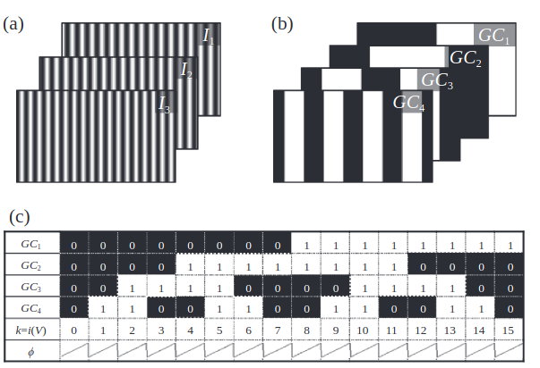

格雷码的最小宽度要刚好等于周期宽度(波长).

值得注意的是,格雷码本身就是一种结构光,只使用格雷码也能完成三维重建,不过要实现高精度的三维重建要投影很多张图片,效率太低.
本文介绍的格雷码法是属于辅助编码技术,不是直接编码技术.

> Qican Zhang, Zhoujie Wu. 《Three-dimensional imaging technique based on Gray-coded structured illumination》. Infrared and Laser Engineering 49, 期 3 (2020): 303004～303004.


```python
import numpy as np
import matplotlib.pyplot as plt
from typing import List
import warnings
warnings.filterwarnings('ignore')

# 配置 matplotlib 中文字体显示
plt.rcParams['font.sans-serif'] = ['SimHei']
plt.rcParams['axes.unicode_minus'] = False
```


```python
# 生成格雷码
def generate_gray_code(n):
    """生成n位格雷码序列"""
    return [i ^ (i >> 1) for i in range(2**n)]
```


```python
print([f'{code:03b}' for code in generate_gray_code(3)])
```

    ['000', '001', '011', '010', '110', '111', '101', '100']


```python
# 生成格雷码图像
def generate_gray_code_patterns(n, width, height):
    """生成n位格雷码图像序列"""
    gray_codes = generate_gray_code(n)
    patterns = []

    fringe_width = width // (2**n)

    for i in range(n):
        pattern = np.zeros((height, width), dtype=np.uint8)
        for j, gray_code in enumerate(gray_codes):
            if (gray_code >> (n - 1 - i)) & 1:
                pattern[:, (j * fringe_width):((j + 1) * fringe_width)] = 255
        patterns.append(pattern)

    patterns.append(np.zeros((height, width), dtype=np.uint8))  # 添加全黑图像
    patterns.append(np.ones((height, width), dtype=np.uint8) * 255)  # 添加全白图像
    return patterns
```


```python
def show_patterns(patterns: List[np.ndarray], titles: List[str] = None, max_cols: int = 8):
    """展示条纹图像序列"""
    n = len(patterns)
    cols = min(n, max_cols)
    rows = (n + max_cols - 1) // max_cols  # 向上取整

    fig, axes = plt.subplots(rows, cols, figsize=(3*cols, 3*rows))

    # 将axes统一处理成一维数组
    if rows == 1 and cols == 1:
        axes = np.array([axes])
    elif rows == 1 or cols == 1:
        axes = axes.flatten()
    else:
        axes = axes.flatten()

    for idx, pattern in enumerate(patterns):
        # 重要：指定vmin和vmax以正确显示全黑(0)和全白(255)的图像
        axes[idx].imshow(pattern, cmap='gray', vmin=0, vmax=255)
        # 显示标题
        if titles:
            axes[idx].set_title(titles[idx], fontsize=16)
            
        axes[idx].axis('on')  # 开启边框
        
        # 设置边框颜色和宽度
        edge_color = 'red'  # 你可以根据需要更改颜色
        for spine in axes[idx].spines.values():
            spine.set_edgecolor(edge_color)
            spine.set_linewidth(3)
        
        # 隐藏刻度
        axes[idx].set_xticks([])
        axes[idx].set_yticks([])

    # 隐藏多余的子图
    for idx in range(2**n, len(axes)):
        axes[idx].axis('off')

    plt.tight_layout()
    plt.show()
```


```python
# 展示格雷码图像
n = 4
width = 2**n * 20
height = 200

patterns = generate_gray_code_patterns(n, width, height)

gray_codes = generate_gray_code(n)

show_patterns(patterns)
```


    

    


```python
# 生成条纹图像
def generate_fringe_pattern(width: int = 1140, height: int = 912, 
                            cycles: float = 28, phase_shift: float = 0, 
                            contrast: float = 0.5, brightness: float = 0.5):
    
    y, x = np.mgrid[0:height, 0:width]

    # 验证参数范围
    assert 0 <= contrast <= 1, "对比度必须在0-1之间"
    assert 0 <= brightness <= 1, "亮度必须在0-1之间"

    # 计算a和b，确保不超出[0,1]范围
    b = contrast    # 振幅
    a = brightness    # 直流偏置

    frequency = cycles/width  # 归一化频率

    # 检查是否超出范围
    if a - b < 0 or a + b > 1:
        warnings.warn(f"参数可能导致饱和: a={a:.2f}, b={b:.2f}, 范围=[{a-b:.2f}, {a+b:.2f}]")
        # 自动调整
        a = np.clip(a, b, 1-b)

    pattern = a + b * np.cos(2 * np.pi * frequency * x  + phase_shift)

    return np.clip(pattern * 255, 0, 255).astype(np.uint8)

# 生成相移条纹图像序列
def generate_phase_shift_fringe_patterns(width: int = 1140, height: int = 912, 
                                 cycles: float = 28, num: int = 12, 
                                 contrast: float = 0.5, brightness: float = 0.5):
    
    patterns = []
    for i in range(num):
        pattern = generate_fringe_pattern(width, height, cycles, (i/num)*2*np.pi, 
                                  contrast, brightness)
        patterns.append(pattern)

    return patterns
```


```python
# 生成条纹图像序列
cycles = 16
num = 4

width = cycles * 80
height = 912

patterns = generate_phase_shift_fringe_patterns(cycles=cycles, num=num, width=width, height=height)

# 展示条纹图像
show_patterns(patterns)
```


    
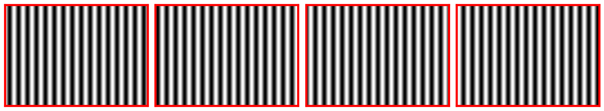
    


```python
# 提取相位
def calc_wrapped_phase(patterns):
    sin_sum = 0
    cos_sum = 0
    N = len(patterns)
    for i, pattern in enumerate(patterns):
        pattern_normalized = pattern / 255.0
        sin_sum = sin_sum + pattern_normalized*np.sin(2*np.pi*i/N)
        cos_sum = cos_sum + pattern_normalized*np.cos(2*np.pi*i/N)
    phase = -np.atan2(sin_sum, cos_sum)

    # 将相位范围调整到[0, 2π]
    phase = (phase + 2 * np.pi) % (2 * np.pi)
    # 计算调制度
    modulation = 255*np.sqrt(sin_sum**2 + cos_sum**2) / N
    return phase, modulation

# 显示相位数据
def visualize_patterns_curve(data: List[np.ndarray], labels: List[str] = None, title: str = None):
    # 绘制这行数据
    plt.figure(figsize=(8, 4))
    for idx, series in enumerate(data):
        label = labels[idx] if labels and idx < len(labels) else f'Signal {idx+1}'
        plt.plot(series, label=label)
    if title:
        plt.title(title)
    plt.xlabel('Column Index')
    plt.ylabel('Value')
    plt.legend()
    plt.grid(True)
    plt.show()
```


```python
phase, _ = calc_wrapped_phase(patterns)
visualize_patterns_curve([phase[height//2, :]], title='中间行的相位曲线')

visualize_patterns_curve([phase[height//2, 0:81]], title='单周期的相位曲线')
```


    
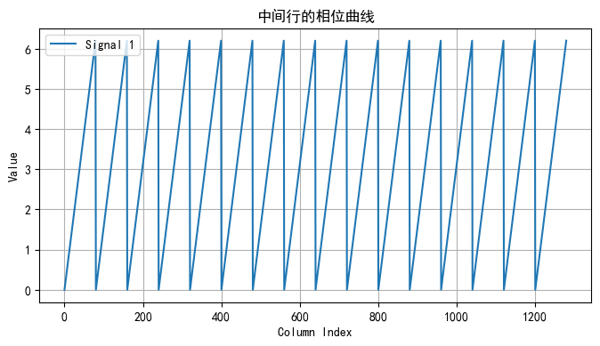
    


    
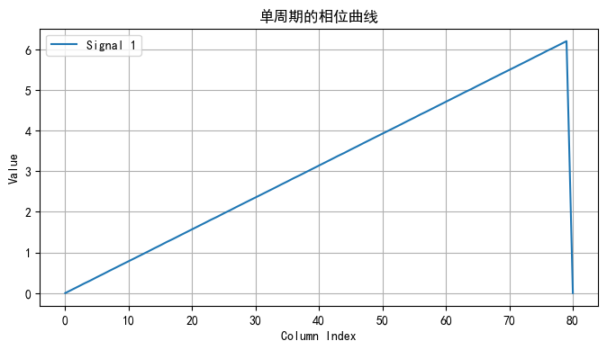
    


```python
# 生成格雷码图像
n = 4
gray_codes_patterns = generate_gray_code_patterns(n, width, height)

# 展示格雷码图像
gray_codes = generate_gray_code(n)

show_patterns(gray_codes_patterns)
```


    

    


```python
def gray_code_patterns_decode(patterns):
    """将格雷码图像序列解码为位置索引图"""
    n = len(patterns) - 2  # 减去全黑和全白图像

    white_image = patterns[-1]
    black_image = patterns[-2]
    threshold = (white_image.astype(np.int32) + black_image.astype(np.int32)) // 2

    height, width = patterns[0].shape
    index_map = np.zeros((height, width), dtype=np.int32)

    for i in range(n):
        pattern = patterns[i]
        bit_value = (pattern >= threshold).astype(np.int32)
        index_map = (index_map << 1) | bit_value

    # 将格雷码转换为二进制索引
    binary_index_map = np.zeros_like(index_map)
    for i in range(height):
        for j in range(width):
            gray_code = index_map[i, j]
            binary_code = 0
            mask = gray_code
            while mask != 0:
                binary_code ^= mask
                mask >>= 1
            binary_index_map[i, j] = binary_code

    return binary_index_map

```


```python
def visualize_gray_code_index_map(index_map):
    plt.imshow(index_map, cmap='jet')
    plt.title('位置索引图', fontsize=16)
    plt.colorbar()
    plt.axis('on') 
    plt.show()
```


```python
# 展示格雷码解码结果
index_map = gray_code_patterns_decode(gray_codes_patterns)

visualize_gray_code_index_map(index_map)

visualize_patterns_curve([index_map[height//2, :]], title='中间行的解码位置索引曲线')

visualize_patterns_curve([index_map[height//2, 0:81]], title='单周期')
```


    

    


    
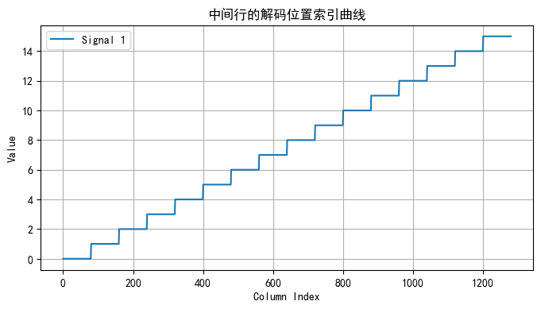
    


    
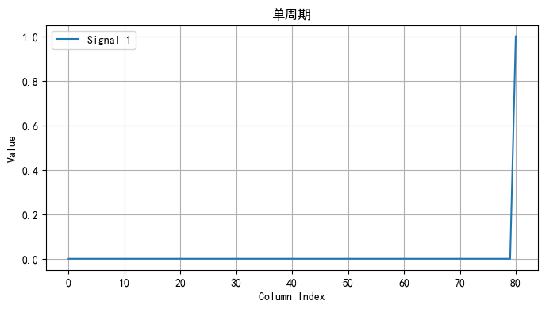
    


```python
# 根据相位和位置索引进行相位展开
def phase_unwrapping(wrapped_phase, index_map):
    """根据相位和位置索引进行相位展开"""
    unwrapped_phase = wrapped_phase + 2 * np.pi * index_map
    return unwrapped_phase
```


```python
def visualize_patterns_3d(pattern, elev=30, azim=45):
    # 降采样以提高性能
    step = 5
    gray_small = pattern[::step, ::step]

    # 创建坐标网格
    x = np.arange(0, gray_small.shape[1])
    y = np.arange(0, gray_small.shape[0])
    X, Y = np.meshgrid(x, y)
    # 3D 可视化
    fig = plt.figure(figsize=(12, 8))
    ax = fig.add_subplot(111, projection='3d')
    surf = ax.plot_surface(X, Y, gray_small, cmap='rainbow',
                        rstride=1, cstride=1, linewidth=0)
    ax.set_xlabel('X')
    ax.set_ylabel('Y')
    ax.set_zlabel('Intensity')
    ax.set_title('3D Surface of Grayscale Image')
    ax.view_init(elev=elev, azim=azim)
    plt.colorbar(surf)
    plt.show()

def visualize_patterns_image(pattern, titles=None):
    plt.imshow(pattern, cmap='gray')
    if titles:
        plt.title(titles, fontsize=16)
    plt.axis('on') 
    plt.colorbar()
    plt.show()
```


```python
phase_unwrapped = phase_unwrapping(phase, index_map)
visualize_patterns_3d(phase_unwrapped, elev=30, azim=-90)
visualize_patterns_curve([phase_unwrapped[height//2, :]], title='中间行的展开相位曲线')
visualize_patterns_image(phase_unwrapped, titles='展开相位图')
```


    

    


    

    


    
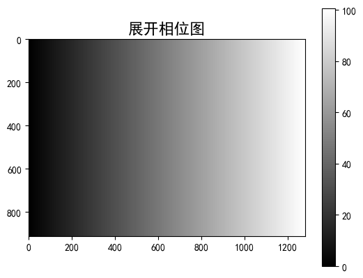
    


```python
# 使用真实数据
import os
from PIL import Image
import numpy as np

# 读取图像文件
data_dir = 'data/1'
images = []

for i in range(10):
    img_path = os.path.join(data_dir, f'{i+1}.bmp')
    img = Image.open(img_path).convert('L')  # 转为灰度图
    images.append(np.array(img))

# 将图像列表分成两组
images1 = images[:4]  # 前4张相移条纹图像
images2 = images[4:]  # 后6张格雷码图像
```


```python
show_patterns(images1, titles=[f'Image {i+1}' for i in range(len(images1))])
show_patterns(images2, titles=[f'Image {i+1}' for i in range(len(images2))])
```


    
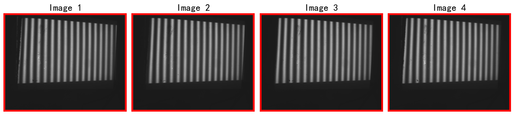
    


    
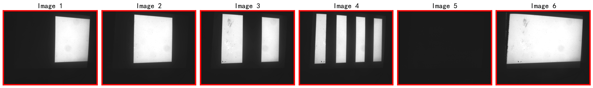
    


```python
phase, modulation = calc_wrapped_phase(images1)

visualize_patterns_image(phase, titles='包裹相位图')

# 根据调制度过滤无效点
mask = modulation > 8  # 调制度阈值
phase = np.where(mask, phase, np.nan)

visualize_patterns_image(phase, titles='过滤后的包裹相位图')
```


    
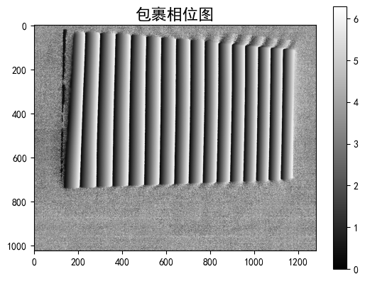
    


    
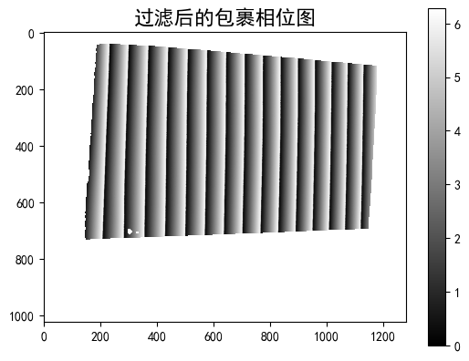
    


```python
# 解码格雷码图像
index_map = gray_code_patterns_decode(images2)
visualize_gray_code_index_map(index_map)

# 根据调制度过滤无效点
mask = modulation > 8  # 调制度阈值
index_map_filtered = np.where(mask, index_map, np.nan)

visualize_gray_code_index_map(index_map_filtered)
```


    
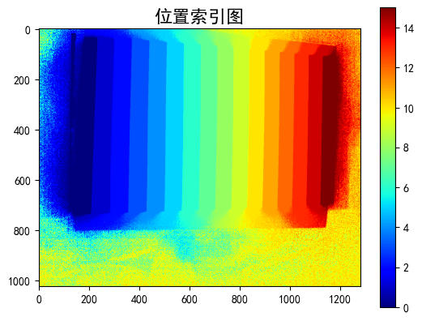
    


    
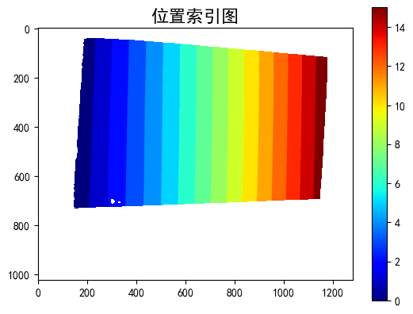
    


```python
phase_unwrapped = phase_unwrapping(phase, index_map)
visualize_patterns_3d(phase_unwrapped, elev=30, azim=-90)
visualize_patterns_image(phase_unwrapped, titles='展开相位图')
visualize_patterns_curve([phase_unwrapped[height//2, :]], title='中间行的展开相位曲线')
```


    
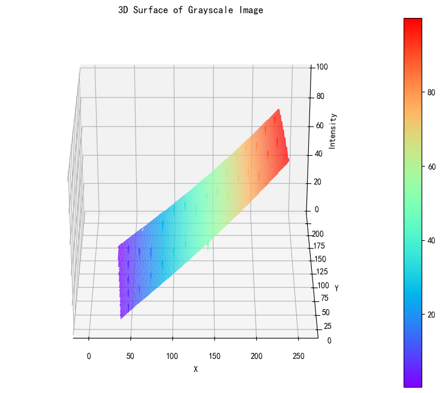
    


    
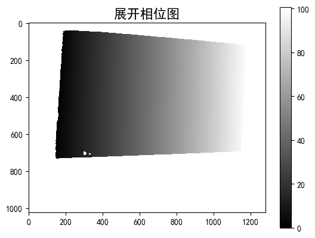
    


    
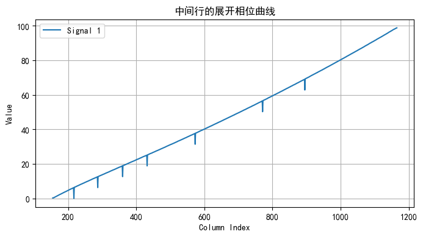
    


```python
import numpy as np
from scipy.ndimage import generic_filter

# 使用 np.nanmedian 忽略窗口内的 NaN
phase_unwrapped_filtered = generic_filter(phase_unwrapped, function=np.nanmedian, size=3, mode='nearest')
```


```python
visualize_patterns_3d(phase_unwrapped_filtered, elev=30, azim=-90)
visualize_patterns_image(phase_unwrapped_filtered, titles='展开相位图')
visualize_patterns_curve([phase_unwrapped_filtered[height//2, :]], title='中间行的展开相位曲线（滤波后）') 
```


    

    


    
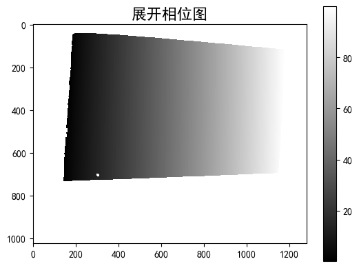
    


    
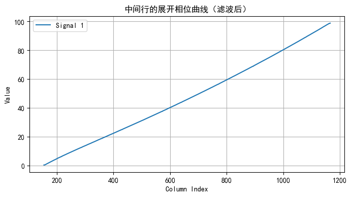
    


### 互补格雷码

经典格雷码方法,由于投影仪离焦或者其他原因(光学传递函数可视为一个低通滤波器,阶跃响应会被平滑),格雷码的边缘会变得模糊,如下图


所以互补格雷码应运而生.
互补格雷码就是在最后在投影一副格雷码图片,得到刚好错开半个周期的格雷码周期.这样就可以消除边缘误差影响了.

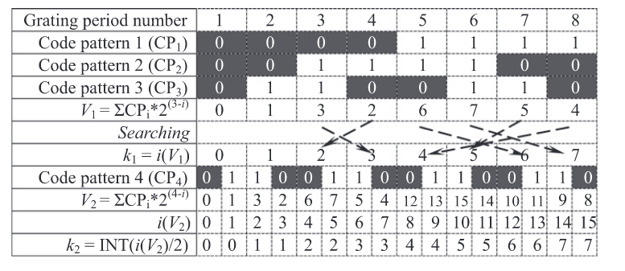

具体步骤如下:

1. 用未加最后一幅的格雷码图片解码出对应的位置索引$k_1$(相位阶数)
2. 加上最后一幅格雷码图片解码出对应的位置索引,将位置索引对2取模得到$k_2$.
3. 再通过下面的公式解调出绝对相位
$$
    \Phi(i,j) = \begin{cases}
\phi(i,j) + 2k_2\pi, \; \phi(i,j)<\frac{\pi}{4}
 \\
 \phi(i,j) + 2k_1\pi, \; \frac{\pi}{4}\le\phi(i,j)<\frac{3\pi}{4}
 \\
\phi(i,j) + 2k_2\pi, \; \phi(i,j)\ge\frac{3\pi}{4}
\end{cases}
$$
- 这里我的周期是调整到$[0,2\pi]$了,原论文没有调整,所以跟原论文的公式有点出入.并且原论文$\ge\frac{3\pi}{4}$的式子减了$2\pi$,那是错误的,不减才对.
  
> Zhang, Qican, Xianyu Su, Liqun Xiang和Xuezhen Sun. 《3-D Shape Measurement Based on Complementary Gray-Code Light》. Optics and Lasers in Engineering 50, 期 4 (2012): 574～79. 


```python
# 生成条纹

cycles = 8 # 根据上图,选择生成8个周期
width = cycles * 80
height = 912

patterns = generate_phase_shift_fringe_patterns(cycles=cycles, num=num, width=width, height=height)

show_patterns(patterns)
```


    
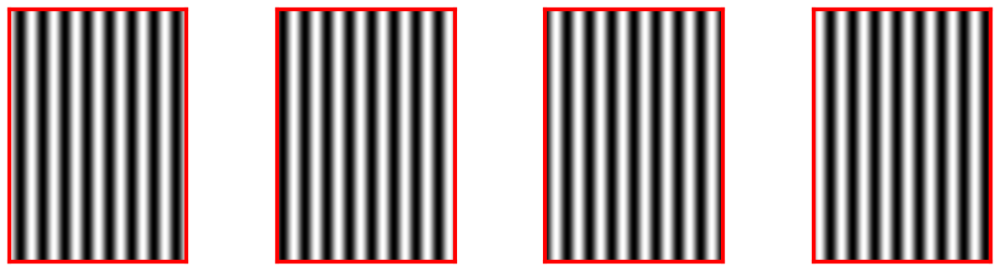
    


```python
# 生成格雷码图像
n = 4
gray_codes_patterns = generate_gray_code_patterns(n, width, height)
show_patterns(gray_codes_patterns)
```


    

    


```python
phase = calc_wrapped_phase(patterns)[0]
visualize_patterns_image(phase, titles='包裹相位图')
```


    
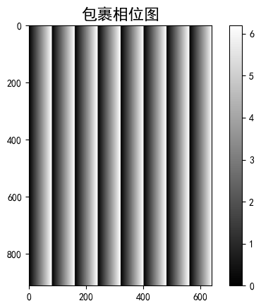
    


```python
def complementary_gray_code_patterns_decode(patterns):
    # 剔除倒数第三张
    patterns1 = patterns[:-3] + patterns[-2:]
    patterns2 = patterns
    index_map1 = gray_code_patterns_decode(patterns1)
    index_map2 = gray_code_patterns_decode(patterns2) // 2

    return index_map1, index_map2
```


```python
index_map1, index_map2 = complementary_gray_code_patterns_decode(gray_codes_patterns)
visualize_gray_code_index_map(index_map1)
visualize_gray_code_index_map(index_map2)
```


    
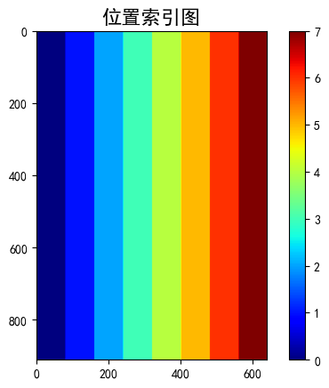
    


    

    


```python
def complementary_gray_code_unwrapping(phase, index_map1, index_map2):
    """使用互补格雷码索引图进行相位展开"""
    zero_phase = np.zeros_like(phase)
    phase_unwrapped = np.where(phase < np.pi/4, phase + 2 * np.pi * index_map2, zero_phase)
    phase_unwrapped += np.where((phase >= np.pi/4) & (phase < (3 * np.pi / 4)), phase + 2 * np.pi * index_map1, zero_phase)
    phase_unwrapped += np.where(phase >= (3 * np.pi / 4), phase + 2 * np.pi * index_map2, zero_phase)
    return phase_unwrapped
```


```python
phase_unwrapped = complementary_gray_code_unwrapping(phase, index_map1, index_map2)
```


```python
visualize_patterns_3d(phase_unwrapped, elev=30, azim=-90)
visualize_patterns_image(phase_unwrapped, titles='展开相位图')
visualize_patterns_curve([phase_unwrapped[height//2, :]], title='中间行的展开相位曲线')
```


    
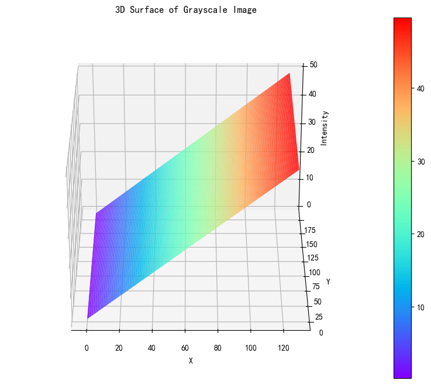
    


    
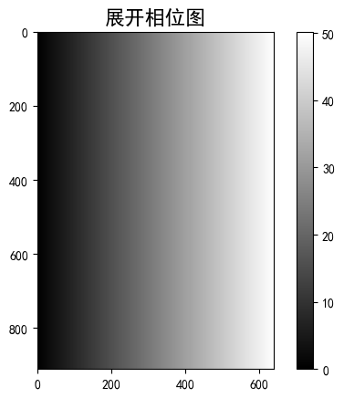
    


    
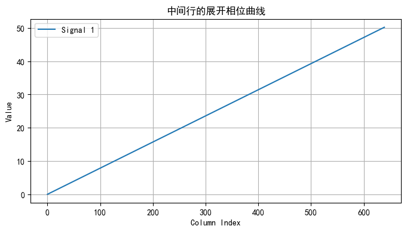
    

