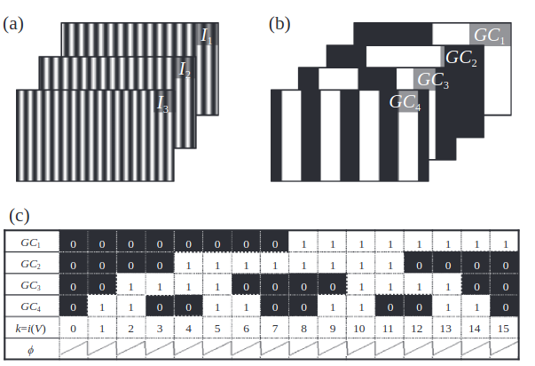
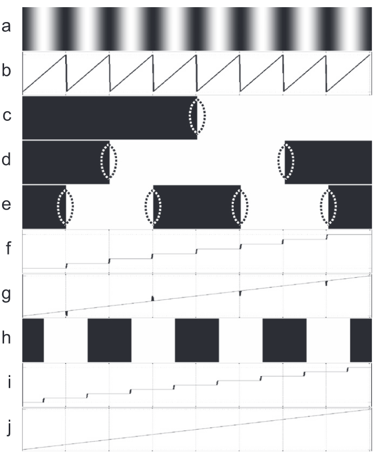
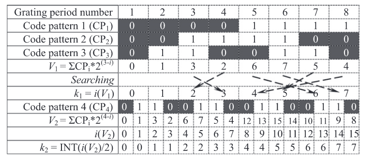
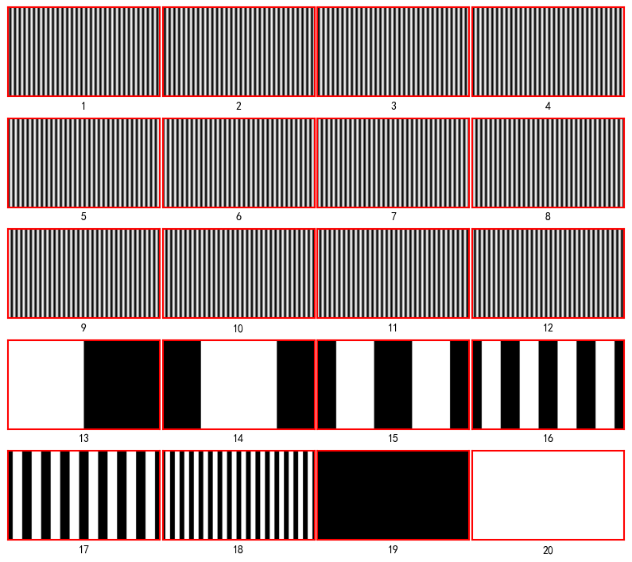
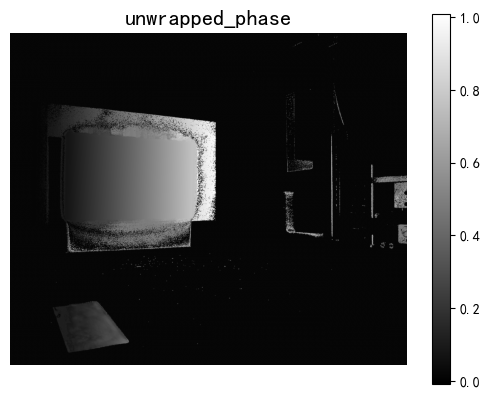
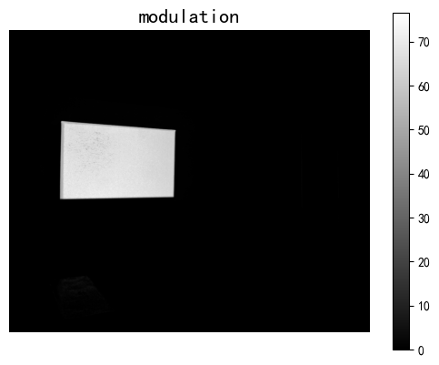
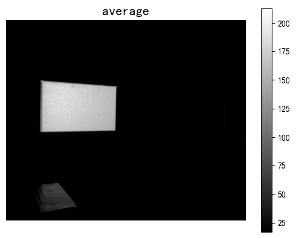

# 格雷码法
## 经典格雷码法
为了消除相位歧义，我们可以标记每一个周期的阶数，然后根据周期的阶数来消除相位歧义。
可以通过格雷码来标记周期的阶数。如下图所示：


**格雷码的最小宽度要刚好等于周期宽度(波长)**。

值得注意的是，格雷码本身就是一种结构光，只使用格雷码也能完成三维重建，不过要实现高精度的三维重建要投影很多张图片，效率太低。
本文介绍的格雷码法是属于辅助编码技术，不是直接编码技术。
> Qican Zhang, Zhoujie Wu. 《Three-dimensional imaging technique based on Gray-coded structured illumination》. Infrared and Laser Engineering 49, 期 3 (2020): 303004～303004.

由于光学系统的低通滤波特性，工程中一般不用格雷码来解包裹相位，而是用互补格雷码。

## 互补格雷码

经典格雷码方法，由于投影仪离焦或者其他原因(光学传递函数可视为一个低通滤波器,阶跃响应会被平滑),格雷码的边缘会变得模糊，如下图。



所以互补格雷码应运而生。
互补格雷码就是在最后再投影一张格雷码图片，得到刚好错开半个周期的格雷码周期。这样就可以消除边缘误差影响了。



具体步骤如下：

1. 用未加最后一幅的格雷码图片解码出对应的位置索引$k_1$(相位阶数)；
2. 加上最后一幅格雷码图片解码出对应的位置索引，将位置索引整除2得到$k_2$；
3. 再通过下面的公式解调出绝对相位。
$$
\Phi(i,j) = \begin{cases}
\phi(i,j) + 2k_2\pi, \; \phi(i,j)<\frac{\pi}{2}
\\
\phi(i,j) + 2k_1\pi, \; \frac{\pi}{2}\le\phi(i,j)<\frac{3\pi}{2}
\\
\phi(i,j) + 2k_2\pi, \; \phi(i,j)\ge\frac{3\pi}{2}
\end{cases}
$$
- 这里我的周期是调整到$[0,2\pi]$了，原论文没有调整，所以跟原论文的公式有点出入。
  
> Zhang, Qican, Xianyu Su, Liqun Xiang和Xuezhen Sun. 《3-D Shape Measurement Based on Complementary Gray-Code Light》. Optics and Lasers in Engineering 50, 期 4 (2012): 574～79. 

### 代码验证

> 代码仓库：https://github.com/fazhehy/fpp

1. 生成互补格雷码
```python
import sys
from pathlib import Path

p = Path.cwd().resolve().parent
sys.path.append(str(p))

from src.fpp import *
from src.utils import *

width, height = 2716, 1600

# 生成互补格雷码条纹图案，is_flipped=True表示生成翻转的图案, 主要是投影仪要翻转图案
patterns = generate_complementary_gray_code_patterns(
    width, height, cycles=32, n_steps=12, 
    save_path="../patterns/complementary_gray_code", is_flipped=True)

show_patterns(patterns, max_cols=4)
```


2. 解包裹相位
```python
import sys
from pathlib import Path

p = Path.cwd().resolve().parent
sys.path.append(str(p))

from src.fpp import *
from src.utils import *

width, height = 2716, 1600

# 互补格雷码解包裹相位
unwrapped_phase, modulation, average = decode_complementary_gray_code_patterns(
    "../images/complementary_gray_code/", n_steps=12
)

show_image(unwrapped_phase, "unwrapped_phase")
show_image(modulation, "modulation")
show_image(average, "average")
```




