# 高速格雷码

参考论文

> Wu, Zhoujie, Wenbo Guo, Yueyang Li, Yihang Liu和Qican Zhang. 《High-Speed and High-Efficiency Three-Dimensional Shape Measurement Based on Gray-Coded Light》. Photonics Research 8, 期 6 (2020): 819.

主要是提出了Tri-PU和时间重叠技术.

## Tripartite Phase-Unwrapping Method

论文认为跳跃误差是由于包裹相位和相位顺序的失配导致的,在论文中,认为相位顺序是可靠的.

Tri-PU方法的主要是通过相位顺序来解决失配问题.

与互补格雷码是不同的思路.

Tri-Pu主要使用三步相移,这也是相移法的最小投影数量.

使用相移法,可以得到以下公式,

$$
\phi(x,y) = \arctan \frac{\sqrt{3}[I_1(x,y)-I_3(x,y)]}{2I_2(x,y)-I_1(x,y)-I_3(x,y)}
$$

通过对三个条纹的不同排列组合,可以得到三个不同初始相位的相位数据.

如果按照$[I_2,I_3,I_1],[I_1,I_2,I_3],[I_3,I_1,I_2]$的顺序排列,可以得到$\phi_1, \phi_2, \phi_3$.

$\phi_1$相对于$\phi_2$延迟了$\frac{2\pi}{3}$, $\phi_3$相对于$\phi_2$超前了$\frac{2\pi}{3}$.

然后使用这三个相位和格雷码就能得到无歧义的相位.

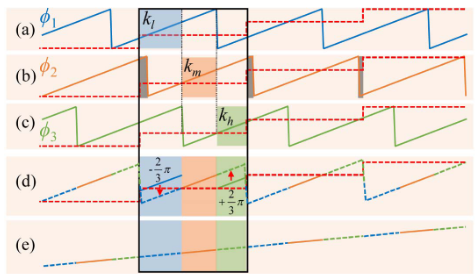

三个相位数据是错开的, 将一个周期分为三个部分, 每个部分都对应着一个非边缘相位, 通过补偿初始相位再叠加相位, 就能得到非歧义的相位数据.

$$
\begin{align*}
\Phi(x,y) = \left\{\begin{matrix}
\phi_1(x,y)+2\pi k_l(x,y) - \frac{2\pi}{3}, \; k \in k_l
 \\
\phi_2(x,y)+2\pi k_m(x,y), \; k \in k_m
 \\
\phi_3(x,y)+2\pi k_h(x,y) + \frac{2\pi}{3}, \; k \in k_h
\end{matrix}\right.
\end{align*}
$$

接下来的问题就是怎么确定$k_l, k_m, k_h$的范围.

首先,可以通过$\phi_2(x,y)$确定$k_m$的范围.

$$
k_m(x,y) = k(x,y) ,  \;\; \text{ where}|\phi_2(x,y)| < \frac{\pi}{3}
$$

注意, 这里的相位的范围是$(-\pi, \pi]$.

因为这是中间的相位,不会受到边缘的影响.
但是不好确定周期的边界,这时引入参考相位.

参考相位是参考平面的无歧义的相位,也就是绝对相位.此相位在进行标定时就应该保存下来(基于相高法标定).

参考相位用$\Phi_{ref}(x, y)$表示.

首先通过格雷码可以得到相位顺序,根据相位顺序分为不同区域$A(i)(i=1,2,3,\dots,2^N)$.


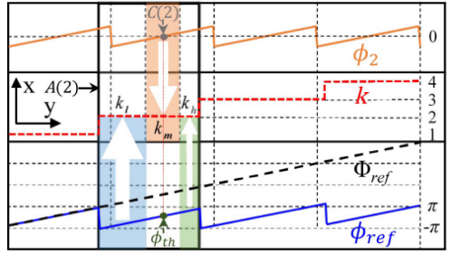

由于相位顺序认为是可靠的,我们可以通过这个确定周期边界.

$$
\phi_{ref}(x,y) = \Phi_{ref}(x,y)-2\pi k(x,y)
$$

通过上述公式可以确定一个周期的范围, 但是$\phi_{ref}(x,y)$可能不固定在$(-\pi, \pi]$.
在一个$A(i)$内$k(x,y)$相等.

接下来可以通过参考相位找到$k_l, k_h$.

通过$\phi_2(x,y)$找到$\phi_{th}(x,y)$,可以由以下操作确定范围.

$$
\begin{align*}
k_l(x,y) &= k(x,y), \; \text{where} \phi_{ref}(x,y) < \phi_{th}(x,y), \\
& (x, y) \in A(i), \; \text{and} (x,y) \notin k_m. \\

k_h(x,y) &= k(x,y), \; \text{where} \phi_{ref}(x,y) > \phi_{th}(x,y), \\
& (x, y) \in A(i), \; \text{and} (x,y) \notin k_m. \\
\end{align*}
$$

通过上图可以形象理解.

阴影处理,

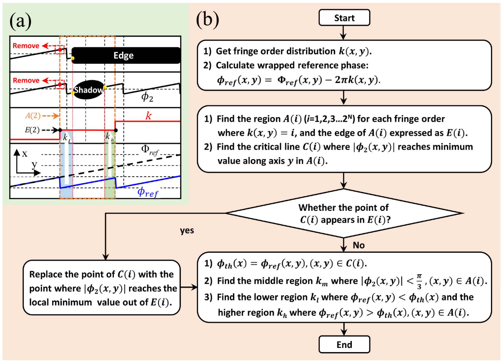

大致思路就是将阴影部分当作$k_m$,其余部分通过参考相位区分$k_l, k_h$.再通过上述操作就能展开高质量无歧义的相位.

暂时没有真实数据,阴影处理不做代码演示了.


```python
import numpy as np
import matplotlib.pyplot as plt
from typing import List
import warnings
warnings.filterwarnings('ignore')

# 配置 matplotlib 中文字体显示
plt.rcParams['font.sans-serif'] = ['SimHei']
plt.rcParams['axes.unicode_minus'] = False
```


```python
# 生成条纹图像
def generate_fringe_pattern(width: int = 1140, height: int = 912, 
                            cycles: float = 28, phase_shift: float = 0, 
                            contrast: float = 0.5, brightness: float = 0.5):
    
    y, x = np.mgrid[0:height, 0:width]

    # 验证参数范围
    assert 0 <= contrast <= 1, "对比度必须在0-1之间"
    assert 0 <= brightness <= 1, "亮度必须在0-1之间"

    # 计算a和b，确保不超出[0,1]范围
    b = contrast    # 振幅
    a = brightness    # 直流偏置

    frequency = cycles/width  # 归一化频率

    # 检查是否超出范围
    if a - b < 0 or a + b > 1:
        warnings.warn(f"参数可能导致饱和: a={a:.2f}, b={b:.2f}, 范围=[{a-b:.2f}, {a+b:.2f}]")
        # 自动调整
        a = np.clip(a, b, 1-b)

    pattern = a + b * np.cos(2 * np.pi * frequency * x  + phase_shift)

    return np.clip(pattern * 255, 0, 255).astype(np.uint8)

# 生成相移条纹图像序列
def generate_phase_shift_fringe_patterns(width: int = 1140, height: int = 912, 
                                 cycles: float = 28, num: int = 12, 
                                 contrast: float = 0.5, brightness: float = 0.5):
    
    patterns = []
    for i in range(num):
        pattern = generate_fringe_pattern(width, height, cycles, (i/num)*2*np.pi, 
                                  contrast, brightness)
        patterns.append(pattern)

    return patterns
```


```python
# 生成格雷码
def generate_gray_code(n):
    """生成n位格雷码序列"""
    return [i ^ (i >> 1) for i in range(2**n)]

# 生成格雷码图像
def generate_gray_code_patterns(n, width, height):
    """生成n位格雷码图像序列"""
    gray_codes = generate_gray_code(n)
    patterns = []

    fringe_width = width // (2**n)

    for i in range(n):
        pattern = np.zeros((height, width), dtype=np.uint8)
        for j, gray_code in enumerate(gray_codes):
            if (gray_code >> (n - 1 - i)) & 1:
                pattern[:, (j * fringe_width):((j + 1) * fringe_width)] = 255
        patterns.append(pattern)

    patterns.append(np.zeros((height, width), dtype=np.uint8))  # 添加全黑图像
    patterns.append(np.ones((height, width), dtype=np.uint8) * 255)  # 添加全白图像
    return patterns
```


```python
# 提取相位
def calc_wrapped_phase(patterns):
    sin_sum = 0
    cos_sum = 0
    N = len(patterns)
    for i, pattern in enumerate(patterns):
        pattern_normalized = pattern / 255.0
        sin_sum = sin_sum + pattern_normalized*np.sin(2*np.pi*i/N)
        cos_sum = cos_sum + pattern_normalized*np.cos(2*np.pi*i/N)
    phase = -np.atan2(sin_sum, cos_sum)

    # 将相位范围调整到[0, 2π]
    phase = (phase + 2 * np.pi) % (2 * np.pi)
    # 计算调制度
    modulation = 255*np.sqrt(sin_sum**2 + cos_sum**2) / N
    return phase, modulation

def gray_code_patterns_decode(patterns):
    """将格雷码图像序列解码为位置索引图"""
    n = len(patterns) - 2  # 减去全黑和全白图像

    white_image = patterns[-1]
    black_image = patterns[-2]
    threshold = (white_image.astype(np.int32) + black_image.astype(np.int32)) // 2

    height, width = patterns[0].shape
    index_map = np.zeros((height, width), dtype=np.int32)

    for i in range(n):
        pattern = patterns[i]
        bit_value = (pattern >= threshold).astype(np.int32)
        index_map = (index_map << 1) | bit_value

    # 将格雷码转换为二进制索引
    binary_index_map = np.zeros_like(index_map)
    for i in range(height):
        for j in range(width):
            gray_code = index_map[i, j]
            binary_code = 0
            mask = gray_code
            while mask != 0:
                binary_code ^= mask
                mask >>= 1
            binary_index_map[i, j] = binary_code

    return binary_index_map

# 根据相位和位置索引进行相位展开
def gray_code_phase_unwrapping(wrapped_phase, index_map):
    """根据相位和位置索引进行相位展开"""

    # wrapped_phase = (wrapped_phase + 2 * np.pi) % (2 * np.pi)

    unwrapped_phase = wrapped_phase + 2 * np.pi * index_map
    return unwrapped_phase
```


```python
def show_patterns(patterns: List[np.ndarray], titles: List[str] = None, max_cols: int = 8):
    """展示条纹图像序列"""
    n = len(patterns)
    cols = min(n, max_cols)
    rows = (n + max_cols - 1) // max_cols  # 向上取整

    fig, axes = plt.subplots(rows, cols, figsize=(3*cols, 3*rows))

    # 将axes统一处理成一维数组
    if rows == 1 and cols == 1:
        axes = np.array([axes])
    elif rows == 1 or cols == 1:
        axes = axes.flatten()
    else:
        axes = axes.flatten()

    for idx, pattern in enumerate(patterns):
        # 重要：指定vmin和vmax以正确显示全黑(0)和全白(255)的图像
        axes[idx].imshow(pattern, cmap='gray', vmin=0, vmax=255)
        # 显示标题
        if titles:
            axes[idx].set_title(titles[idx], fontsize=16)
            
        axes[idx].axis('on')  # 开启边框
        
        # 设置边框颜色和宽度
        edge_color = 'red'  # 你可以根据需要更改颜色
        for spine in axes[idx].spines.values():
            spine.set_edgecolor(edge_color)
            spine.set_linewidth(3)
        
        # 隐藏刻度
        axes[idx].set_xticks([])
        axes[idx].set_yticks([])

    # 隐藏多余的子图
    for idx in range(2**n, len(axes)):
        axes[idx].axis('off')

    plt.tight_layout()
    plt.show()

# 显示相位数据
def visualize_patterns_curve(data: List[np.ndarray], labels: List[str] = None, title: str = None):
    # 绘制这行数据
    plt.figure(figsize=(8, 4))
    for idx, series in enumerate(data):
        label = labels[idx] if labels and idx < len(labels) else f'Signal {idx+1}'
        plt.plot(series, label=label)
    if title:
        plt.title(title)
    plt.xlabel('Column Index')
    plt.ylabel('Value')
    plt.legend()
    plt.grid(True)
    plt.show()

def visualize_gray_code_index_map(index_map):
    plt.imshow(index_map, cmap='jet')
    plt.title('位置索引图', fontsize=16)
    plt.colorbar()
    plt.axis('on') 
    plt.show()

def visualize_patterns_3d(pattern, elev=30, azim=45):
    # 降采样以提高性能
    step = 5
    gray_small = pattern[::step, ::step]

    # 创建坐标网格
    x = np.arange(0, gray_small.shape[1])
    y = np.arange(0, gray_small.shape[0])
    X, Y = np.meshgrid(x, y)
    # 3D 可视化
    fig = plt.figure(figsize=(12, 8))
    ax = fig.add_subplot(111, projection='3d')
    surf = ax.plot_surface(X, Y, gray_small, cmap='rainbow',
                        rstride=1, cstride=1, linewidth=0)
    ax.set_xlabel('X')
    ax.set_ylabel('Y')
    ax.set_zlabel('Intensity')
    ax.set_title('3D Surface of Grayscale Image')
    ax.view_init(elev=elev, azim=azim)
    plt.colorbar(surf)
    plt.show()

def visualize_patterns_image(pattern, titles=None):
    plt.imshow(pattern, cmap='gray')
    if titles:
        plt.title(titles, fontsize=16)
    plt.axis('on') 
    plt.colorbar()
    plt.show()
```


```python
# 生成条纹图像序列
cycles = 16
num = 3

fringe_width = 80

width = cycles * fringe_width
height = 912

patterns = generate_phase_shift_fringe_patterns(cycles=cycles, num=num, width=width, height=height)

# 展示条纹图像
show_patterns(patterns)
```


    
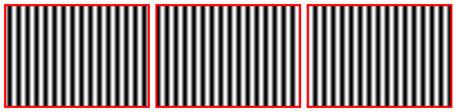
    


```python
patterns1 = [patterns[1], patterns[2], patterns[0]]
patterns2 = patterns
patterns3 = [patterns[2], patterns[0], patterns[1]]

phase1, _ = calc_wrapped_phase(patterns1)
phase2, _ = calc_wrapped_phase(patterns2)
phase3, _ = calc_wrapped_phase(patterns3)

# 用phase2作为参考相位
phase = phase2

visualize_patterns_curve([phase1[height//2, 0:4*fringe_width], phase2[height//2, 0:4*fringe_width], phase3[height//2, 0:4*fringe_width]])
```


    

    


```python
# 生成格雷码图像
n = 4
gray_codes_patterns = generate_gray_code_patterns(n, width, height)

# 展示格雷码图像
gray_codes = generate_gray_code(n)

show_patterns(gray_codes_patterns)
```


    

    


```python
# 展示格雷码解码结果
index_map = gray_code_patterns_decode(gray_codes_patterns)

visualize_gray_code_index_map(index_map)
```


    
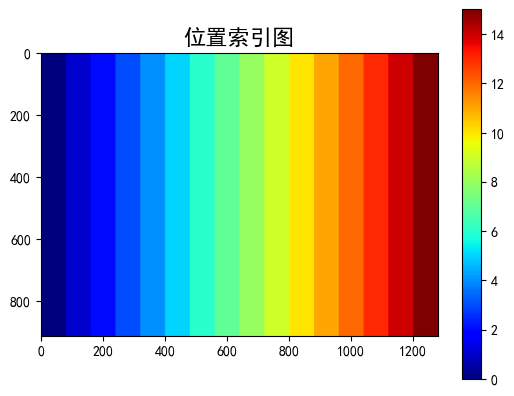
    


```python
# 生成绝对参考相位
Phi_ref = gray_code_phase_unwrapping(phase, index_map)
visualize_patterns_3d(Phi_ref, elev=30, azim=-90)
```


    
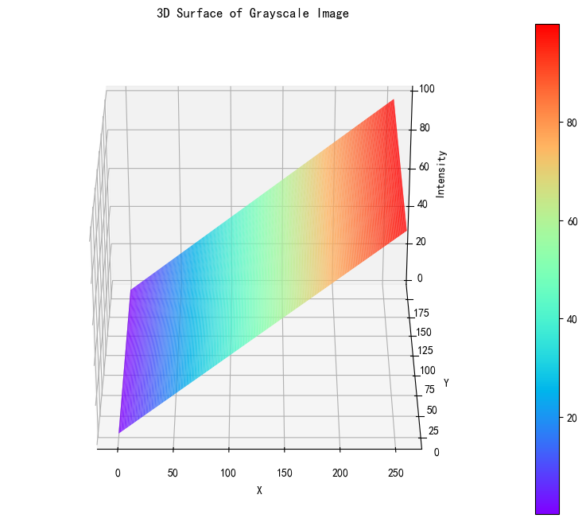
    


```python
# 计算k_m
# 由于phase2在[0, 2π]范围内，因此k_m的判定条件为|phase2 - π| < π/3
phi2_mask = np.abs(phase2 - np.pi) < np.pi / 3

phi2 = phase2*phi2_mask

k_m = index_map * phi2_mask

visualize_patterns_curve([phase2[height//2, 0:4*fringe_width], phi2[height//2, 0:4*fringe_width], k_m[height//2, 0:4*fringe_width], index_map[height//2, 0:4*fringe_width]], labels=['Wrapped Phase', 'phi2', 'k_m', 'Index Map'])
```


    
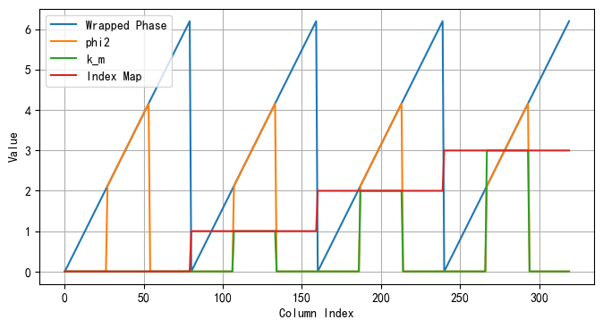
    


```python
# 计算参考相位
phi_ref = Phi_ref - index_map * 2 * np.pi


phi_th = phi_ref * phi2_mask

visualize_patterns_curve([phi_ref[height//2, 0:4*fringe_width], phi_th[height//2, 0:4*fringe_width], index_map[height//2, 0:4*fringe_width]], labels=['Reference Phase', 'phi_th', 'Index Map'])
```


    
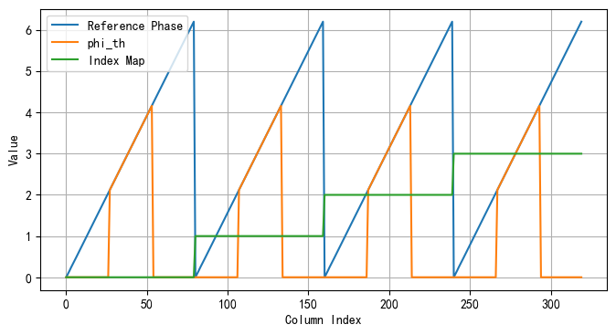
    


由于这里是生成的平面数据,所以相位数据和相位顺序匹配的很好.


```python
# 对每个区域计算phi1和phi3的掩码
# 掩码能够区分出phi1和phi3的有效区域

phi1_mask = np.zeros_like(Phi_ref)
phi3_mask = np.zeros_like(Phi_ref)

for i in range(np.max(index_map)+1):

    current_mask = (index_map == i)
    
    phi1_th = phi_th * current_mask
    phi3_th = phi_th * current_mask

    phi_ref_temp = phi_ref * current_mask

    phi1_mask_temp =  phi_ref_temp < np.min(phi1_th[phi1_th != 0]) 
    phi1_mask_temp =  phi1_mask_temp * current_mask

    phi3_mask_temp =  phi_ref_temp > np.max(phi3_th[phi3_th != 0])

    phi1_mask = phi1_mask + phi1_mask_temp
    phi3_mask = phi3_mask + phi3_mask_temp
```


```python
visualize_patterns_curve([phi1_mask[height//2, 0:4*fringe_width], phi2_mask[height//2, 0:4*fringe_width], phi3_mask[height//2, 0:4*fringe_width]])
```


    
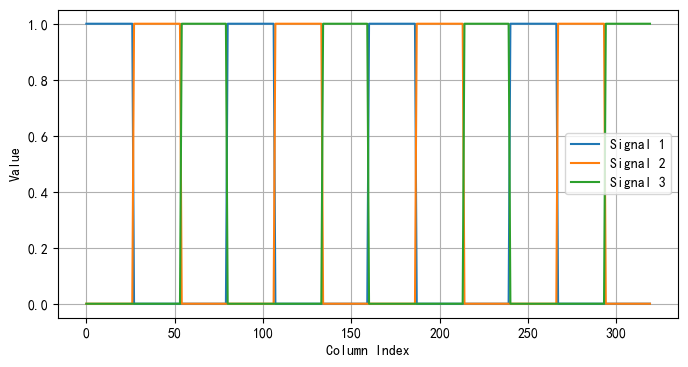
    


可以看到区域划分得非常好,不多也不少.

需要说明的是,因为是生成的平面数据,所以三个区域是等分的,但是在实际测量时不一定是等分的.


```python
# 通过掩码提取phi1和phi3的有效部分
phi1 = phase1 * phi1_mask
phi3 = phase3 * phi3_mask

visualize_patterns_curve([phi1[height//2, 0:4*fringe_width], phi3[height//2, 0:4*fringe_width]])
```


    
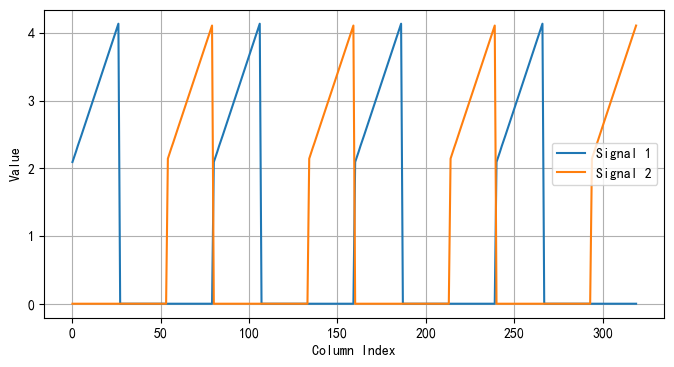
    


```python
# 计算k_l和k_h
k_l = index_map * phi1_mask
k_h = index_map * phi3_mask

visualize_patterns_curve([k_l[height//2, 0:4*fringe_width], k_m[height//2, 0:4*fringe_width], k_h[height//2, 0:4*fringe_width], index_map[height//2, 0:4*fringe_width]], labels=['k_l', 'k_m', 'k_h', 'Index Map'])
```


    
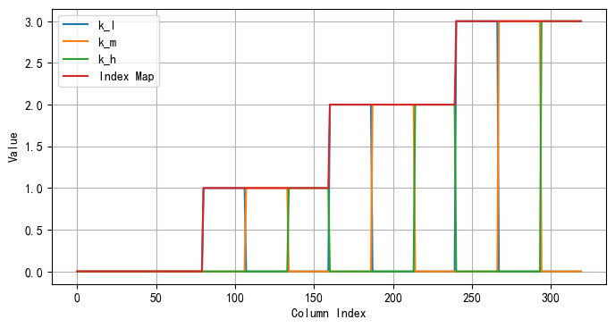
    


可以看到相位顺序很好地被区分成$k_l,k_m,k_l$三个部分


```python
# 通过k_l, k_m, k_h进行相位展开
unwrapped_phase1 = np.where(phi1 == 0, 0, phi1 + 2 * np.pi * k_l - 2 * np.pi / 3)
unwrapped_phase2 = np.where(phi2 == 0, 0, phi2 + 2 * np.pi * k_m)
unwrapped_phase3 = np.where(phi3 == 0, 0, phi3 + 2 * np.pi * k_h + 2 * np.pi / 3)

visualize_patterns_curve([unwrapped_phase1[height//2, 0:4*fringe_width], unwrapped_phase2[height//2, 0:4*fringe_width], unwrapped_phase3[height//2, 0:4*fringe_width]], labels=['Unwrapped Phase1', 'Unwrapped Phase2', 'Unwrapped Phase3'])
```


    
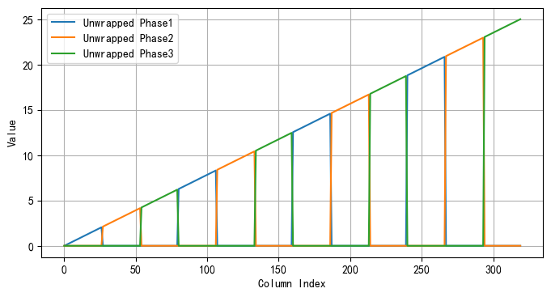
    


```python
# 合并三部分展开的相位
unwrapped_phase = unwrapped_phase1 + unwrapped_phase2 + unwrapped_phase3

visualize_patterns_curve([unwrapped_phase[height//2, :]], labels=['Unwrapped Phase'])
visualize_patterns_3d(unwrapped_phase, elev=30, azim=-90)
```


    
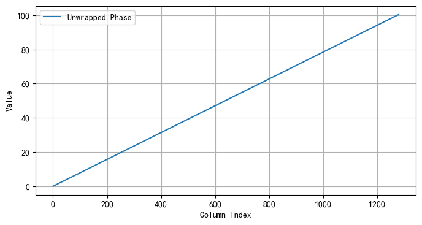
    


    

    


## Time-Overlapping Gray-Code Coding Strategy

正常格雷码投影是投影完相移条纹,紧接着就应该投影格雷码.

原本是要投影6张格雷码图片(包括全黑全白).但是全黑和全白是为了确定阈值的,通过对相移条纹取平均就能省去这两幅图片.

所以按照正常步骤来,格雷码投影要投$(3+4)$
- 3张相移图
- 4张格雷码图

如果采用互补格雷码,还要额外投影一张格雷码.

时间重叠技术就是将原本连续投影的格雷码图片分开投影,投完相移条纹之后,就只投一张格雷码,当时是按顺序投影.

程序需要存储前三幅格雷码图,再加入当前时刻的格雷码图,刚好四幅,就能得到相位顺序.

此时,只要投影$(3+1)$

- 3张相移图
- 1张格雷码图
- 计算机要保存前三幅格雷码图

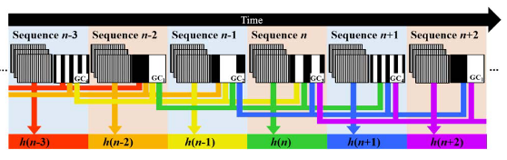

但是, 投影速率要远大于物体运动的速率,这样得到的相位顺序才有意义.

论文中采用的投影速率的量级在kHZ.

论文中说,包裹相位和相位顺序失配不超过$\frac{1}{3}$周期时,tri-pu方法效果良好.

由于没数据就不用代码实现了.~~其实就是懒~~

个人见解, 当前深度学习单帧重建非常火热, 能够使用深度学习完成单帧重建, 就不用考虑传统相移法(包括格雷码法和多频外差法,当然这些在生成标签中还是有很重要的作用).时间重叠就是能少投一张就少投一张, 单帧重建就不考虑这些.


