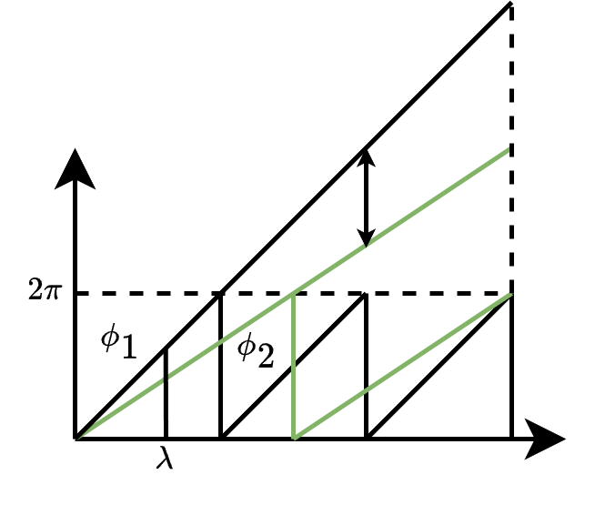
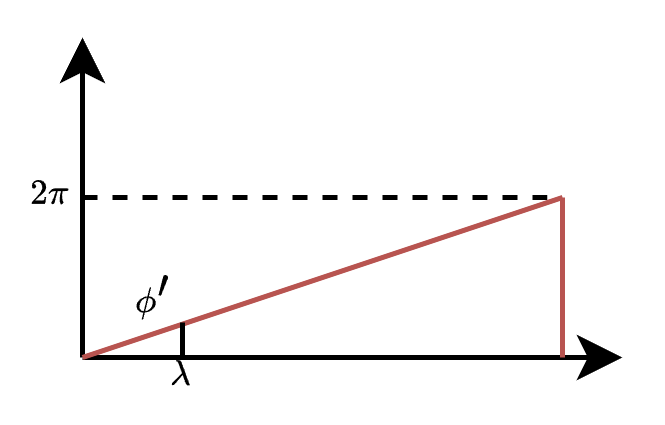
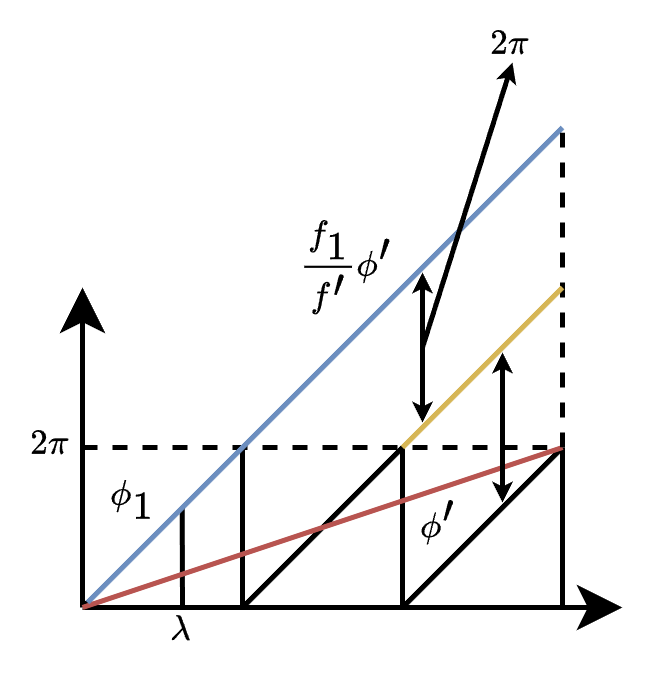
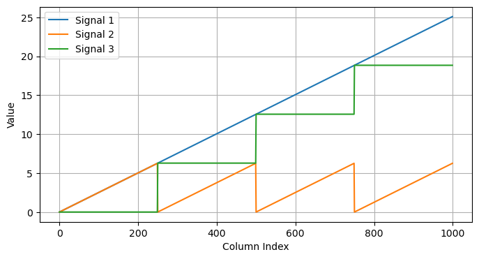
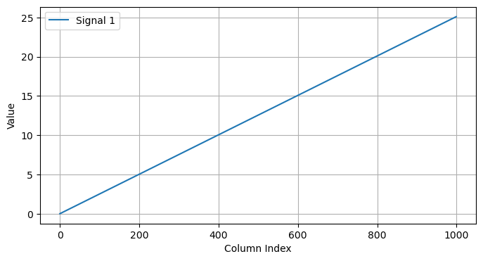

## 多频外差法

### 数学原理推导

现有两个歧义相位$\phi_1$和$\phi_2$

分别设频率为$f_1,f_2(f_1>f_2)$,波长$\lambda_1,\lambda_2(\lambda_1<\lambda_2)$

$\phi_1$和$\phi_2$如下图所示



将两个相位做差,可以得到${\phi}'$,为了使${\phi}'\in [0, 2\pi]$

可以进行如下操作

$$
{\phi}'=
\begin{cases}
 \phi_1 - \phi_2,\;if \;\phi_1 \ge \phi_2
 \\
 \phi_1 - \phi_2+2\pi,\;if \;\phi_1 < \phi_2
\end{cases}
$$

${\phi}'$不是绝对相位相减,而是绝对相位相减后的歧义相位,也就是相减后相位对$2\pi$取模
绝对相位相减

$$
\begin{align*}
\varphi' &= \varphi_1 - \varphi_2 \\
&= \phi_1+2\pi n_1 - (\phi_2+2\pi n_2) \\
&= \phi_1-\phi_2 + 2\pi(n_1-n_2)
\end{align*}
$$

得到的${\phi}'$如下图



在同一$\lambda$处有以下等式

$$
\begin{align*}
\frac{\phi_1}{\lambda} &= \frac{2\pi}{\lambda_1} \\\\
\frac{\phi_2}{\lambda} &= \frac{2\pi}{\lambda_2} \\\\
\frac{\phi'}{\lambda} &= \frac{2\pi}{\lambda'} 
\end{align*}
$$
根据图像可知

$$
\begin{align*}
\phi'&=\phi_1-\phi_2\\
&= \lambda\frac{2\pi}{\lambda_1}-\lambda\frac{2\pi}{\lambda_2}
\end{align*}
$$
所以
$$
\begin{align*}
\frac{1}{\lambda'} &= \frac{1}{\lambda_1} - \frac{1}{\lambda_2} \\\\
\lambda' &= \frac{\lambda_1\lambda_2}{\lambda_2-\lambda_1} \\\\
f' &= f_1 - f_2
\end{align*}
$$

要想得到无歧义的相位,就要保证$\lambda'>W$

然而我们得到无歧义的相位之后尽量还是使用原始数据
现在问题转换成怎么通过无歧义的相位$\phi'$找到原始数据(一般取高频)的n(也可以称为阶数)



由上面的等式,可以推导出

$$
\begin{align*}
\phi_1 \lambda_1 &= 2\pi\lambda \\\\
\phi' \lambda' &= 2\pi\lambda \\\\
\phi_1 \lambda_1 &= \phi' \lambda'
\end{align*}
$$

又$\lambda = \frac{1}{f}$,所以

$$
\begin{align*}
\frac{\phi_1}{f_1} &= \frac{\phi'}{f'} \\\\
\phi_1 &= \frac{f_1}{f'}\phi'
\end{align*}
$$

所以
$$
\varphi_1 = \phi_1 + 2\pi \text{Round}(\frac{\frac{f_1}{f'}\phi'-\phi_1}{2\pi})
$$

- $\text{Round}(*)$是向下取整函数,除$2\pi$是为了换算到整数

### 代码验证

```python
import numpy as np
import matplotlib.pyplot as plt
from typing import List
import warnings
warnings.filterwarnings('ignore')
```


```python
# 生成歧义相位数据
def generate_phase(cycles: float, num_points: int = 1000) -> np.ndarray:
    phase = np.linspace(0, cycles * 2 * np.pi, num_points, endpoint=False)
    phase = (phase + np.pi) % (2 * np.pi) - np.pi
    return phase
```


```python
# 显示相位数据
def visualize_patterns_curve(data: List[np.ndarray], labels: List[str] = None, title: str = None):
    # 绘制这行数据
    plt.figure(figsize=(8, 4))
    for idx, series in enumerate(data):
        label = labels[idx] if labels and idx < len(labels) else f'Signal {idx+1}'
        plt.plot(series, label=label)
    if title:
        plt.title(title)
    plt.xlabel('Column Index')
    plt.ylabel('Value')
    plt.legend()
    plt.grid(True)
    plt.show()
```


```python
# 合成相位等于图像宽度

cycles1 = 3  # 第一个频率周期数
cycles2 = 4  # 第二个频率周期数

num_points = 1000

period1 = num_points / cycles1
period2 = num_points / cycles2main_files

phase1 = generate_phase(cycles1, num_points=num_points)
phase2 = generate_phase(cycles2, num_points=num_points)

phase3 = np.where(phase2 >= phase1, phase2-phase1, phase2 - phase1 + 2 * np.pi)

period3 = (period1 * period2) / abs(period1 - period2)

print(f"Period 1: {period1}, Period 2: {period2}, Combined Period: {period3}")

visualize_patterns_curve([phase1, phase2, phase3])
```

    Period 1: 333.3333333333333, Period 2: 250.0, Combined Period: 1000.0000000000001


    

    


```python
# 合成相位小于图像宽度

cycles1 = 12  # 第一个频率周期数
cycles2 = 16  # 第二个频率周期数

num_points = 1000

period1 = num_points / cycles1
period2 = num_points / cycles2

phase1 = generate_phase(cycles1, num_points=num_points)
phase2 = generate_phase(cycles2, num_points=num_points)

phase4 = np.where(phase2 >= phase1, phase2-phase1, phase2 - phase1 + 2 * np.pi)

period4 = (period1 * period2) / abs(period1 - period2)

print(f"Period 1: {period1}, Period 2: {period2}, Combined Period: {period4}")

visualize_patterns_curve([phase1, phase2, phase4])
```

    Period 1: 83.33333333333333, Period 2: 62.5, Combined Period: 250.00000000000003


    

    


```python
visualize_patterns_curve([phase3, phase4])
```


    

    


```python
phase3_ = period3*phase3/period4
visualize_patterns_curve([phase3_, phase4])
```


    

    


```python
phase_n = phase3_ - phase4
visualize_patterns_curve([phase3_, phase4, phase_n])
```


    

    


```python
phase = phase4 + np.round(phase_n/(2*np.pi))*2*np.pi
visualize_patterns_curve([phase])
```
    

