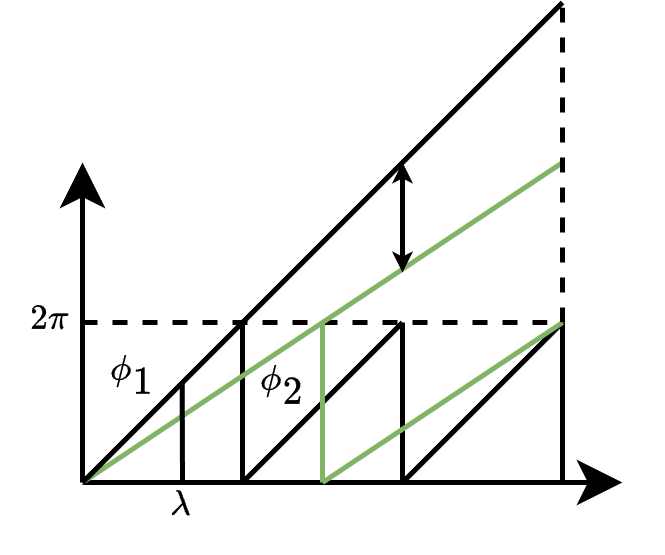
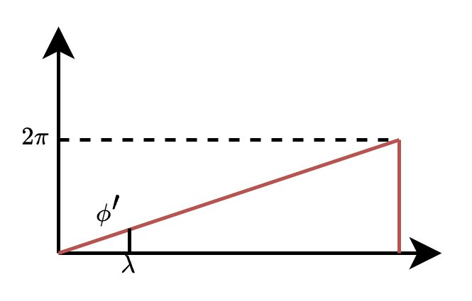
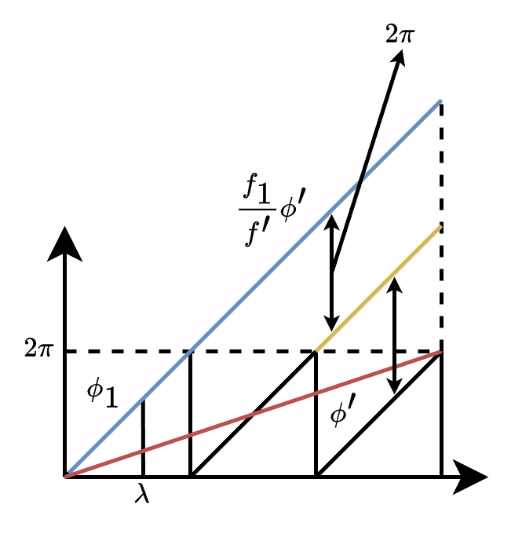
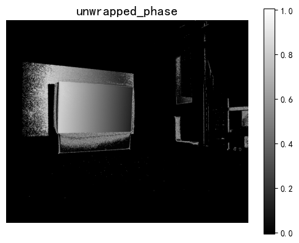
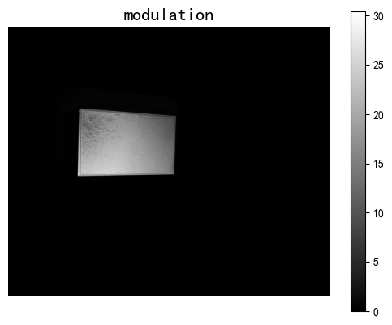
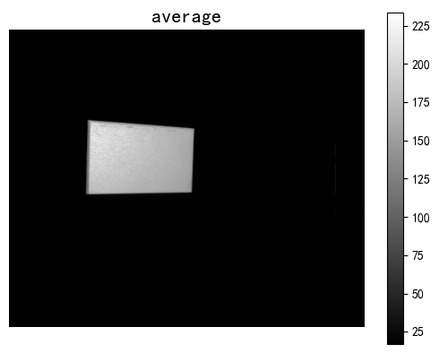

# 多频外差法
## 原理推导
现有两个歧义相位$\phi_1$和$\phi_2$

分别设频率为$f_1,f_2(f_1>f_2)$,波长$\lambda_1,\lambda_2(\lambda_1<\lambda_2)$

$\phi_1$和$\phi_2$如下图所示



将两个相位做差,可以得到${\phi}'$,为了使${\phi}'\in [0, 2\pi]$

可以进行如下操作

$$
{\phi}'=
\begin{cases}
 \phi_1 - \phi_2,\;if \;\phi_1 \ge \phi_2
 \\
 \phi_1 - \phi_2+2\pi,\;if \;\phi_1 < \phi_2
\end{cases}
$$

${\phi}'$不是绝对相位相减,而是绝对相位相减后的歧义相位,也就是相减后相位对$2\pi$取模
绝对相位相减

$$
\begin{align*}
\varphi' &= \varphi_1 - \varphi_2 \\
&= \phi_1+2\pi n_1 - (\phi_2+2\pi n_2) \\
&= \phi_1-\phi_2 + 2\pi(n_1-n_2)
\end{align*}
$$

得到的${\phi}'$如下图



在同一$\lambda$处有以下等式

$$
\begin{align*}
\frac{\phi_1}{\lambda} &= \frac{2\pi}{\lambda_1} \\\\
\frac{\phi_2}{\lambda} &= \frac{2\pi}{\lambda_2} \\\\
\frac{\phi'}{\lambda} &= \frac{2\pi}{\lambda'} 
\end{align*}
$$
根据图像可知

$$
\begin{align*}
\phi'&=\phi_1-\phi_2\\
&= \lambda\frac{2\pi}{\lambda_1}-\lambda\frac{2\pi}{\lambda_2}
\end{align*}
$$
所以
$$
\begin{align*}
\frac{1}{\lambda'} &= \frac{1}{\lambda_1} - \frac{1}{\lambda_2} \\\\
\lambda' &= \frac{\lambda_1\lambda_2}{\lambda_2-\lambda_1} \\\\
f' &= f_1 - f_2
\end{align*}
$$

要想得到无歧义的相位，就要保证$\lambda'>W$

如果是用一幅图中有多少个周期来生成条纹的话，只需要满足最后计算的周期数小于或者等于1。

例如使用三频外差，可以使用61，70，80。
因为$$61+80-2\times70=1$$
方便的是，无论你的图像宽度是多少，都可以用这几个值。
然而我们得到无歧义的相位之后尽量还是使用原始数据
现在问题转换成怎么通过无歧义的相位$\phi'$找到原始数据(一般取高频)的n(也可以称为阶数)



由上面的等式,可以推导出

$$
\begin{align*}
\phi_1 \lambda_1 &= 2\pi\lambda \\\\
\phi' \lambda' &= 2\pi\lambda \\\\
\phi_1 \lambda_1 &= \phi' \lambda'
\end{align*}
$$

又$\lambda = \frac{1}{f}$,所以

$$
\begin{align*}
\frac{\phi_1}{f_1} &= \frac{\phi'}{f'} \\\\
\phi_1 &= \frac{f_1}{f'}\phi'
\end{align*}
$$

所以
$$
\varphi_1 = \phi_1 + 2\pi \text{Round}(\frac{\frac{f_1}{f'}\phi'-\phi_1}{2\pi})
$$

- $\text{Round}(*)$是四舍五入函数,除$2\pi$是为了换算到整数

### 代码验证

> 代码仓库：https://github.com/fazhehy/fpp

``` python
import sys
from pathlib import Path

p = Path.cwd().resolve().parent
sys.path.append(str(p))

from src.fpp import *
from src.utils import *

width, height = 2716, 1600

# 多频外差法解包裹相位
cycles_list = [36, 55, 75]
unwrapped_phase, modulation, average = decode_multiple_cycles_patterns(
    "../images/multiple_cycles/", n_steps=12, cycles_list=cycles_list)

show_image(unwrapped_phase, "unwrapped_phase")
show_image(modulation, "modulation")
show_image(average, "average")
```




