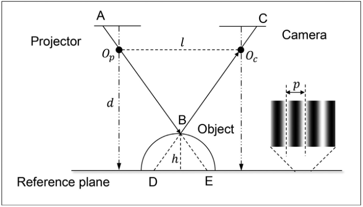
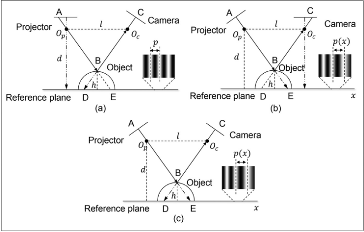
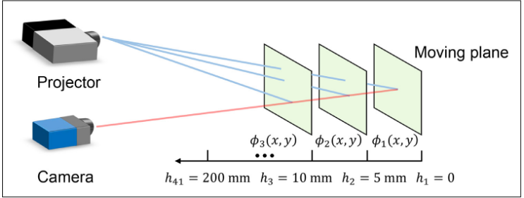
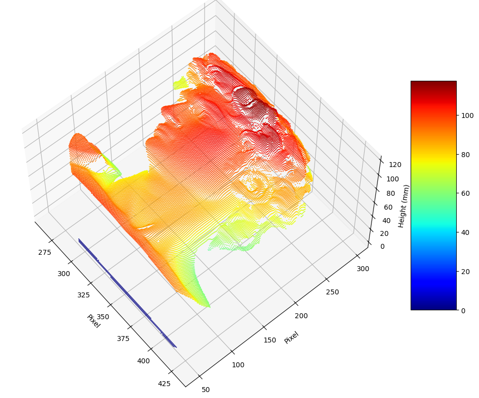
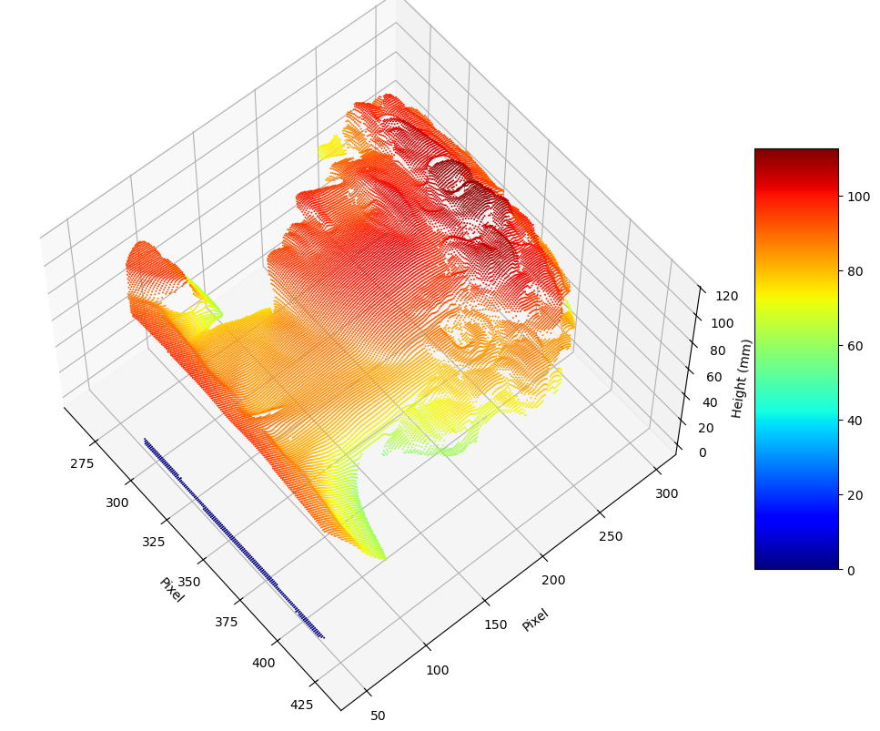
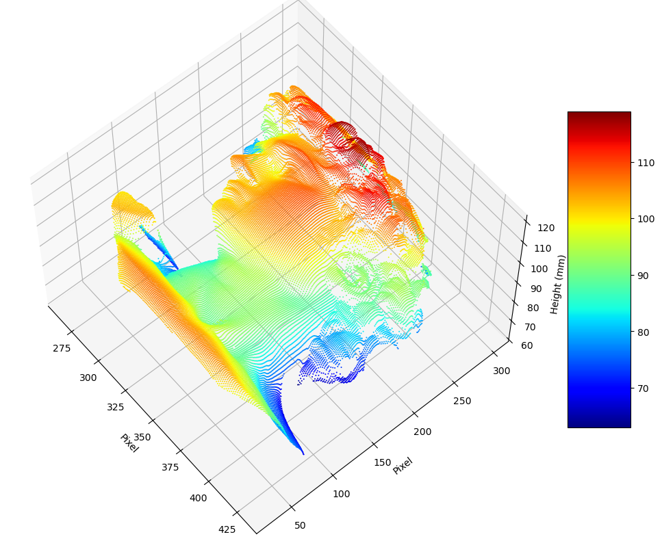

## 条纹投影标定

主要分为相高法和逆相机法,本文主要介绍相高法.

本文主要参考

> Feng, Shijie, Chao Zuo, Liang Zhang, 等. 《Calibration of Fringe Projection Profilometry: A Comparative Review》. Optics and Lasers in Engineering 143 (2021年8月): 106622. 

本文采用的数据来自于这篇论文,程序也是参考这篇论文.

### 经典相高法

原理示意图如下



注意:
- 投影仪和相机光轴要保持平行, 并垂直于参考平面
- 投影仪和相机要处于同一高度平面

根据三角形相似,

$$
h = \frac{\overline{\text{DE}}\cdot d}{l + \overline{\text{DE}}} \tag{1}
$$

$\overline{\text{DE}}$和相位差有一个比例关系,

$$
\overline{\text{DE}} = \frac{\Phi_D-\Phi_E}{2\pi}p = \frac{\Phi_{DE}}{2\pi}p
$$

其中,
- $p$是条纹一个周期的物理宽度.

$$
h = \frac{\Phi_{DE}\cdot p \cdot d}{\Phi_{DE}\cdot p + 2\pi l}
$$

其中, $p, l, d$是要通过标定计算的参数.

然而光轴平行并不容易满足,所以下面讨论光轴不平行的情况.



总共分为三种情况:


1. 相机光轴不垂直参考平面
2. 投影仪光轴不垂直参考平面
3. 相机光轴和投影仪光轴都不垂直参考平面

对于第一种情况,并不会影响条纹投影,故不用改变高度公式.
而对于第二三种情况,由于投影仪倾斜,条纹宽度不再相等,而是一个随$x$变化的函数.

于是高度公式就变换成,

$$
h = \frac{\Phi_{DE}\cdot p(x) \cdot d}{\Phi_{DE}\cdot p(x) + 2\pi l} \tag{2}
$$

相高法要解决的问题就是怎么更好地拟合这个公式.

### 线性相高模型

在一些情况下,相机和投影仪之间的距离远大于物体高度,此时公式1可以变换成

$$
h \approx \frac{\overline{\text{DE}}\cdot d}{l} = \frac{p\cdot d}{2\pi l}\Phi_{DE} = k \Phi_{DE}, \text{if} \; l \gg \overline{\text{DE}}
$$

令$\bigtriangleup \Phi(x, y)= \Phi_{DE}(x,y)$,

$$
h(x,y)=k(x,y)\bigtriangleup \Phi(x, y)
$$

我们只要计算出k就能得到标定模型.


```python
import scipy.io as sio
import numpy as np
import matplotlib.pyplot as plt
```

数据说明



如上图,通过移动参考平面和相位展开,得到每个位置的相位数据


```python
# 读取数据 
load_data = sio.loadmat('./data/up_all.mat')

up_all = load_data['up_all']
ref_heights = load_data['ref_heights']

ref_heights
```


    array([[  0],
           [ 10],
           [ 20],
           [ 30],
           [ 40],
           [ 50],
           [ 60],
           [ 70],
           [ 80],
           [ 90],
           [100]], dtype=uint8)


```python
# 统计非NaN数据总数, NaN就是调制度较低的点
non_nan_count = np.count_nonzero(~np.isnan(up_all))
total_count = up_all.size
nan_count = np.count_nonzero(np.isnan(up_all))

print(f"总数据点数: {total_count}")
print(f"非NaN数据点数: {non_nan_count}")
print(f"NaN数据点数: {nan_count}")
print(f"非NaN比例: {non_nan_count/total_count*100:.2f}%")
```

    总数据点数: 3379200
    非NaN数据点数: 780271
    NaN数据点数: 2598929
    非NaN比例: 23.09%


```python
# 设置参数
n_ord = 1
img_width = 640
img_height = 480
```


```python
delta_up_all = up_all - up_all[:, :, 0:1]
coeff_all = np.zeros((img_height, img_width, n_ord+1))
y_height = ref_heights

for i in range(img_height):
    for j in range(img_width):
        x_delta_phi = np.reshape(delta_up_all[i, j, :], (len(delta_up_all[i, j, :]), 1))
        valid = ~np.isnan(x_delta_phi)
        valid_sum = sum(valid)
        if valid_sum >= n_ord+1:
            x_valid_phi = x_delta_phi[valid]
            y_valid_height = y_height[valid]
            # 一阶多项式拟合
            p = np.polyfit(x_valid_phi, y_valid_height, n_ord)
            coeff_all[i, j, :] = p
```


```python
# 读取测试数据
load_data = sio.loadmat('./data/up_test_obj.mat')
up_test_obj = load_data['up_test_obj']
```


```python
# 通过线性相高模型计算高度
delta_up = up_test_obj - up_all[:, :, 1]
height_est = np.zeros((img_height, img_width))
for i in range(img_height):
    for j in range(img_width):
        p = np.reshape(coeff_all[i, j, :], (n_ord+1, 1))
        x_test_phi = delta_up[i, j]
        x_test_height = np.polyval(p, x_test_phi)
        height_est[i, j] = x_test_height.item()
```


```python
def show_height_map(height_map, elev=60, azim=-40):

    height_flipped = np.flip(height_map)

    fig = plt.figure(figsize=(10, 8))
    ax = fig.add_subplot(111, projection='3d')
    # 获取数据形状
    rows, cols = height_est.shape
    # 创建坐标网格
    x_coords, y_coords = np.meshgrid(np.arange(cols), np.arange(rows))

    x_flat = x_coords.flatten()
    y_flat = y_coords.flatten()
    z_flat = height_flipped.flatten()

    # 绘制点云图
    scatter = ax.scatter(x_flat, y_flat, z_flat, 
                        c=z_flat,           # 根据高度着色
                        cmap='jet',     # 颜色映射
                        s=2,               # 点的大小
                        alpha=1,         # 透明度
                        edgecolor='none')  # 无边缘颜色

    ax.set_xlabel('Pixel')
    ax.set_ylabel('Pixel')
    ax.set_zlabel('Height (mm)')

    fig.colorbar(scatter, ax=ax, shrink=0.6, aspect=5)

    ax.view_init(elev=elev, azim=azim)
    plt.tight_layout()
    plt.show()
```


```python
show_height_map(height_est, elev=60, azim=-40)
```


    

    


### 逆线性相高模型

将公式2取个倒数,可以将公式2改写成

$$
\frac{1}{h(x,y)}=a(x,y)+b(x,y)\frac{1}{\bigtriangleup \Phi(x, y)}
$$

也可以将上式重新排列成
$$
\bigtriangleup \Phi(x, y) = h(x,y)\bigtriangleup \Phi(x, y)a(x,y)+h(x,y)b(x,y)
$$

将$a(x,y), b(x,y)$视为未知量,上式可以看成关于$a(x,y), b(x,y)$的线性方程组,可以通过最小二乘法来拟合出参数.

此方法释放了严格的几何限制.


```python
# 读取数据 
load_data = sio.loadmat('./data/up_all.mat')

up_all = load_data['up_all']
ref_heights = load_data['ref_heights']

# 设置参数
img_width = 640
img_height = 480
```


```python
delta_up_all = up_all - up_all[:, :, 0:1]
coeff_all = np.zeros((img_height, img_width, 2))
```


```python
for i in range(1, img_height):
    for j in range(1, img_width):
        A_lst = []
        b_lst = []
        for h in range(1, len(ref_heights)):
            if not np.isnan(delta_up_all[i, j, h]):
                A_row = [ref_heights[h]*delta_up_all[i, j, h], ref_heights[h]]
                b_row = delta_up_all[i, j, h]
                A_lst.append(A_row)
                b_lst.append(b_row)

        if len(A_lst) >= 2:
            A = np.array(A_lst).squeeze()
            b = np.array(b_lst).squeeze()

            try:
                rank = np.linalg.matrix_rank(A)
                # 最小二乘法求解
                x, residuals, rank, s = np.linalg.lstsq(A, b, rcond=None)
                coeff_all[i, j, 0] = x[0]
                coeff_all[i, j, 1] = x[1]
                
            except np.linalg.LinAlgError:
                print('fail')
```


```python
# 读取测试数据
load_data = sio.loadmat('./data/up_test_obj.mat')
up_test_obj = load_data['up_test_obj']
```


```python
delta_up = up_test_obj - up_all[:, :, 1]
height_est = np.zeros((img_height, img_width))

for i in range(img_height):
    for j in range(img_width):
        coeff_a = coeff_all[i, j, 0]
        coeff_b = coeff_all[i, j, 1]

        height_est[i, j] = 1 / (coeff_a + coeff_b * 1 / (delta_up[i, j]))
```

    /tmp/ipykernel_50600/1597592474.py:9: RuntimeWarning: divide by zero encountered in scalar divide
      height_est[i, j] = 1 / (coeff_a + coeff_b * 1 / (delta_up[i, j]))


```python
show_height_map(height_est, elev=60, azim=-40)
```


    

    


### 多项式相高模型

根据公式
$$
h = \frac{\bigtriangleup \Phi(x, y)\cdot p(x) \cdot d}{\bigtriangleup \Phi(x, y)\cdot p(x) + 2\pi l} 
$$

可知,高度公式是一个关于$\bigtriangleup \Phi(x, y)$的函数.通过泰勒公式,可以将上式展开成多项式函数.

$$
h(x,y) = \sum_{i=0}^{n}a_i(x,y)\bigtriangleup \Phi(x, y)^i
$$

参数$a_i(x,y)$就是我们要标定的参数.


```python
import scipy.io as sio
import numpy as np
import matplotlib.pyplot as plt
```


```python
load_data = sio.loadmat('./data/up_all.mat')
up_all = load_data['up_all']
ref_heights = load_data['ref_heights']
```


```python
n_ord = 3
img_width = 640
img_height = 480
```


```python
delta_up_all = up_all - up_all[:, :, 0:1]
coeff_all = np.zeros((img_height, img_width, n_ord+1))

y_height = ref_heights

for i in range(img_height):
    for j in range(img_width):
        x_delta_phi = np.reshape(delta_up_all[i, j, :], (len(delta_up_all[i, j, :]), 1))
        valid = ~np.isnan(x_delta_phi)
        valid_sum = sum(valid)
        if valid_sum >= n_ord+1:
            x_valid_phi = x_delta_phi[valid]
            y_valid_height = y_height[valid]
            # n_ord阶多项式拟合
            p = np.polyfit(x_valid_phi, y_valid_height, n_ord)
            coeff_all[i, j, :] = p
```


```python
load_data = sio.loadmat('./data/up_test_obj.mat')
up_test_obj = load_data['up_test_obj']
```


```python
delta_up = up_test_obj - up_all[:, :, 1]
height_est = np.zeros((img_height, img_width))
for i in range(img_height):
    for j in range(img_width):
        p = np.reshape(coeff_all[i, j, :], (n_ord+1, 1))
        x_test_phi = delta_up[i, j]
        x_test_height = np.polyval(p, x_test_phi)
        height_est[i, j] = x_test_height.item()
```


```python
show_height_map(height_est, elev=60, azim=-40)
```


    

    


### 控制方程相高模型

根据控制方程,高度可以写成如下形式,(为什么可以我也不知道)

$$
h(x,y) = \frac{C_0+C_1\Phi(x,y)+[C_2+C_3\Phi(x,y)]x+[C_4+C_5\Phi(x,y)]y}{D_0+D_1\Phi(x,y)+[D_2+D_3\Phi(x,y)]x+[D_4+D_5\Phi(x,y)]y}
$$

注意:
- 公式是关于相位的函数,而不是相位差
- 通过Levenberg-Marquardt算法来计算参数


```python
import scipy.io as sio
import numpy as np
import matplotlib.pyplot as plt
from scipy.optimize import least_squares
```


```python
load_data = sio.loadmat('./data/up_all.mat')
up_all = load_data['up_all']
ref_heights = load_data['ref_heights']
```


```python
img_width = 640
img_height = 480
```


```python
# 通过最小二乘法计算初始点
X = []
Z = []
A_all = []
n_pos = 11

# 转换up_all为浮点数类型
if up_all.dtype != np.float64:
    up_all = up_all.astype(np.float64)

for n in range(n_pos):
    h = ref_heights[n].item()
    for i in range(0, img_height, 10):
        for j in range(0, img_width, 10):

            if not np.isnan(up_all[i, j, n]):

                u = float(j)
                v = float(i)
                z = float(h)
                phi = float(up_all[i, j, n])

                A_row = [phi, u, phi*u, v, phi*v, -z, -phi*z, -u*z, -phi*u*z, -v*z, -phi*v*z]
                A_all.append(A_row)

                X.append([j, i, up_all[i, j, n]])
                Z.append([h])

b = -np.ones((len(Z), 1))
A = np.array(A_all).squeeze()
X = np.array(X).squeeze()
Z = np.array(Z).squeeze()

try:
    x, residuals, rank, s = np.linalg.lstsq(A, b, rcond=None)
except np.linalg.LinAlgError:
    print('fail')
```


```python
# 定义拟合函数
def fit_fun(params, X):
    """
    params: [C1, C2, C3, C4, C5, D0, D1, D2, D3, D4, D5]
    X: 输入数据，形状为(N, 3)，每行是[u, v, phi]
    返回: 计算的高度值
    """
    C1, C2, C3, C4, C5, D0, D1, D2, D3, D4, D5 = params
    
    u = X[:, 0]  # j
    v = X[:, 1]  # i
    phi = X[:, 2]  # phase
    
    # 根据Eq. (13)计算z
    numerator = 1 + C1*phi + C2*u + C3*phi*u + C4*v + C5*phi*v
    denominator = D0 + D1*phi + D2*u + D3*phi*u + D4*v + D5*phi*v
    
    # 防止除以零
    denominator = np.where(np.abs(denominator) < 1e-12, 1e-12, denominator)
    
    return numerator / denominator

# 定义残差函数
def residuals(params, X, Z):
    """
    计算残差: fit_fun(params, X) - Z
    """
    return fit_fun(params, X) - Z.flatten()
```


```python
# 使用levenberg-marquardt算法
param_ini = np.array(x).squeeze()  # 初始参数，根据实际情况设置
bounds = (-np.inf, np.inf)  # 无约束

# 调用最小二乘优化
result = least_squares(
    residuals,                   # 残差函数
    param_ini,                   # 初始参数
    args=(X, Z),                 # 额外参数
    method='lm',                 # Levenberg-Marquardt算法
    ftol=1e-9,                   # 函数容差，对应StepTolerance
    max_nfev=10000,              # 最大函数评估次数
    verbose=1                    # 显示优化过程（可选）
)

# 提取结果
param = result.x                 # 优化后的参数
residual = result.fun            # 残差向量
resnorm = np.sum(residual**2)    # 残差平方和
exitflag = result.status         # 退出状态
success = result.success         # 是否成功

print(f"优化状态: {success}")
print(f"退出标志: {exitflag}")
print(f"残差平方和: {resnorm}")
print(f"优化后的参数: {param}")
```

    `ftol` termination condition is satisfied.
    Function evaluations 37, initial cost 2.1821e+01, final cost 2.1590e+01, first-order optimality 5.67e+06.
    优化状态: True
    退出标志: 2
    残差平方和: 43.17962716938368
    优化后的参数: [-5.80091611e-02  3.47254821e-02 -2.36561560e-05  1.90839773e-04
     -2.53891811e-06 -1.74711981e-02 -7.99270879e-05  5.10376526e-05
     -3.74006104e-08 -4.26430193e-07 -3.21710578e-09]


```python
load_data = sio.loadmat('./data/up_test_obj.mat')
up_test_obj = load_data['up_test_obj']
```


```python
x_grid, y_grid = np.meshgrid(np.arange(1, img_width + 1), np.arange(1, img_height + 1))

X_input = np.zeros((img_height * img_width, 3))

X_input[:, 0] = x_grid.ravel()
X_input[:, 1] = y_grid.ravel()
X_input[:, 2] = up_test_obj.ravel()

height_est = fit_fun(param, X_input)

height_est = np.reshape(height_est, (img_height, img_width))
```


```python
show_height_map(height_est, elev=60, azim=-40)
```


    

    

