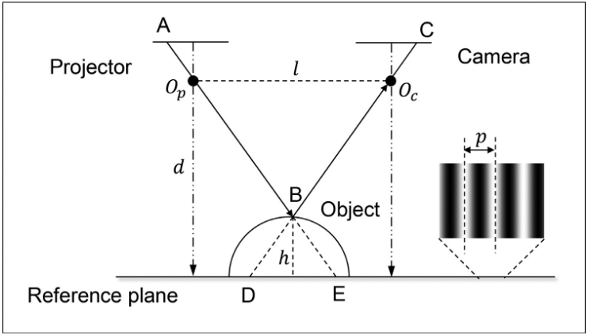
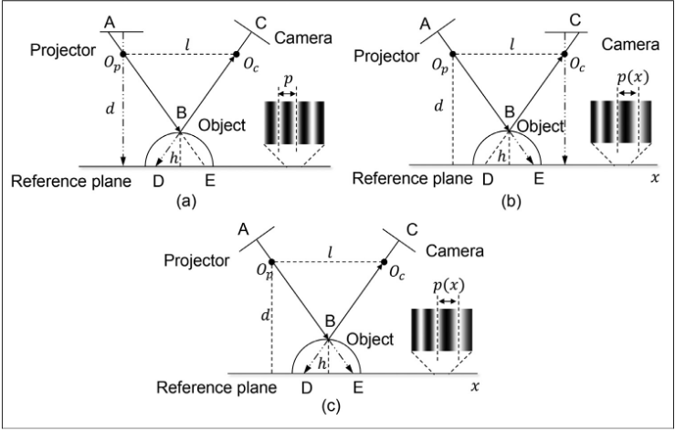
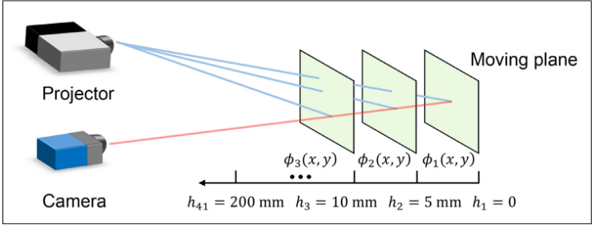
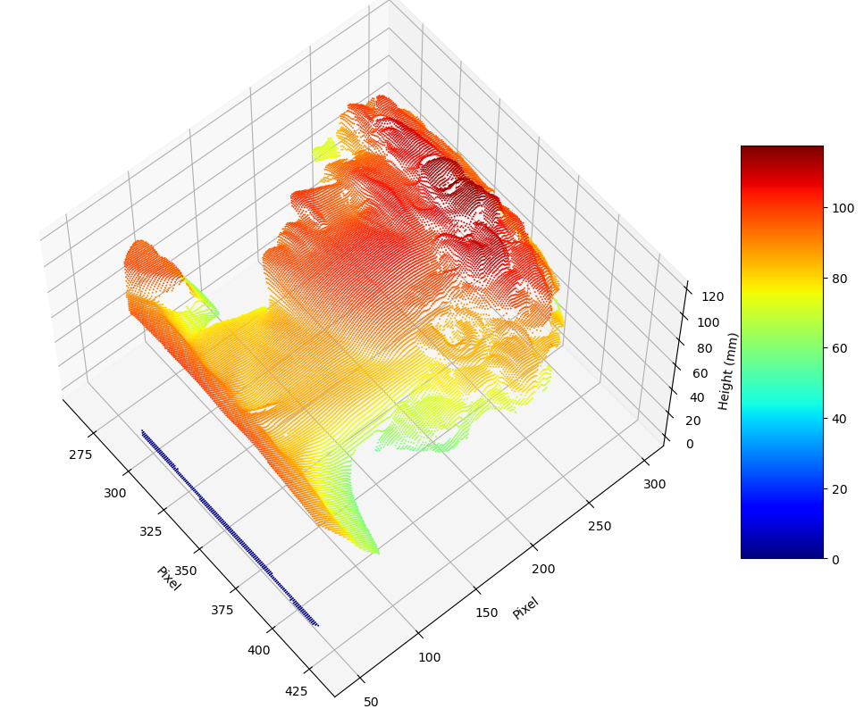
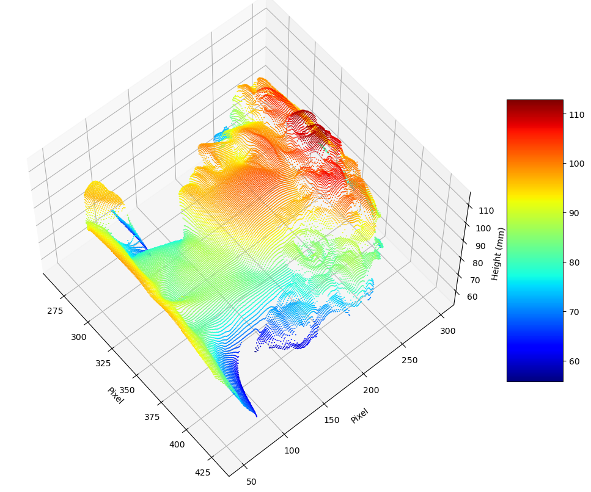
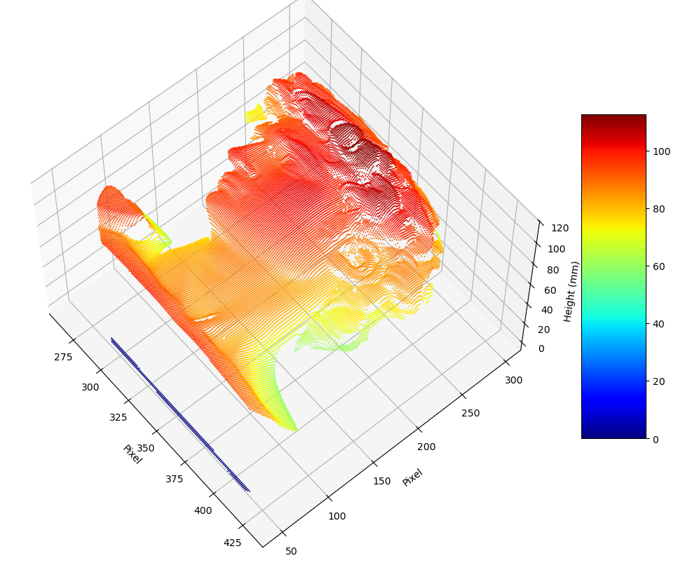
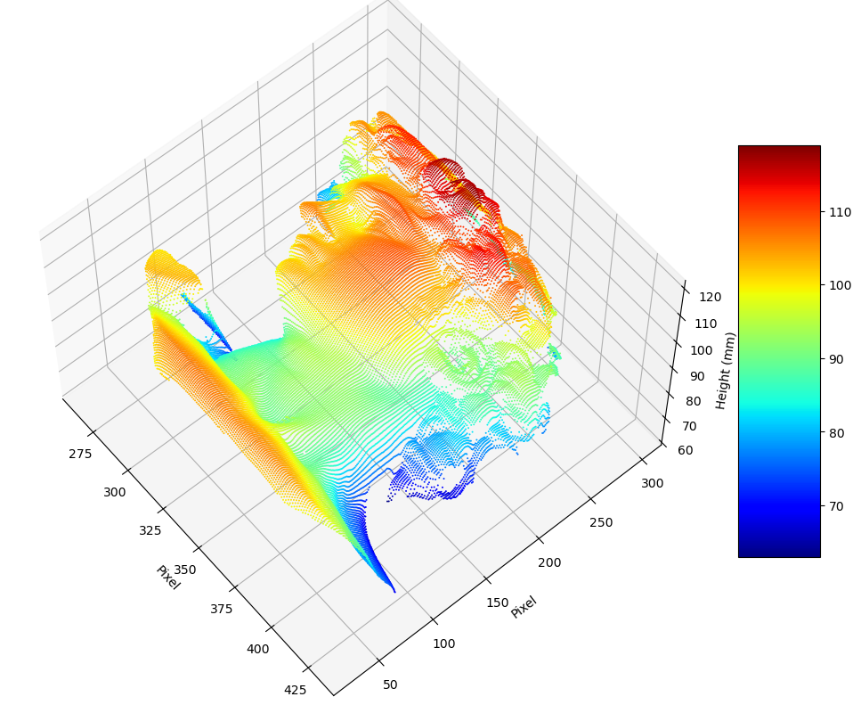

# 条纹投影标定

主要分为相高法和逆相机法，本文主要介绍相高法，参考以下论文：

> Feng, Shijie, Chao Zuo, Liang Zhang, 等. 《Calibration of Fringe Projection Profilometry: A Comparative Review》. Optics and Lasers in Engineering 143 (2021年8月): 106622.

## 经典相高法

原理示意图如下：



注意：
- 投影仪和相机光轴要保持平行，并垂直于参考平面
- 投影仪和相机要处于同一高度平面

根据三角形相似：

$$
h = \frac{l \cdot \overline{\text{DE}}}{d + \overline{\text{DE}}} \tag{1}
$$

$\overline{\text{DE}}$ 和相位差有一个比例关系：

$$
\overline{\text{DE}} = \frac{\Phi_D-\Phi_E}{2\pi}p = \frac{\Phi_{DE}}{2\pi}p
$$

其中 $p$ 是条纹一个周期的物理宽度。代入式 (1) 得：

$$
h = \frac{l \cdot \Phi_{DE} \cdot p}{2\pi d + \Phi_{DE} \cdot p}
$$

其中 $p, l, d$ 是要通过标定计算的参数。

然而光轴平行并不容易满足。下面讨论光轴不平行的情况：



分三种情况：

1. 相机光轴不垂直参考平面
2. 投影仪光轴不垂直参考平面
3. 相机光轴和投影仪光轴都不垂直参考平面

第一种情况不影响条纹投影，不必改变高度公式。
第二、三种情况由于投影仪倾斜，条纹宽度不再相等，而是一个随 $x$ 变化的函数，高度公式变换为：

$$
h = \frac{l \cdot \Phi_{DE} \cdot p(x)}{2\pi d + \Phi_{DE} \cdot p(x)} \tag{2}
$$

相高法要解决的问题就是怎么更好地拟合这个公式。

## 线性相高模型

当 $d \gg \overline{\text{DE}}$ 时，式 (1) 可近似为：

$$
h \approx \frac{l}{d}\overline{\text{DE}} = \frac{p \cdot l}{2\pi d}\Phi_{DE} = k \Phi_{DE}
$$

令 $\bigtriangleup \Phi(x, y)= \Phi_{DE}(x,y)$，则：

$$
h(x,y)=k(x,y)\bigtriangleup \Phi(x, y)
$$

只要计算出 $k$ 就能得到标定模型。


```python
import scipy.io as sio
import numpy as np
import matplotlib.pyplot as plt

# 读取数据：移动参考平面得到的各位置相位数据
load_data = sio.loadmat('./data/up_all.mat')
up_all = load_data['up_all']
ref_heights = load_data['ref_heights']  # [0, 10, 20, ..., 100] mm

n_ord = 1
img_width, img_height = 640, 480
```




```python
delta_up_all = up_all - up_all[:, :, 0:1]
coeff_all = np.zeros((img_height, img_width, n_ord + 1))

for i in range(img_height):
    for j in range(img_width):
        x_delta_phi = delta_up_all[i, j, :].reshape(-1, 1)
        valid = ~np.isnan(x_delta_phi).flatten()
        if valid.sum() >= n_ord + 1:
            p = np.polyfit(x_delta_phi[valid].flatten(), ref_heights[valid].flatten(), n_ord)
            coeff_all[i, j, :] = p
```

```python
# 读取测试数据并计算高度
load_data = sio.loadmat('./data/up_test_obj.mat')
up_test_obj = load_data['up_test_obj']

delta_up = up_test_obj - up_all[:, :, 1]
height_est = np.zeros((img_height, img_width))
for i in range(img_height):
    for j in range(img_width):
        height_est[i, j] = np.polyval(coeff_all[i, j, :], delta_up[i, j])
```

```python
def show_height_map(height_map, elev=60, azim=-40):
    rows, cols = height_map.shape
    x_coords, y_coords = np.meshgrid(np.arange(cols), np.arange(rows))

    fig = plt.figure(figsize=(10, 8))
    ax = fig.add_subplot(111, projection='3d')
    scatter = ax.scatter(x_coords.flatten(), y_coords.flatten(),
                         np.flip(height_map).flatten(),
                         c=np.flip(height_map).flatten(),
                         cmap='jet', s=2, alpha=1, edgecolor='none')
    ax.set_xlabel('Pixel')
    ax.set_ylabel('Pixel')
    ax.set_zlabel('Height (mm)')
    fig.colorbar(scatter, ax=ax, shrink=0.6, aspect=5)
    ax.view_init(elev=elev, azim=azim)
    plt.tight_layout()
    plt.show()
```

```python
show_height_map(height_est, elev=60, azim=-40)
```


    


## 逆线性相高模型

将式 (2) 取倒数，可改写为：

$$
\frac{1}{h(x,y)}=a(x,y)+b(x,y)\frac{1}{\bigtriangleup \Phi(x, y)}
$$

整理成关于 $a, b$ 的线性方程：

$$
\bigtriangleup \Phi(x, y) = h(x,y)\bigtriangleup \Phi(x, y)a(x,y)+h(x,y)b(x,y)
$$

将 $a(x,y), b(x,y)$ 视为未知量，用最小二乘法拟合即可。此方法释放了严格的几何限制。


```python
load_data = sio.loadmat('./data/up_all.mat')
up_all = load_data['up_all']
ref_heights = load_data['ref_heights']

img_width, img_height = 640, 480

delta_up_all = up_all - up_all[:, :, 0:1]
coeff_all = np.zeros((img_height, img_width, 2))
```

```python
for i in range(img_height):
    for j in range(img_width):
        A_lst, b_lst = [], []
        for h in range(1, len(ref_heights)):
            if not np.isnan(delta_up_all[i, j, h]):
                A_lst.append([ref_heights[h] * delta_up_all[i, j, h], ref_heights[h]])
                b_lst.append(delta_up_all[i, j, h])

        if len(A_lst) >= 2:
            A = np.array(A_lst)
            b = np.array(b_lst)
            x, _, _, _ = np.linalg.lstsq(A, b, rcond=None)
            coeff_all[i, j, :] = x
```

```python
load_data = sio.loadmat('./data/up_test_obj.mat')
up_test_obj = load_data['up_test_obj']

delta_up = up_test_obj - up_all[:, :, 1]
height_est = np.zeros((img_height, img_width))
for i in range(img_height):
    for j in range(img_width):
        a, b = coeff_all[i, j]
        height_est[i, j] = 1 / (a + b / delta_up[i, j])
```

```python
show_height_map(height_est, elev=60, azim=-40)
```




## 多项式相高模型

高度公式是关于 $\bigtriangleup \Phi(x, y)$ 的函数，由泰勒展开：

$$
h(x,y) = \sum_{i=0}^{n}a_i(x,y)\bigtriangleup \Phi(x, y)^i
$$

参数 $a_i(x,y)$ 即为待标定系数。


```python
load_data = sio.loadmat('./data/up_all.mat')
up_all = load_data['up_all']
ref_heights = load_data['ref_heights']

n_ord = 3
img_width, img_height = 640, 480

delta_up_all = up_all - up_all[:, :, 0:1]
coeff_all = np.zeros((img_height, img_width, n_ord + 1))

for i in range(img_height):
    for j in range(img_width):
        x_delta_phi = delta_up_all[i, j, :].reshape(-1, 1)
        valid = ~np.isnan(x_delta_phi).flatten()
        if valid.sum() >= n_ord + 1:
            coeff_all[i, j, :] = np.polyfit(
                x_delta_phi[valid].flatten(), ref_heights[valid].flatten(), n_ord)
```

```python
load_data = sio.loadmat('./data/up_test_obj.mat')
up_test_obj = load_data['up_test_obj']

delta_up = up_test_obj - up_all[:, :, 1]
height_est = np.zeros((img_height, img_width))
for i in range(img_height):
    for j in range(img_width):
        height_est[i, j] = np.polyval(coeff_all[i, j, :], delta_up[i, j])
```

```python
show_height_map(height_est, elev=60, azim=-40)
```




## 控制方程相高模型

高度可写成关于绝对相位 $\Phi(x,y)$（非相位差）的有理函数：

$$
h(x,y) = \frac{C_0+C_1\Phi+[C_2+C_3\Phi]x+[C_4+C_5\Phi]y}{D_0+D_1\Phi+[D_2+D_3\Phi]x+[D_4+D_5\Phi]y}
$$

注意：
- 公式中是绝对相位，不是相位差
- 通过 Levenberg-Marquardt 算法计算参数

```python
import scipy.io as sio
import numpy as np
from scipy.optimize import least_squares

load_data = sio.loadmat('./data/up_all.mat')
up_all = load_data['up_all'].astype(np.float64)
ref_heights = load_data['ref_heights']

img_width, img_height = 640, 480
```

```python
# 构建最小二乘问题，获取 LM 算法初始值（每 10 像素采样）
X, Z, A_all = [], [], []
n_pos = 11

for n in range(n_pos):
    h = ref_heights[n].item()
    for i in range(0, img_height, 10):
        for j in range(0, img_width, 10):
            if not np.isnan(up_all[i, j, n]):
                u, v = float(j), float(i)
                phi = float(up_all[i, j, n])
                A_all.append([phi, u, phi*u, v, phi*v,
                             -h, -phi*h, -u*h, -phi*u*h, -v*h, -phi*v*h])
                X.append([j, i, phi])
                Z.append(h)

A = np.array(A_all)
X_arr = np.array(X)
Z_arr = np.array(Z)
b = -np.ones(len(Z))
x_init, _, _, _ = np.linalg.lstsq(A, b, rcond=None)
```

```python
def fit_fun(params, X_in):
    C1, C2, C3, C4, C5, D0, D1, D2, D3, D4, D5 = params
    u, v, phi = X_in[:, 0], X_in[:, 1], X_in[:, 2]
    num = 1 + C1*phi + C2*u + C3*phi*u + C4*v + C5*phi*v
    den = D0 + D1*phi + D2*u + D3*phi*u + D4*v + D5*phi*v
    den = np.where(np.abs(den) < 1e-12, 1e-12, den)
    return num / den

def residuals(params, X_in, Z_in):
    return fit_fun(params, X_in) - Z_in

result = least_squares(residuals, x_init, args=(X_arr, Z_arr),
                       method='lm', ftol=1e-9, max_nfev=10000)
param = result.x
```

```python
load_data = sio.loadmat('./data/up_test_obj.mat')
up_test_obj = load_data['up_test_obj']

x_grid, y_grid = np.meshgrid(np.arange(1, img_width + 1), np.arange(1, img_height + 1))
X_input = np.column_stack([x_grid.ravel(), y_grid.ravel(), up_test_obj.ravel()])
height_est = fit_fun(param, X_input).reshape(img_height, img_width)
```

```python
show_height_map(height_est, elev=60, azim=-40)
```



- 各模型精度比较详见原论文
