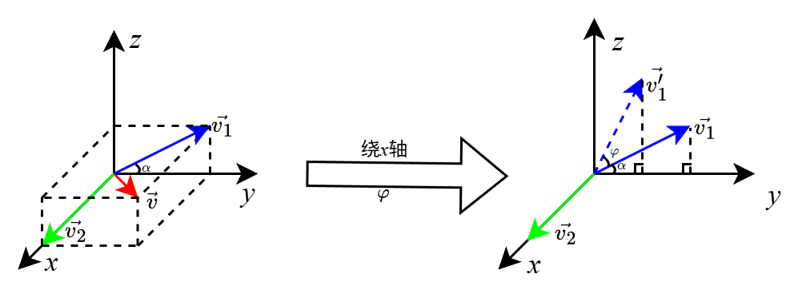
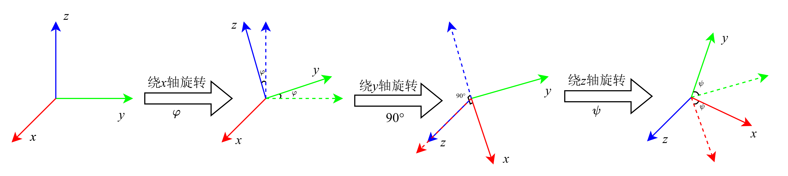
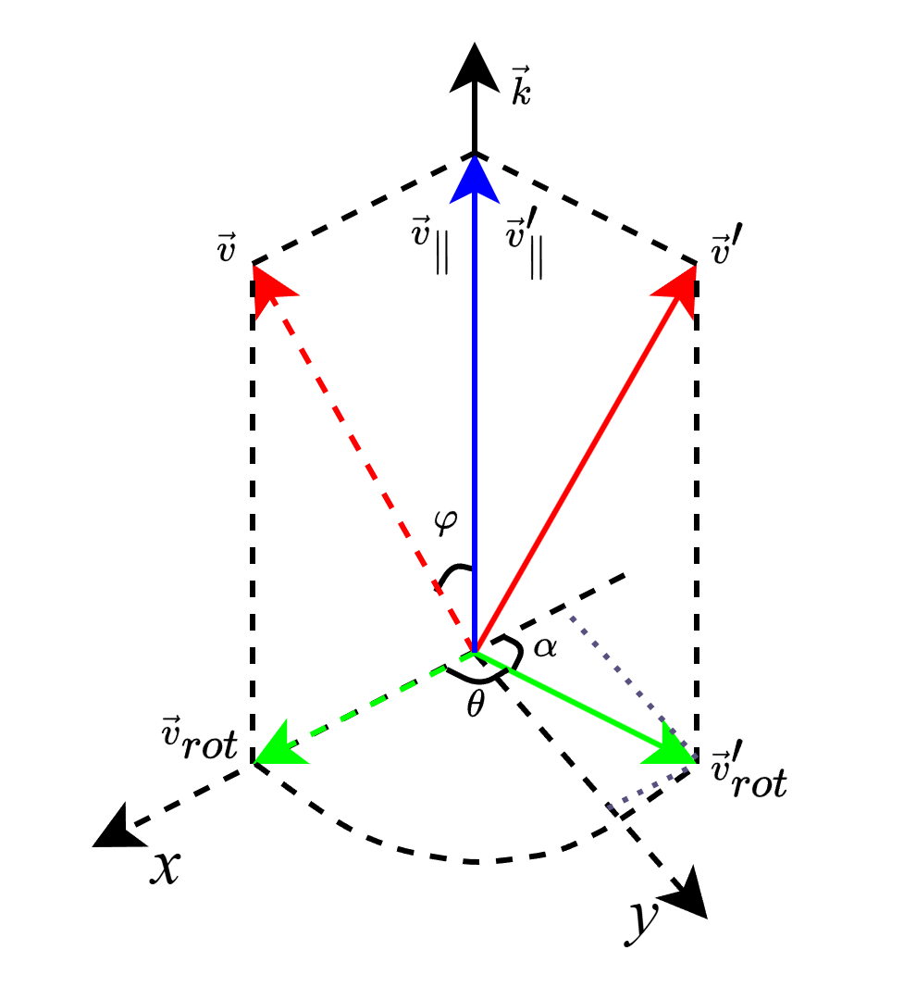

## 姿态表达

### 方向余弦矩阵

#### 矩阵推导

​	向量$$\vec{v}$$分别绕$x, y, z$轴旋转$\varphi, \theta, \psi$角，我们可以推出旋转前与旋转后的坐标关系。

 1. 对$x$轴旋转$\varphi$角

    $$\vec{v}=(x \quad y \quad z)^T$$可以分解成沿$x$轴和垂直$x$轴的分量，分别记为$\vec{v_1}$和$\vec{v_2}$。当向量$\vec{v}$绕$x$轴旋转时，$\vec{v_2}$不变，只需将$\vec{v_1}$旋转$\varphi$角。

​		可知
$$
\begin{align*}
x' &= x \\ \\
y' &= v_{1}\cos(\alpha + \varphi) = v_{1}\cos\alpha \cos\varphi -v_{1}\sin\alpha \sin \varphi  \\
&= y\cos\varphi-z\sin\varphi \\ \\
z' &= v_{1}\sin(\alpha + \varphi) = v_{1}\sin \cos\varphi+v_{1}\cos\alpha\sin \varphi  \\
&= z\cos\varphi+y\sin\varphi 
\end{align*}
$$
​		即
$$
\begin{align*}
\begin{bmatrix}x'\\ y' \\ z' \end{bmatrix} = 
\begin{bmatrix}
 1 & 0 & 0 \\
 0 & \cos\varphi & -\sin \varphi\\
 0 & \sin\varphi & \cos \varphi
\end{bmatrix}\cdot 
\begin{bmatrix}
x
 \\
y
 \\
z
\end{bmatrix} = M_x\cdot 
\begin{bmatrix}
x
 \\
y
 \\
z
\end{bmatrix}
\end{align*}
$$

  2. 同理可得绕$y,z$轴旋转的坐标变换矩阵为$M_y$,$M_z$
     $$
     \begin{align*}
     M_y &= \begin{bmatrix}
      \cos\theta & 0 & \sin\theta \\
      0 & 1 &0\\
      -\sin\theta & 0 & \cos\theta
     \end{bmatrix} \\\\
     M_z &= \begin{bmatrix}
      \cos\psi  & -\sin\psi & 0 \\
      \sin\psi & \cos\psi & 0\\
      0 & 0 & 1
     \end{bmatrix}
     \end{align*}
     $$

​	3.按照$x-y-z$的顺序旋转$\varphi, \theta, \psi$角，可得坐标变换矩阵
$$
\begin{align*}
\begin{bmatrix}
x'
 \\
y'
 \\
z'
\end{bmatrix} & =   M_z\cdot M_y\cdot M_x\cdot \begin{bmatrix}
x
 \\
y
 \\
z
\end{bmatrix} \\\\
&= \begin{bmatrix}
 \cos\psi  & -\sin\psi & 0 \\
 \sin\psi & \cos\psi & 0\\
 0 & 0 & 1
\end{bmatrix}\cdot\begin{bmatrix}
 \cos\theta & 0 & \sin\theta \\
 0 & 1 &0\\
 -\sin\theta & 0 & \cos\theta
\end{bmatrix}\cdot\begin{bmatrix}
 1 & 0 & 0 \\
 0 & \cos\varphi & -\sin \varphi\\
 0 & \sin\varphi & \cos \varphi
\end{bmatrix}\cdot \begin{bmatrix}
x
 \\
y
 \\
z
\end{bmatrix} \\\\
&= \begin{bmatrix}
 \cos\theta \cos\psi & -\cos\varphi\sin\psi+\sin\varphi\sin\theta\cos\psi & \sin\varphi\sin\psi+\cos\varphi\sin\theta\cos\psi \\
 \sin\psi\cos\theta & \cos\varphi\cos\psi+\sin\varphi \sin\theta\sin\psi & -\sin \varphi\cos\psi+\cos\varphi\sin\theta\sin\psi\\
 -\sin\theta & \sin\varphi\cos\theta & \cos \varphi\cos\theta
\end{bmatrix} \cdot \begin{bmatrix}
x
 \\
y
 \\
z
\end{bmatrix}
\end{align*}
$$

> 如果按照不同顺序旋转，得到的向量将完全不同。如果按照$x-y-z$的顺序旋转，则有$roll = \varphi,pitch = \theta ,yaw = \psi$

​	上式表示了从机体坐标系到大地坐标系的旋转，也就是机体到大地的方向余弦矩阵，即
$$
{R^e_b} = \begin{bmatrix}
 \cos\theta \cos\psi & -\cos\varphi\sin\psi+\sin\varphi\sin\theta\cos\psi & \sin\varphi\sin\psi+\cos\varphi\sin\theta\cos\psi \\
 \sin\psi\cos\theta & \cos\varphi\cos\psi+\sin\varphi \sin\theta\sin\psi & -\sin \varphi\cos\psi+\cos\varphi\sin\theta\sin\psi\\
 -\sin\theta & \sin\varphi\cos\theta & \cos \varphi\cos\theta
\end{bmatrix}
$$

> e代表earth，b代表body

​	如果按照相反角度和相反顺序的轴旋转，可得到大地到机体的方向余弦矩阵$R^b_e$。
$$
\begin{align*}
\begin{bmatrix}x\\y\\z\end{bmatrix} &= M_x'\cdot M_y'\cdot M_z'\cdot \begin{bmatrix}x'\\y'\\z'\end{bmatrix} \\\\
&= \begin{bmatrix}
 1 & 0 & 0 \\
 0 & \cos\varphi & \sin \varphi\\
 0 & -\sin\varphi & \cos \varphi
\end{bmatrix}\cdot\begin{bmatrix}
 \cos\theta & 0 & -\sin\theta \\
 0 & 1 &0\\
 \sin\theta & 0 & \cos\theta
\end{bmatrix}\cdot\begin{bmatrix}\cos\psi & \sin\psi & 0 \\ -\sin\psi & \cos\psi & 0\\ 0 & 0 & 1\end{bmatrix}\cdot \begin{bmatrix}
x'
 \\
y'
 \\
z'
\end{bmatrix} \\\\
&= \begin{bmatrix}
 \cos\theta \cos\psi & \cos\theta \sin\psi & -\sin\theta \\
 \sin\varphi\sin\theta\cos\psi-\cos\varphi\sin\psi & \sin\varphi\sin\theta\sin\psi+\cos\varphi \cos\psi & \sin \varphi\cos\theta\\
 \cos\varphi\sin\theta\cos\psi+\sin\varphi\sin\psi & \cos\varphi\sin\theta\sin\psi-\sin \varphi\cos\psi & \cos \varphi\cos\theta
\end{bmatrix} \cdot \begin{bmatrix}
x
 \\
y
 \\
z
\end{bmatrix}
\end{align*}
$$
​	可知
$$
R^e_b \cdot R^b_e = I
$$
​	其中
$$
\begin{align*}
R^b_e & =  \begin{bmatrix}
 \cos\theta \cos\psi & \cos\theta \sin\psi & -\sin\theta \\
 \sin\varphi\sin\theta\cos\psi-\cos\varphi\sin\psi & \sin\varphi\sin\theta\sin\psi+\cos\varphi \cos\psi & \sin \varphi\cos\theta\\
 \cos\varphi\sin\theta\cos\psi+\sin\varphi\sin\psi & \cos\varphi\sin\theta\sin\psi-\sin \varphi\cos\psi & \cos \varphi\cos\theta
\end{bmatrix} \\\\
I &= \begin{bmatrix}
 1 & 0 & 0 \\
 0 & 1 & 0\\
 0 & 0 & 1
\end{bmatrix}
\end{align*}
$$

#### 万向死锁

​	当$\theta = 90\degree$时，$x$轴和$z$轴会重合，此时就缺少一个维度的旋转。

 1. 代数解释

    当$\theta = 90\degree$时， $\cos\theta = 0, \sin\theta = 1$.
    $$
    \begin{align*}
    {R^e_b} &= \begin{bmatrix}
     0 & \cos\varphi\sin\psi+\sin\varphi\cos\psi & \sin\varphi\sin\psi-\cos\varphi\cos\psi \\
     0 & \cos\varphi\cos\psi-\sin\varphi \sin\psi & \sin \varphi\cos\psi+\cos\varphi0\sin\psi\\
     1 & 0 & 0
    \end{bmatrix}\\\\
    &= \begin{bmatrix}
     0 & \sin(\varphi+\psi) & -\cos(\varphi+\psi) \\
     0 & \cos(\varphi+\psi)  & \sin(\varphi+\psi)\\
     1 & 0 & 0
    \end{bmatrix}
    \end{align*}
    $$
    此时便只对$x,y$有作用，对$z$没有旋转。

 2. 图像解释

    

​	由上图可知，绕$y$轴旋转$90\degree$后，$z$轴就旋转到了原本$x$轴的位置，此时再绕$z$轴旋转，就跟绕$x$轴旋转的效果一致。对$z$轴分量并无贡献，所以此时旋转就少了一个自由度。正是因为万向死锁，姿态解算并不会用欧拉角表示，而是会用四元数来表示，尽管欧拉角直观。

### 罗德里格旋转公式（Rodriguez Rotation formula）

​	如图，向量$\vec{v}$绕旋转轴$k$轴旋转$\theta$角得到$\vec{v}'$，旋转轴的单位向量是$\vec{k}$。那么$\vec{v}'$与$\vec{v}$,$\theta$,$\vec{k}$有什么关系呢？下面来进行推导。

<!--  -->

由题可知
$$
\begin{align*}
|k| &= 1 \\\\
|v_{rot}'| &= |v_{rot}| \\\\
\cos\varphi &= \frac{\vec{v}\cdot\vec{k}}{|v||k|}\\\\
\vec{x} &= \frac{\vec{v}_{rot}}{|v_{rot}|} \\\\
\vec{y} &= \frac{\vec{k}\times\vec{v}_{rot}}{|v_{rot}|\cdot|k|\cdot\sin90\degree}
 \end{align*}
$$
​	

由图可知
$$
\begin{align*}
\vec{v} &= \vec{v}_{\parallel}+\vec{v}_{rot} \\\\
\vec{v}' &= \vec{v}_{\parallel}'+\vec{v}_{rot}'\\\\
 \end{align*}
$$
​	其中
$$
\begin{align*}
\vec{v}_{\parallel}' &=  \vec{v}_{\parallel} \\\\
\vec{v}_{rot}' &= \vec{v}_{rot_{x}}'+\vec{v}_{rot_{y}}' \\\\
			&= -|v_{rot}'|\cos \alpha \cdot\vec{x}+ |v_{rot}'|\sin\alpha\cdot\vec{y} \\\\
			&=  |v_{rot}'|\cos \theta \cdot\vec{x}+|v_{rot}'|\sin\theta\cdot\vec{y} \\\\		&= |v_{rot}'|\cos \theta \cdot \frac{\vec{v}_{rot}}{|v_{rot}|} + |v_{rot}'|\sin\theta\cdot\frac{\vec{k}\times\vec{v}_{rot}}{|v_{rot}|\cdot|k|\cdot\sin90\degree} \\\\
			&= \vec{v}_{rot}\cos \theta + (\vec{k}\times\vec{v}_{rot})\sin\theta
\end{align*}
$$
​	而
$$
\begin{align*}
 \vec{v}_{\parallel} &=|v|\cos\varphi\cdot\vec{k}\\\\
 					&=|v|\frac{\vec{v}\cdot\vec{k}}{|v||k|}\cdot\vec{k} \\\\
 					&= \vec{v}\cdot\vec{k}\cdot\vec{k} \\\\
 \vec{v}_{rot} &= \vec{v}-\vec{v}_{\parallel}\\\\
 				&= \vec{v}- \vec{v}\cdot\vec{k}\cdot\vec{k}
\end{align*}
$$
所以
$$
\begin{align*}
 \vec{v}' &= \vec{v}_{\parallel}' + \vec{v}_{rot}' \\\\
 			&= \vec{v}_{\parallel} + \vec{v}_{rot}\cos \theta + (\vec{k}\times\vec{v}_{rot})\sin\theta \\\\
 			&=  \vec{v}\cdot\vec{k}\cdot\vec{k} + (\vec{v}- \vec{v}\cdot\vec{k}\cdot\vec{k})\cos\theta + [\vec{k}\times(\vec{v}- \vec{v}\cdot\vec{k}\cdot\vec{k})]\sin\theta \\\\
 			&=  \vec{v}\cdot\vec{k}\cdot\vec{k} + \vec{v}\cos\theta- \vec{v}\cdot\vec{k}\cdot\vec{k}\cos\theta + (\vec{k}\times\vec{v}-\vec{v}\cdot\vec{k}\cdot\vec{k}\times\vec{k})\sin\theta \\\\
 			&=  \vec{v}\cos\theta+(1-\cos\theta)\vec{v}\cdot\vec{k}\cdot\vec{k}+(\vec{k}\times\vec{v})\sin\theta 
\end{align*}
$$
矩阵表达式推导
$$
\begin{align*}
 \vec{v}' &=  \vec{v}\cos\theta+(1-\cos\theta)\vec{v}\cdot\vec{k}\cdot\vec{k}+\vec{k}\times\vec{v}\sin\theta  \\\\
 		&= \vec{v} + (\cos\theta-1)\vec{v} +(1-\cos\theta)\vec{v}\cdot\vec{k}\cdot\vec{k}+\vec{k}\times\vec{v}\sin\theta \\\\
 		&= \vec{v}+(1-\cos\theta)(\vec{v}\cdot\vec{k}\cdot\vec{k}-\vec{v}) + \vec{k}\times\vec{v}\sin\theta\\\\
 		&= \vec{v}+(1-\cos\theta)[\vec{k}\cdot(\vec{v}\cdot\vec{k})-\vec{v}\cdot(\vec{k}\cdot\vec{k})]+\vec{k}\times\vec{v}\sin\theta \\\\
 		&= \vec{v}+(1-\cos\theta)\vec{k}\times\vec{k}\times\vec{v}+\vec{k}\times\vec{v}\sin\theta\\\\
 		&= \vec{v} + (1-\cos\theta)K^2\vec{v} + \sin\theta K\vec{v} \\\\
 		&= [I+(1-\cos\theta)K^2+\sin\theta K]\vec{v}
\end{align*}
$$
其中，$K$为叉乘矩阵
$$
K = \begin{bmatrix}
 0 & -k_z & k_y \\
 k_z & 0  & -k_x\\
 -k_y &  k_x & 0
\end{bmatrix}
$$

> $\vec{a}\times\vec{b}\times\vec{b} = \vec{b}(\vec{a}\cdot\vec{c})-\vec{c}(\vec{a}\cdot\vec{b})$
>
> 叉乘矩阵
>
> $\vec{a}\times\vec{b} = A\cdot\vec{b}$
>
> 其中
>
> $A = \begin{bmatrix}
>  0 & -a_z & a_y \\
>  a_z & 0  & -a_x\\
>  -a_y &  a_x & 0
> \end{bmatrix}$

由前文可知，
$$
\vec{v}' = R_b^e\cdot\vec{v}
$$
故而
$$
\begin{align*}
 		R_b^e &=I-(1-\cos\theta)K^2+\sin\theta K\\\\
\end{align*}
$$

### 四元数

#### 定义

$$
\begin{align*}
q &= q_0+q_1\boldsymbol{i}+q_2\boldsymbol{j}+q_3\boldsymbol{k}\qquad q_0,\ q_1,\ q_2,\ q_3 \in R
\end{align*}
$$

$\boldsymbol{i},\ \boldsymbol{j},\ \boldsymbol{k}$满足以下运算关系，
$$
\begin{align*}
\boldsymbol{i}^2 &= \boldsymbol{j}^2 = \boldsymbol{k}^2 = \boldsymbol{i}\boldsymbol{j}\boldsymbol{k} = -1\\\\
\boldsymbol{i}\boldsymbol{j} &= \boldsymbol{k},\boldsymbol{j}\boldsymbol{i} = -\boldsymbol{k} \\\\
\boldsymbol{j}\boldsymbol{k} &= \boldsymbol{i},\boldsymbol{k}\boldsymbol{j} = -\boldsymbol{i} \\\\
\boldsymbol{k}\boldsymbol{i} &= \boldsymbol{j},\boldsymbol{i}\boldsymbol{k} = -\boldsymbol{j} 
\end{align*}
$$
前面$q_0$可以看成标量，而$q_1\boldsymbol{i}+q_2\boldsymbol{j}+q_3\boldsymbol{k}$可以看成向量部分，于是四元数可以写成，
$$
\begin{align*}
q &= u+\vec{v}
\end{align*}
$$
表示旋转时，一般写作，
$$
\begin{align*}
q &= \cos\frac{\theta}{2}+\vec{\lambda}\sin\frac{\theta}{2}
\end{align*}
$$
下面是一些特殊四元数，

纯四元数：$q_0 = 0$；

单位四元数：$\sqrt{q_0^2+q_1^2+q_2^2+q_3^2} = 1$；

共轭四元数：$q=u+\vec{v},\ q^*= u-\vec{v}$；

四元数的逆：$q^{-1}=\frac{q^*}{|q|}$；

对于单位四元数：$q^{-1} = q^*$

#### 四元数乘法

令
$$
\begin{align*}
q_0 &= w_0+x_0\boldsymbol{i}+y_0\boldsymbol{j}+z_0\boldsymbol{k}\\\\ 
	&= w_0+\vec{r_0} \\\\
q_1 &= w_1+x_1\boldsymbol{i}+y_1\boldsymbol{j}+z_1\boldsymbol{k}\\\\
	&= w_1+\vec{r_1}
\end{align*}
$$
则有
$$
\begin{align*}
q_0q_1 &= (w_0+x_0\boldsymbol{i}+y_0\boldsymbol{j}+z_0\boldsymbol{k})(w_1+x_1\boldsymbol{i}+y_1\boldsymbol{j}+z_1\boldsymbol{k})\\\\
	 &= w_0w_1 + w_0x_1\boldsymbol{i} + w_0y_1\boldsymbol{j}+w_0z_1\boldsymbol{k} +\\\\
	 &\quad \ w_1x_0\boldsymbol{i} - x_0x_1- x_0y_1\boldsymbol{k} - x_0z_1\boldsymbol{j} + \\\\
	 &\quad \ w_1y_0\boldsymbol{j} - x_1y_0\boldsymbol{k}- y_0y_1 + y_0z_1\boldsymbol{i} + \\\\
	 &\quad \ w_1z_0\boldsymbol{k} + x_1z_0\boldsymbol{j}- y_1z_0\boldsymbol{i} - z_0z_1 + \\\\
	 & = w_0w_1- x_0x_1- y_0y_1 - z_0z_1 + \\\\
	 &\quad \ w_0(x_1\boldsymbol{i}+y_1\boldsymbol{j}+z_1\boldsymbol{k}) + w_1(x_0\boldsymbol{i}+y_0\boldsymbol{j}+z_0\boldsymbol{k}) + \\\\
	 &\quad \  (y_0z_1-y_1z_0)\boldsymbol{i} + (x_1z_0-x_0z_1)\boldsymbol{j}+ (x_0y_1-x_1y_0)\boldsymbol{i} \\\\
	 &= \underline{\textcolor{red}{w_0w_1-\vec{r_0}\cdot\vec{r_1} + w_0\vec{r_1} + w_1\vec{r_0} + \vec{r_0}\times\vec{r_1}}}
\end{align*}
$$

#### 四元数如何表达旋转

$\vec{v}$绕旋转轴$\vec{k}$旋转$\theta$角得到向量$\vec{v}'$

$\vec{v}=0+\vec{v}$，可视为纯四元数；

$q=\cos\frac{\theta}{2}+\vec{k}\sin\frac{\theta}{2}$，为单位四元数。

则$\vec{v}'=q\vec{v}q^{-1}=q\vec{v}q^*$

证明如下：
$$
\begin{align*}
q\vec{v}q^* &=(\cos\frac{\theta}{2}+\vec{k}\sin\frac{\theta}{2})(0+\vec{v})(\cos\frac{\theta}{2}-\vec{k}\sin\frac{\theta}{2}) \\\\
		&= [-\vec{k}\cdot\vec{v}\sin\frac{\theta}{2}+\vec{v}\cos\frac{\theta}{2} + (\vec{k}\times\vec{v})\sin\frac{\theta}{2}](\cos\frac{\theta}{2}-\vec{k}\sin\frac{\theta}{2}) \\\\
		&= -\vec{k}\cdot\vec{v}\sin\frac{\theta}{2}\cos\frac{\theta}{2}+[\vec{v}\cos\frac{\theta}{2} + (\vec{k}\times\vec{v})\sin\frac{\theta}{2}]\cdot\vec{k}\sin\frac{\theta}{2} + \vec{k}\cdot\vec{v}\sin\frac{\theta}{2}\cdot\vec{k}\sin\frac{\theta}{2}+\\\\
        & \quad \ \cos\frac{\theta}{2}[\vec{v}\cos\frac{\theta}{2} + (\vec{k}\times\vec{v})\sin\frac{\theta}{2}] - [\vec{v}\cos\frac{\theta}{2} + (\vec{k}\times\vec{v})\sin\frac{\theta}{2}]\times\vec{k}\sin\frac{\theta}{2}\\\\
        &= [-\vec{k}\cdot\vec{v}\sin\frac{\theta}{2}\cos\frac{\theta}{2}+\vec{v}\cdot\vec{k}\sin\frac{\theta}{2}\cos\frac{\theta}{2}+(\vec{k}\times\vec{v})\sin\frac{\theta}{2}\cdot\vec{k}\sin\frac{\theta}{2}] + \\\\
        & \quad \ [\vec{k}\cdot\vec{v}\cdot\vec{k}\sin^2\frac{\theta}{2} +\vec{v}\cos^2\frac{\theta}{2}+(\vec{k}\times\vec{v})\sin\frac{\theta}{2}\cos\frac{\theta}{2}-(\vec{v}\times\vec{k})\sin\frac{\theta}{2}\cos\frac{\theta}{2}-(\vec{k}\times\vec{v}\times\vec{k})\sin^2\frac{\theta}{2}]\\\\
        &= 0 + \vec{k}\cdot\vec{v}\cdot\vec{k}\sin^2\frac{\theta}{2}+\vec{v}\cos^2\frac{\theta}{2}+2(\vec{k}\times\vec{v})\sin\frac{\theta}{2}\cos\frac{\theta}{2} + (\vec{v}\times\vec{k}\times\vec{k})\sin^2\frac{\theta}{2} \\\\
        &= \vec{k}\cdot\vec{v}\cdot\vec{k}\sin^2\frac{\theta}{2}+\vec{v}\cos^2\frac{\theta}{2}+2(\vec{k}\times\vec{v})\sin\frac{\theta}{2}\cos\frac{\theta}{2} +\sin^2\frac{\theta}{2}[\vec{k}(\vec{k}\cdot\vec{v})-\vec{v}(\vec{k}\cdot\vec{k})] \\\\
        &= \vec{v}(\cos^2\frac{\theta}{2}-\sin^2\frac{\theta}{2})+2(\vec{k}\times\vec{v})\sin\frac{\theta}{2}\cos\frac{\theta}{2}+2\vec{k}\cdot\vec{v}\cdot\vec{k}\sin^2\frac{\theta}{2} \\\\
        &= \vec{v}\cos\theta+(1-\cos\theta)\vec{v}\cdot\vec{k}\cdot\vec{k}+(\vec{k}\times\vec{v})\sin\theta
\end{align*}
$$

由前文可知，罗德里格旋转公式为
$$
\vec{v}' =  \vec{v}\cos\theta+(1-\cos\theta)\vec{v}\cdot\vec{k}\cdot\vec{k}+(\vec{k}\times\vec{v})\sin\theta
$$
所以
$$
\vec{v}'=q\vec{v}q^{-1}=q\vec{v}q^*
$$

#### 四元数和方向余弦矩阵的联系

由于$q=\cos\frac{\theta}{2}+\vec{k}\sin\frac{\theta}{2}$，则有

$$
\begin{align*}
q_0 &= \cos\frac{\theta}{2} \\\\
q_1 &= k_x\sin\frac{\theta}{2} \\\\
q_2 &= k_y\sin\frac{\theta}{2} \\\\
q_3 &= k_z\sin\frac{\theta}{2} \\\\
1 &=q_0^2+q_1^2+q_2^2+q_3^2
\end{align*}
$$

则
$$
\begin{align*}
R_b^e &=I-(1-\cos\theta)K^2+\sin\theta K\\\\
 			&=  \begin{bmatrix}1 & 0 & 0 \\0 & 1  & 0\\0 & 0 & 1 \end{bmatrix}+ (1-\cos\theta)\begin{bmatrix}0 & -k_z & k_y \\k_z & 0  & -k_x\\-k_y &  k_x & 0\end{bmatrix}\cdot\begin{bmatrix}0 & -k_z & k_y \\k_z & 0  & -k_x\\-k_y &  k_x & 0\end{bmatrix} + \\\\ & \quad \  \sin\theta\begin{bmatrix}0 & -k_z & k_y \\k_z & 0  & -k_x\\-k_y &  k_x & 0\end{bmatrix} \\\\
 			&= \begin{bmatrix}1 & 0 & 0 \\0 & 1  & 0\\0 & 0 & 1 \end{bmatrix}+2 \sin^2\frac{\theta}{2}\begin{bmatrix}-k_z^2-k_y^2 & k_xk_y & k_xk_z \\k_xk_y & -k_x^2-k_z^2  &  k_yk_z\\k_xk_z &  k_yk_z & -k_x^2-k_y^2\end{bmatrix} + 
 			\\\\ & \quad \ 2\sin\frac{\theta}{2}\cos\frac{\theta}{2}\begin{bmatrix}0 & -k_z & k_y \\k_z & 0  & -k_x\\-k_y &  k_x & 0\end{bmatrix} \\\\ 
 			& = \begin{bmatrix}1 & 0 & 0 \\0 & 1  & 0\\0 & 0 & 1 \end{bmatrix}+\\\\ & \quad \ \begin{bmatrix}-2k_z^2\sin^2\frac{\theta}{2}-2k_y^2\sin^2\frac{\theta}{2} & 2k_xk_y\sin^2\frac{\theta}{2} & 2k_xk_z\sin^2\frac{\theta}{2} \\2k_xk_y\sin^2\frac{\theta}{2} & -2k_x^2\sin^2\frac{\theta}{2}-2k_z^2\sin^2\frac{\theta}{2}  &  2k_yk_z\sin^2\frac{\theta}{2}\\2k_xk_z\sin^2\frac{\theta}{2} &  2k_yk_z\sin^2\frac{\theta}{2} & -2k_x^2\sin^2\frac{\theta}{2}-2k_y^2\sin^2\frac{\theta}{2}\end{bmatrix} + 
 			\\\\ & \quad \  \begin{bmatrix}0 & -2k_z \sin\frac{\theta}{2}\cos\frac{\theta}{2} & 2k_y\sin\frac{\theta}{2}\cos\frac{\theta}{2} \\2k_z\sin\frac{\theta}{2}\cos\frac{\theta}{2} & 0  & -2k_x\sin\frac{\theta}{2}\cos\frac{\theta}{2}\\-2k_y\sin\frac{\theta}{2}\cos\frac{\theta}{2} &  2k_x\sin\frac{\theta}{2}\cos\frac{\theta}{2} & 0\end{bmatrix} \\\\  
 			&= \begin{bmatrix}q_0^2+q_1^2+q_2^2+q_3^2 & 0 & 0 \\0 & q_0^2+q_1^2+q_2^2+q_3^2  & 0\\0 & 0 & q_0^2+q_1^2+q_2^2+q_3^2 \end{bmatrix} + \\\\
 			& \quad \ \begin{bmatrix}-2(q_2^2+q_3^2) & 2q_1q_2 & 2q_1q_3 \\2q_1q_2 & -2(q_1^2+q_3^2)  & 2q_2q_3\\2q_1q_3 & 2q_2q_3 & -2(q_1^2+q_2^2) \end{bmatrix} + \\\\
 			& \quad \ \begin{bmatrix}0 & -2q_0q_3 & 2q_0q_2 \\2q_0q_3 & 0  & -2q_0q_1\\ -2q_0q_2 & 2q_0q_1 & 0 \end{bmatrix} \\\\
 			&= \begin{bmatrix}q_0^2+q_1^2-q_2^2-q_3^2 & 2q_1q_2-2q_0q_3 & 2q_1q_3+2q_0q_2 \\2q_1q_2+2q_0q_3 & q_0^2-q_1^2+q_2^2-q_3^2  & 2q_2q_3-2q_0q_1\\2q_1q_3-2q_0q_2 & 2q_2q_3+2q_0q_1 & q_0^2-q_1^2-q_2^2+q_3^2 \end{bmatrix} \\\\
 			 &=
 \begin{bmatrix}1-2(q_2^2+q_3^2) & 2q_1q_2-2q_0q_3 & 2q_1q_3+2q_0q_2 \\2q_1q_2+2q_0q_3 & 1-2(q_1^2+q_3^2)  & 2q_2q_3-2q_0q_1\\2q_1q_3-2q_0q_2 & 2q_2q_3+2q_0q_1 & 1-2(q_1^2+q_2^2) \end{bmatrix}
 			
 			
\end{align*}
$$
又因为
$$
{R^e_b} = \begin{bmatrix}
 \cos\theta \cos\psi & -\cos\varphi\sin\psi+\sin\varphi\sin\theta\cos\psi & \sin\varphi\sin\psi+\cos\varphi\sin\theta\cos\psi \\
 \sin\psi\cos\theta & \cos\varphi\cos\psi+\sin\varphi \sin\theta\sin\psi & -\sin \varphi\cos\psi+\cos\varphi\sin\theta\sin\psi\\
 -\sin\theta & \sin\varphi\cos\theta & \cos \varphi\cos\theta
\end{bmatrix}
$$
所以，四元数可以转换成欧拉角
$$
\begin{align*}
\varphi &= \arctan(\frac{2q_2q_3+2q_0q_1}{ q_0^2-q_1^2-q_2^2+q_3^2}) \\\\
\theta &= -\arcsin(2q_1q_3-2q_0q_2) \\\\\
\psi &= \arctan(\frac{2q_1q_2+2q_0q_3}{ q_0^2+q_1^2-q_2^2-q_3^2}) 
\end{align*}
$$

同样，欧拉角也能转换成四元数
$$
\begin{align*}
q_0 &= \frac{1}{2}\sqrt{1+ (\cos\theta \cos\psi)+(\cos\varphi\cos\psi+\sin\varphi \sin\theta\sin\psi)+(\cos \varphi\cos\theta)} \\\\
q_1 &= \frac{\sin\varphi\cos\theta-(-\sin \varphi\cos\psi+\cos\varphi\sin\theta\sin\psi)}{4q_0} \\\\\
q_2 &= \frac{(\sin\varphi\sin\psi+\cos\varphi\sin\theta\cos\psi)-(-\sin\theta)}{4q_0} \\\\
q_3 &= \frac{(\sin\psi\cos\theta)-(-\cos\varphi\sin\psi+\sin\varphi\sin\theta\cos\psi)}{4q_0}
\end{align*}
$$

如果我们令$p=q^*$，则有$p\vec{v}'p^*= pq\vec{v}q^*p^*=q^*q\vec{v}q^*q=(qq^*)\vec{v}(qq^*)^*=\vec{v}$

所以
$$
\begin{align*}
R_e^b &=
 \begin{bmatrix}1-2(q_2^2+q_3^2) & 2q_1q_2+2q_0q_3 & 2q_1q_3-2q_0q_2 \\2q_1q_2-2q_0q_3 & 1-2(q_1^2+q_3^2)  & 2q_2q_3+2q_0q_1\\2q_1q_3+2q_0q_2 & 2q_2q_3-2q_0q_1 & 1-2(q_1^2+q_2^2) \end{bmatrix}	
\end{align*}
$$

## 姿态更新

在极小时间$\mathrm{d}t \to 0$里面，$q_{t+\mathrm{d}t}=q_{t}+\dot{q}\mathrm{d}t$，

既然四元数能够表达欧拉角，那么四元数的导数$\dot{q}$是不是跟角速度有关。

设四元数
$$
\begin{align*}
	q &= q_0+q_1\boldsymbol{i}+q_2\boldsymbol{j}+q_3\boldsymbol{k}
\end{align*}
$$
则有
$$
\begin{align*}
	\dot{q} =  \lim_{\bigtriangleup t \to 0} \frac{q_{t+\bigtriangleup t } -q_t }{\bigtriangleup t} 
\end{align*}
$$
又因为
$$
\begin{align*}
\vec{v}' &= q_t\vec{v}q_t^* \\\\
\vec{v}'' &= q_{t+\bigtriangleup t } \vec{v} q_{t+\bigtriangleup t }^*\\\\
		&= pq_t\vec{v}(pq_t)^* \\\\
		&= pq_t\vec{v}q_t^*p^* \\\\
		&= p\vec{v}'p^*
\end{align*}
$$
所以
$$
\begin{align*}
 &q_{t+\bigtriangleup t } = pq_t \\\\
 &p = \cos\frac{\bigtriangleup \theta}{2} + \vec{u}\sin\frac{\bigtriangleup \theta}{2}
\end{align*}
$$
令
$$
i = 1+0\boldsymbol{i}+0\boldsymbol{j}+0\boldsymbol{k}
$$
则有
$$
\begin{align*}
	\dot{q} &=  \lim_{\bigtriangleup t \to 0} \frac{q_{t+\bigtriangleup t } -q_t }{\bigtriangleup t}  \\\\
		&= \lim_{\bigtriangleup t \to 0}\frac{p -i }{\bigtriangleup t}\cdot q_t
\end{align*}
$$
令
$$
\rho =\frac{p -i }{\bigtriangleup t}
$$
则有
$$
\dot{q} = \frac{\partial \rho}{\partial t} \cdot q_t
$$
下面来求$ \frac{\partial \rho}{\partial t}$，
$$
\begin{align*}
\frac{\partial \rho}{\partial t} &=  \lim_{ \bigtriangleup t \to 0} \frac{p -i }{\bigtriangleup t} \\\\ 
&= \lim_{ \bigtriangleup t \to 0} \frac{\cos\frac{\bigtriangleup \theta}{2} + \vec{u}\sin\frac{\bigtriangleup \theta}{2} -1 }{\bigtriangleup t} \\\\

\end{align*}
$$
令
$$
\bigtriangleup t = \frac{\bigtriangleup \theta}{\omega } 
$$
这个$\omega$就是实际的角速度，没有方向。

则有
$$
\begin{align*}
\frac{\partial \rho}{\partial t} 
&= \lim_{ \bigtriangleup \theta \to 0}\frac{\cos\frac{\bigtriangleup \theta}{2} + \vec{u}\sin\frac{\bigtriangleup \theta}{2} -1 }{\bigtriangleup \theta}\cdot\omega\\\\
&= (\lim_{ \bigtriangleup \theta \to 0}\frac{\cos\frac{\bigtriangleup \theta}{2} -1 }{\bigtriangleup \theta} + \vec{u}\lim_{ \bigtriangleup \theta \to 0}\frac{\sin\frac{\bigtriangleup \theta}{2}}{\bigtriangleup \theta})\cdot\omega\\\\
&=  \frac{1}{2} \vec{u}\cdot\omega = \frac{1}{2} \vec{\omega}\\\\
\end{align*}
$$
所以四元数的导数为
$$
\dot{q} = \frac{1}{2}\vec{\omega } q_t
$$
$\vec{\omega}$就是实际的角速度，有方向，是相对于大地的。但是角速度计测量的是机体坐标系的角速度$\vec{\omega_b}$，所以要进行一下变换。

由于$\vec{\omega} = q_t\vec{\omega_b}q_t^* $
$$
\begin{align*}
\dot{q} &= \frac{1}{2}\vec{\omega } q_t \\\\
		&= \frac{1}{2}q_t\vec{\omega_b}q_t^* q_t \\\\
		&= \frac{1}{2}q_t\vec{\omega_b}
\end{align*}
$$
矩阵表达式为
$$
\begin{align*}
\dot{q} &= \frac{1}{2}q_t\vec{\omega_b}\\\\
&=\frac{1}{2}( q_0+q_1\boldsymbol{i}+q_2\boldsymbol{j}+q_3\boldsymbol{k})({\omega_b}_x\boldsymbol{i}+{\omega_b}_y\boldsymbol{j}+{\omega_b}_z\boldsymbol{k}) \\\\
&= \frac{1}{2}(q_0{\omega_b}_x\boldsymbol{i}+q_0{\omega_b}_y\boldsymbol{j}+q_0{\omega_b}_z\boldsymbol{k}\\\\
&\quad \quad\ \  
-q_1{\omega_b}_x+q_1{\omega_b}_y\boldsymbol{k}-q_1{\omega_b}_z\boldsymbol{j} \\\\
&\quad \quad\ \ 
-q_2{\omega_b}_x\boldsymbol{k}-q_2{\omega_b}_y+q_2{\omega_b}_z\boldsymbol{i}\\\\
&\quad \quad\ \  
+q_3{\omega_b}_x\boldsymbol{j}-q_3{\omega_b}_y\boldsymbol{i}-q_3{\omega_b}_z
) \\\\
&= \frac{1}{2}[(-q_1{\omega_b}_x-q_2{\omega_b}_y-q_3{\omega_b}_z) + (q_0{\omega_b}_x+q_2{\omega_b}_z-q_3{\omega_b}_y)\boldsymbol{i} + \\\\
&\quad\quad\ \ (q_0{\omega_b}_y-q_1{\omega_b}_z+q_3{\omega_b}_x)\boldsymbol{j} +
(q_0{\omega_b}_z+q_1{\omega_b}_y-q_2{\omega_b}_x)\boldsymbol{k}] \\\\
&=  \frac{1}{2}\begin{bmatrix}0 & -{\omega_b}_x & -{\omega_b}_y & -{\omega_b}_z \\{\omega_b}_x & 0 & {\omega_b}_z & -{\omega_b}_y \\{\omega_b}_y & -{\omega_b}_z & 0 & {\omega_b}_x \\{\omega_b}_z & {\omega_b}_y & -{\omega_b}_x & 0 \end{bmatrix} \cdot
\begin{bmatrix}q_0 \\ q_1 \\ q_2\\ q_3\\ \end{bmatrix} 

\end{align*}
$$
所以我们能够根据上式来更新四元数，从而更新姿态。

## Mahony算法

1. 通过加速度分量计算初始四元数；

   - 加速度归一化，得到$(a_x,\ a_y,\ a_z)^T$；
   - 计算欧拉角；

   $$
   \begin{align*}
   \begin{bmatrix}a_x\\a_y\\a_z\end{bmatrix} &= 
   R^b_e\cdot\begin{bmatrix}0\\0\\1\end{bmatrix} \\\\
   & =  \begin{bmatrix}
    \cos\theta \cos\psi & \cos\theta \sin\psi & -\sin\theta \\
    \sin\varphi\sin\theta\cos\psi-\cos\varphi\sin\psi & \sin\varphi\sin\theta\sin\psi+\cos\varphi \cos\psi & \sin \varphi\cos\theta\\
    \cos\varphi\sin\theta\cos\psi+\sin\varphi\sin\psi & \cos\varphi\sin\theta\sin\psi-\sin \varphi\cos\psi & \cos \varphi\cos\theta
   \end{bmatrix}\cdot\begin{bmatrix}0\\0\\1\end{bmatrix} \\\\
   &= \begin{bmatrix}-\sin\theta\\\sin \varphi\cos\theta\\\cos \varphi\cos\theta\end{bmatrix}
   \end{align*}
   $$

   ​		由于加速度计测不到$\psi$，可令$\psi=0$。则有
   $$
   \begin{align*}
   \varphi &= \arctan\frac{a_y}{a_z} \\\\
   \theta &= -\arcsin a_x \\\\
   \psi &= 0
   \end{align*}
   $$

   - 通过以下公式计算初始四元数。

   $$
   \begin{align*}
   q_0 &= \frac{1}{2}\sqrt{1+ (\cos\theta \cos\psi)+(\cos\varphi\cos\psi+\sin\varphi \sin\theta\sin\psi)+(\cos \varphi\cos\theta)} \\\\
   q_1 &= \frac{\sin\varphi\cos\theta-(-\sin \varphi\cos\psi+\cos\varphi\sin\theta\sin\psi)}{4q_0} \\\\\
   q_2 &= \frac{(\sin\varphi\sin\psi+\cos\varphi\sin\theta\cos\psi)-(-\sin\theta)}{4q_0} \\\\
   q_3 &= \frac{(\sin\psi\cos\theta)-(-\cos\varphi\sin\psi+\sin\varphi\sin\theta\cos\psi)}{4q_0}
   \end{align*}
   $$

2. 通过四元数将理论归一化重力加速度旋转到机体坐标系；
   $$
   \begin{align*}
   \begin{bmatrix}a_x'\\a_y'\\a_z'\end{bmatrix} &= R_e^b\cdot\begin{bmatrix}0\\0\\1\end{bmatrix}\\\\
   &=
    \begin{bmatrix}1-2(q_2^2+q_3^2) & 2q_1q_2+2q_0q_3 & 2q_1q_3-2q_0q_2 \\2q_1q_2-2q_0q_3 & 1-2(q_1^2+q_3^2)  & 2q_2q_3+2q_0q_1\\2q_1q_3+2q_0q_2 & 2q_2q_3-2q_0q_1 & 1-2(q_1^2+q_2^2) \end{bmatrix}	\cdot\begin{bmatrix}0\\0\\1\end{bmatrix} \\\\
    &= \begin{bmatrix}2q_1q_2-2q_0q_3\\2q_2q_3+2q_0q_1\\1-2(q_1^2+q_2^2)\end{bmatrix} =\begin{bmatrix}2q_1q_2-2q_0q_3\\2q_2q_3+2q_0q_1\\2q_0^2+2q_1^2+2q_2^2+2q_3^2-2(q_1^2+q_2^2)-1\end{bmatrix} = \begin{bmatrix}2q_1q_2-2q_0q_3\\2q_2q_3+2q_0q_1\\2q_0^2+2q_3^2-1\end{bmatrix}
   \end{align*}
   $$

3. 将加速度计测量值归一化；

   加速度归一化，得到$(a_x,\ a_y,\ a_z)^T$

4. 通过叉乘计算误差；
   $$
   \begin{align*}
   err &= \vec{a}\times\vec{a'} \\\\
   	&= |a||a'|\sin\theta	\\\\
   	&= \sin\theta \approx \theta
   \end{align*}
   $$
   即
   $$
   \begin{align*}
   {\theta}_x &= a_ya_z'-a_za_y' \\\\
   {\theta}_y &= a_za_x'-a_xa_z' \\\\
   {\theta}_z &= a_xa_y'-a_ya_x' \\\\
   \end{align*}
   $$

5. 通过PI控制器，得到角速度补偿值；
   $$
   \begin{align*}
   g_x' &= k_p\theta_x+k_i\sum\frac{\theta_x}{\mathrm{d}t} \\\\
   g_y' &= k_p\theta_y+k_i\sum\frac{\theta_y}{\mathrm{d}t} \\\\
   g_z' &= k_p\theta_z+k_i\sum\frac{\theta_z}{\mathrm{d}t} 
   \end{align*}
   $$

6. 将角速度补偿值补偿到测量值；
   $$
   \begin{align*}
   g_x'' &= g_x+g_x' \\\\
   g_y'' &= g_y+g_y' \\\\
   g_z'' &= g_z+g_z' 
   \end{align*}
   $$

7. 通过补偿后的角速度更新四元数；
   $$
   \begin{align*}
   \begin{bmatrix}{q_0}_{t+\mathrm{d}t} \\ {q_1}_{t+\mathrm{d}t} \\ {q_2}_{t+\mathrm{d}t}\\ {q_3}_{t+\mathrm{d}t}\\ \end{bmatrix} = \frac{1}{2}\begin{bmatrix}0 & -g''_x & -g''_y & -g''_z \\g''_x & 0 & g''_z & -g''_y \\g''_y & -g''_z & 0 & g''_x \\g''_z & g''_y & -g''_x & 0 \end{bmatrix} \cdot
   \begin{bmatrix}{q_0}_t \\ {q_1}_t \\ {q_2}_t\\ {q_3}_t\\ \end{bmatrix} 
   \end{align*}
   $$

8. 通过更新后的四元数计算欧拉角；
   $$
   \begin{align*}
   \varphi &= \arctan(\frac{2q_2q_3+2q_0q_1}{ q_0^2-q_1^2-q_2^2+q_3^2}) \\\\
   \theta &= -\arcsin(2q_1q_3-2q_0q_2) \\\\\
   \psi &= \arctan(\frac{2q_1q_2+2q_0q_3}{ q_0^2+q_1^2-q_2^2-q_3^2}) 
   \end{align*}
   $$

9. 回到步骤2。

by fazhehy on 2025.8.8

