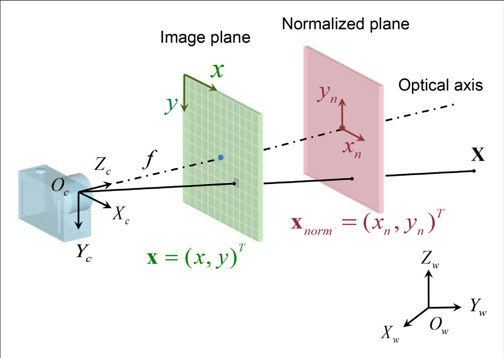
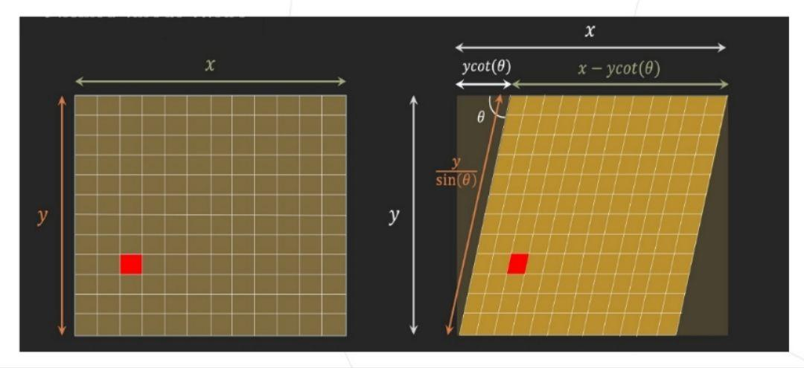
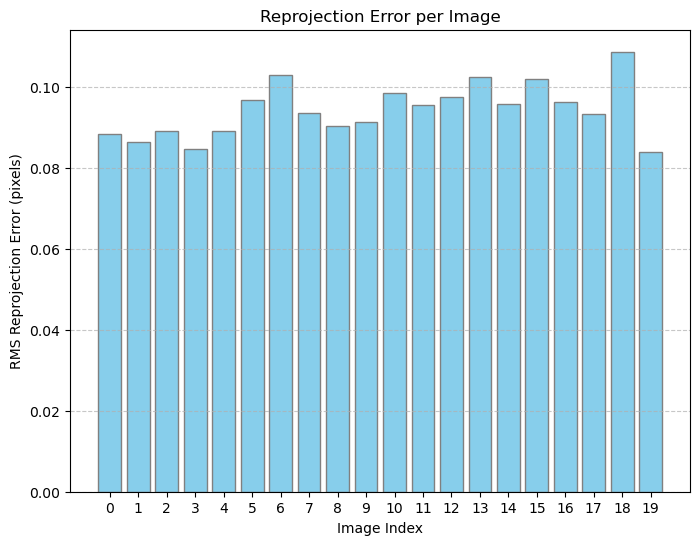
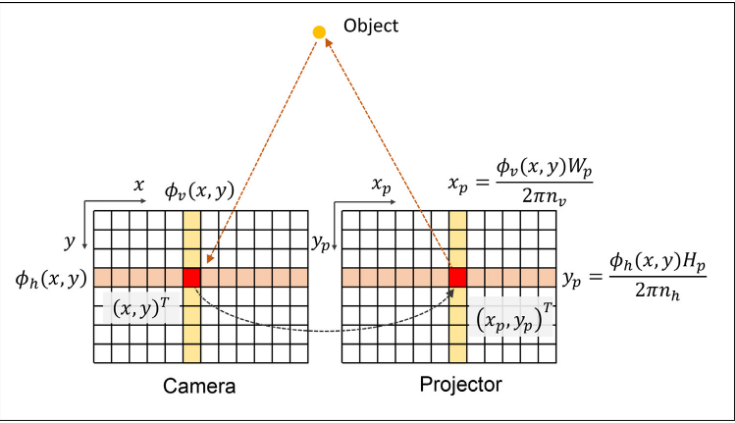
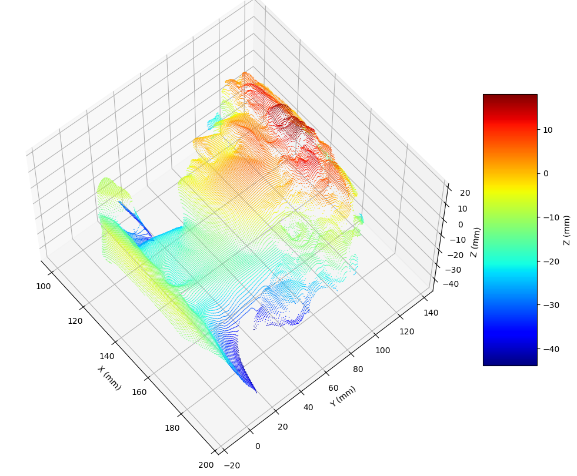

# 逆相机法

众所周知,双目相机可以测量深度信息,其原理是在两个相机画面找到同一个点(同名点), 然后根据视差原理计算高度信息.其难点是找到同名点.

投影仪可以看成逆相机模型,通过条纹编码,可以很方便地找到同名点.

## 成像原理

### 四大坐标系
一般用针孔模型来描述相机成像.



总共有四个坐标系:

1. 世界坐标系
2. 相机坐标系
3. 图像坐标系
4. 像素坐标系

下面说明,四个坐标系如何转换.

1. 世界坐标系到相机坐标系

通过旋转和平移能够使两个坐标系对齐.

设点在世界坐标系的坐标为$X_w=(x_w,y_w,z_w)^T$, 在相机坐标系中为$X_c=(x_c,y_c,z_c)^T$ 则有

$$
X_c = RX_w+T
$$

其中,
- $R$是旋转矩阵,其形状是$3\times 3$
- $T$是平移矩阵,其形状是$3\times 1$

化成齐次坐标$\widetilde{X_w}=(x_w,y_w,z_w,1)^T, \widetilde{X_c}=(x_c,y_c,z_c,1)^T$

$$
\widetilde{X_c} = \begin{bmatrix}
 R & T\\
 0 & 1
\end{bmatrix}\widetilde{X_w}
$$

$R$和$T$是相机的外参.

2. 相机坐标系到图像坐标系

图像一般位于相机镜头的焦点处,所以图像坐标和相机坐标只有一个缩放关系.

$$
\frac{x_c}{x_n} = \frac{y_c}{y_n} = \frac{z_c}{f}
$$

其中,
- $f$是焦距

化成矩阵形式,
$$
\begin{align*}
x_n &= \frac{f}{z_c}x_c\\
y_n &= \frac{f}{z_c}y_c\\

\begin{bmatrix}
 x_n \\
 y_n \\
 1
\end{bmatrix} &= \frac{1}{z_c}\begin{bmatrix}
 f & 0 & 0 & 0\\
 0 & f & 0 & 0 \\
 0 & 0 & f & 0 \\
 0 & 0 & 0 & 1
\end{bmatrix}\begin{bmatrix}
 x_c \\
 y_c \\
 z_c \\
 1
\end{bmatrix} 

\end{align*}
$$

其中,
- $\frac{1}{z_c}$称为缩放因子

3. 图像坐标系到像素坐标系
   
图像坐标系和像素坐标系处于同一平面, 区别就是坐标原点不同和单位不同.

$$
\begin{align*}
u &= \frac{x_n}{dx}+u_0 \\
v &= \frac{y_n}{dy}+v_0 \\

\begin{bmatrix}
 u \\
 v \\
 1
\end{bmatrix} &= \begin{bmatrix}
 \frac{1}{dx} & 0 & u_0\\
 0 & \frac{1}{dy} & v_0\\
 0 & 0 & 1
\end{bmatrix}\begin{bmatrix}
 x_n \\
 y_n \\
 1
\end{bmatrix} 

\end{align*}
$$

如果考虑到像素坐标系和图像坐标系之间的坐标轴可能发生旋转和位移的变换。



$$
\begin{bmatrix}
 u \\
 v \\
 1
\end{bmatrix} = \begin{bmatrix}
 \frac{1}{dx} & -\frac{\cot\theta}{dx} & u_0\\
 0 & \frac{1}{dy\sin\theta} & v_0\\
 0 & 0 & 1
\end{bmatrix}\begin{bmatrix}
 x_n \\
 y_n \\
 1
\end{bmatrix} 
$$

综上, 
$$
\begin{bmatrix}
 u \\
 v \\
 1
\end{bmatrix} = \frac{1}{z_c}\begin{bmatrix}
 \frac{1}{dx} & 0 & u_0\\
 0 & \frac{1}{dy} & v_0\\
 0 & 0 & 1
\end{bmatrix} \begin{bmatrix}
 f & 0 & 0 & 0\\
 0 & f & 0 & 0 \\
 0 & 0 & f & 0 \\
 0 & 0 & 0 & 1
\end{bmatrix}\begin{bmatrix}
 R & T\\
 0 & 1
\end{bmatrix}\begin{bmatrix}
 x_w \\
 y_w \\
 z_w \\
 1
\end{bmatrix} 
$$

$R$和$T$是相机的外参,其他的都是内参

### 相机畸变

相机畸变主要分为径向畸变和切向畸变

径向畸变:
$$
\begin{align*}
\hat{x} &= x(1+k_1r^2+k_2r^4+k_3r^6) \\
\hat{y} &= y(1+k_1r^2+k_2r^4+k_3r^6)
\end{align*}
$$

切向畸变:

$$
\begin{align*}
\hat{x} &= x+(2p_1y+p_2(r^2+2x^2)) \\
\hat{y} &= y+(p_1(r^2+2y^2)+2p_2x)
\end{align*}
$$

其中,
- $(x,y)$为理想无畸变的图像坐标
- $(\hat{x},\hat{y})$为畸变的图像坐标
- $r^2=x^2+y^2$,即$r$是图像点到图像中心点的距离
- $k_1,k_2,k_3,p_1,p_2$可以通过张正友标定法测量得到

## 相机标定

由上文可以知道,像素坐标公式为

未带畸变

$$
\begin{bmatrix}
 u \\
 v \\
 1
\end{bmatrix} = \frac{1}{z_c}\begin{bmatrix}
 \frac{1}{dx} & 0 & u_0\\
 0 & \frac{1}{dy} & v_0\\
 0 & 0 & 1
\end{bmatrix} \begin{bmatrix}
 f & 0 & 0 & 0\\
 0 & f & 0 & 0 \\
 0 & 0 & f & 0 \\
 0 & 0 & 0 & 1
\end{bmatrix}\begin{bmatrix}
 R & T\\
 0 & 1
\end{bmatrix}\begin{bmatrix}
 x_w \\
 y_w \\
 z_w \\
 1
\end{bmatrix} 
$$

带畸变

畸变主要影响图像坐标$(x_n, y_n)$

$$
\begin{align*}
\begin{bmatrix}
 x_{dn} \\
 y_{dn} 
\end{bmatrix} &= \begin{bmatrix}
 x_n \\
 y_n
\end{bmatrix} + \delta_r+\delta_t \\

\delta_r &= \begin{bmatrix}
 k_1r^2+k_2r^4+k_3r^6 \\
 k_1r^2+k_2r^4+k_3r^6 \\
 0
\end{bmatrix}\begin{bmatrix}
 x_n \\
 y_n \\
 1
\end{bmatrix} ^T\\

\delta_t &= \begin{bmatrix}
 2p_1y_n+p_2(r^2+2{x_n}^2) \\
 p_1(r^2+2{y_n}^2)+2p_2x_n \\
 0
\end{bmatrix} \\

\end{align*}
$$

$$
\begin{align*}
\begin{bmatrix}
 u \\
 v \\
 1
\end{bmatrix} &= \begin{bmatrix}
 \frac{1}{dx} & 0 & u_0\\
 0 & \frac{1}{dy} & v_0\\
 0 & 0 & 1
\end{bmatrix} \begin{bmatrix}
 x_{dn} \\
 y_{dn} \\
 1
\end{bmatrix} \\
&=  \begin{bmatrix}
 \frac{1}{dx} & 0 & u_0\\
 0 & \frac{1}{dy} & v_0\\
 0 & 0 & 1
\end{bmatrix} \left (\begin{bmatrix}
 x_n \\
 y_n \\
 1
\end{bmatrix} + \delta_r+\delta_t \right )  \\
&= \begin{bmatrix}
 \frac{1}{dx} & 0 & u_0\\
 0 & \frac{1}{dy} & v_0\\
 0 & 0 & 1
\end{bmatrix}\left (\frac{1}{z_c}\begin{bmatrix}
 f & 0 & 0 & 0\\
 0 & f & 0 & 0 \\
 0 & 0 & f & 0 \\
 0 & 0 & 0 & 1
\end{bmatrix}\begin{bmatrix}
 R & T\\
 0 & 1
\end{bmatrix}\begin{bmatrix}
 x_w \\
 y_w \\
 z_w \\
 1
\end{bmatrix} + \delta_r+\delta_t    \right ) 

\end{align*}
$$

通过张正友标定法就能得到上述参数.


```python
import scipy.io as sio
import numpy as np
import matplotlib.pyplot as plt
from mpl_toolkits.mplot3d.art3d import Poly3DCollection
import cv2
```


```python
load_data = sio.loadmat('./data/camera_imagePoints.mat')
imagePoints = load_data['imagePoints']
imagePoints.shape

# 99个点, 每个点有2个坐标, 拍了20张
```


    (99, 2, 20)


```python
num_x = 11
num_y = 9
dist_circ = 25
```


```python
worldPoints = np.zeros((num_x * num_y, 3), np.float32)
y_coords, x_coords = np.meshgrid(np.arange(num_y) * dist_circ, np.arange(num_x) * dist_circ)
worldPoints[:, :2] = np.column_stack((x_coords.ravel(), y_coords.ravel()))

worldPoints.shape
```


    (99, 3)


```python
num_images = imagePoints.shape[2]
objectPoints = [worldPoints.astype(np.float32)] * num_images
imagePoints_list = [imagePoints[:, :, i].astype(np.float32) for i in range(num_images)]

# cv的标定函数
ret, cameraMatrix, distCoeffs, rvecs, tvecs = cv2.calibrateCamera(
    objectPoints, imagePoints_list, (640, 480), None, None
)
```


```python
# 比较结果
load_data = sio.loadmat('./data/CamCalibResult.mat')
for key in load_data.keys():
    if not key.startswith('__'):
        print(f'key:{key}, shape:{load_data[key].shape}')

KK = load_data['KK']

print(KK)
print(cameraMatrix)

# 计算二范数（谱范数）
norm_2 = np.linalg.norm(KK-cameraMatrix, ord=2)
print(f"矩阵的二范数: {norm_2}")
```

    key:KK, shape:(3, 3)
    key:Rc_1, shape:(3, 3)
    key:Tc_1, shape:(3, 1)
    [[1.04554902e+03 0.00000000e+00 3.25860852e+02]
     [0.00000000e+00 1.04558921e+03 2.30815979e+02]
     [0.00000000e+00 0.00000000e+00 1.00000000e+00]]
    [[1.04562507e+03 0.00000000e+00 3.25858361e+02]
     [0.00000000e+00 1.04566715e+03 2.30810062e+02]
     [0.00000000e+00 0.00000000e+00 1.00000000e+00]]
    矩阵的二范数: 0.0781614802596933


```python
def draw_plane(ax, rvecs, tvecs):

    planes = []
    W, H = 200, 200
    # corners = np.array([[0, 0, 0], [num_x * dist_circ, 0, 0], [num_x * dist_circ, num_y * dist_circ, 0], [0, num_y * dist_circ, 0]])

    corners = np.array([[0, 0, 0], [W, 0, 0], [W, H, 0], [0, H, 0]])

    # print(corners.shape)

    np.random.seed(42)

    for idx, (r, t) in enumerate(zip(rvecs, tvecs)):
        R, _ = cv2.Rodrigues(r)
        corners_world = (R @ corners.T).T + t.reshape(1, 3)
        corners_world[:, [1, 2]] = corners_world[:, [2, 1]]
        planes.append(corners_world)
        poly = Poly3DCollection([corners_world], facecolors=np.random.rand(3), edgecolors='gray', alpha=0.25)
        ax.add_collection3d(poly)

        # 在左上角（corners_world[3]）添加索引标签
        top_left = corners_world[3]
        ax.text(top_left[0], top_left[1], top_left[2], f'{idx}', color='black', fontsize=10)


    return planes

# 画相机
def draw_camera(ax, C, R=np.eye(3), scale=80, color='b', lw=2):
    C = np.asarray(C).reshape(3,)
    x = R @ np.array([1,0,0]) * scale
    y = R @ np.array([0,1,0]) * scale
    z = R @ np.array([0,0,1]) * scale
    ax.quiver(*C, *x, color='r', linewidth=lw)
    ax.quiver(*C, *y, color='g', linewidth=lw)
    ax.quiver(*C, *z, color=color, linewidth=lw)

    d = 1.5 * scale
    w = 0.9 * scale
    h = 0.7 * scale
    P0 = C + (R @ np.array([0,0,1])) * d
    X = R @ np.array([1,0,0]) * w
    Y = R @ np.array([0,1,0]) * h
    corners = np.array([P0 - X - Y, P0 + X - Y, P0 + X + Y, P0 - X + Y])

    def line(a,b):
        ax.plot([a[0],b[0]],[a[1],b[1]],[a[2],b[2]], color=color, linewidth=lw)
    for k in range(4):
        line(C, corners[k])
        line(corners[k], corners[(k+1)%4])
    ax.text(C[0], C[1], C[2], "Cam", color=color)
    return corners

def euler_to_rotation_matrix(roll, pitch, yaw):
    # 欧拉角单位为弧度
    # R_x (roll)
    Rx = np.array([[1, 0, 0],
                   [0, np.cos(roll), -np.sin(roll)],
                   [0, np.sin(roll), np.cos(roll)]])
    
    # R_y (pitch)
    Ry = np.array([[np.cos(pitch), 0, np.sin(pitch)],
                   [0, 1, 0],
                   [-np.sin(pitch), 0, np.cos(pitch)]])
    
    # R_z (yaw)
    Rz = np.array([[np.cos(yaw), -np.sin(yaw), 0],
                   [np.sin(yaw), np.cos(yaw), 0],
                   [0, 0, 1]])
    
    # 旋转矩阵：R = Rz * Ry * Rx
    R = Rz @ Ry @ Rx
    return R
```


```python
fig = plt.figure(figsize=(8,6))
ax = fig.add_subplot(111, projection='3d')

planes = draw_plane(ax, rvecs, tvecs)

C = np.array([0, 0, 0])      # 相机中心（你换成自己的）
R = euler_to_rotation_matrix(-np.pi/2, 0, 0)                    # 相机姿态（你换成自己的）
cam_corners = draw_camera(ax, C, R, scale=20, color='b')

ax.set_xlim(-150, 150)
ax.set_ylim(0, 800)
ax.set_zlim(-150, 150)

ax.set_xlabel("X (mm)"); ax.set_ylabel("Z (mm)"); ax.set_zlabel("Y (mm)")
ax.view_init(elev=25, azim=-135)
plt.tight_layout()
plt.show()
```


    

    


```python
# 初始化误差列表
errors = []

for i in range(num_images):
    # 重投影世界点到图像平面
    projected_points, _ = cv2.projectPoints(objectPoints[i], rvecs[i], tvecs[i], cameraMatrix, distCoeffs)
    projected_points = projected_points.reshape(-1, 2)
    
    # 计算与实际点的误差（像素距离）
    diff = projected_points - imagePoints_list[i]
    distances = np.sqrt(np.sum(diff**2, axis=1))
    errors.extend(distances)

# 转换为numpy数组
errors = np.array(errors)

# 统计
mean_error = np.mean(errors)
max_error = np.max(errors)
rms_error = np.sqrt(np.mean(errors**2))

print(f"平均重投影误差: {mean_error:.2f} 像素")
print(f"最大重投影误差: {max_error:.2f} 像素")
print(f"RMS重投影误差: {rms_error:.2f} 像素")
```

    平均重投影误差: 0.08 像素
    最大重投影误差: 0.25 像素
    RMS重投影误差: 0.09 像素


```python
# 计算每个图像的RMS误差
errors_per_image = []
for i in range(num_images):
    projected_points, _ = cv2.projectPoints(objectPoints[i], rvecs[i], tvecs[i], cameraMatrix, distCoeffs)
    projected_points = projected_points.reshape(-1, 2)
    diff = projected_points - imagePoints_list[i]
    distances = np.sqrt(np.sum(diff**2, axis=1))
    rms = np.sqrt(np.mean(distances**2))
    errors_per_image.append(rms)

# 画柱状图
plt.figure(figsize=(8, 6))
plt.bar(range(num_images), errors_per_image, color='skyblue', edgecolor='gray')
plt.xlabel('Image Index')
plt.ylabel('RMS Reprojection Error (pixels)')
plt.title('Reprojection Error per Image')
plt.xticks(range(num_images))
plt.grid(axis='y', linestyle='--', alpha=0.7)
plt.show()
```


    

    


## 投影仪标定

投影仪可以看成逆相机,其成像模型和相机模型一致.

现在问题是怎么获得投影仪的像素坐标.

可以用条纹投影解算出坐标.具体做法是分别投影横向纵向条纹,利用相移算法可以得到绝对相位.



通过以下公式可以计算像素坐标

$$
\begin{align*}
x_p &= \frac{\phi_v(x,y)W_p}{2\pi n_v} \\
y_p &= \frac{\phi_h(x,y)H_p}{2\pi n_h} 
\end{align*}
$$

其中,
- $\phi$是相位
- $W_p,H_p$是投影仪的分辨率
- $n$是周期数量

利用投影仪像素坐标和张正友标定法也能得到投影仪的内参和外参.

使用联合标定,精度会更高.


```python
load_data = sio.loadmat('./data/projector_imagePoints.mat')
prjPoints = load_data['prjPoints']
prjPoints.shape
```


    (99, 2, 20)


```python
num_images = prjPoints.shape[2]
objectPoints = [worldPoints.astype(np.float32)] * num_images
prjPoints_list = [prjPoints[:, :, i].astype(np.float32) for i in range(num_images)]

# cv的标定函数
ret, prjMatrix, prjdistCoeffs, rvecs, tvecs = cv2.calibrateCamera(
    objectPoints, prjPoints_list, (912, 1140), None, None
)
```


```python
load_data = sio.loadmat('./data/PrjCalibResult.mat')
for key in load_data.keys():
    if not key.startswith('__'):
        print(f'key:{key}, shape:{load_data[key].shape}')

KK = load_data['KK']

print(KK)
print(prjMatrix)

# 计算二范数（谱范数）
norm_2 = np.linalg.norm(KK-prjMatrix, ord=2)
print(f"矩阵的二范数: {norm_2}")
```

    key:KK, shape:(3, 3)
    key:Rc_1, shape:(3, 3)
    key:Tc_1, shape:(3, 1)
    [[1.11927742e+03 0.00000000e+00 4.21680345e+02]
     [0.00000000e+00 2.23826660e+03 1.17015540e+03]
     [0.00000000e+00 0.00000000e+00 1.00000000e+00]]
    [[1.21856338e+03 0.00000000e+00 4.83986503e+02]
     [0.00000000e+00 2.44005346e+03 9.52383341e+02]
     [0.00000000e+00 0.00000000e+00 1.00000000e+00]]
    矩阵的二范数: 300.89833500481456


可能是分辨率问题,和参考值差距很大

## 三维重建

现在我们知道相机和投影仪的内参和外参,可以通过这些参数计算深度信息.

$$
\begin{align*}
\begin{bmatrix}
 x_c \\
 y_c \\
 1
\end{bmatrix} &= P^c \begin{bmatrix}
 x_w \\
 y_w \\
 z_w \\
 1
\end{bmatrix}

\begin{bmatrix}
 x_p \\
 y_p \\
 1
\end{bmatrix} &= P^p \begin{bmatrix}
 x_w \\
 y_w \\
 z_w \\
 1
\end{bmatrix}
\end{align*}
$$

记$\widetilde{X}=\begin{bmatrix}
 x_w \\
 y_w \\
 z_w \\
 1
\end{bmatrix}$

上述两个式子可以重新排列成

$$
\begin{align*}
A\widetilde{X} &= 0 \\
A &= \begin{bmatrix}
 x_cP_c^3 - P_c^1 \\
 y_cP_c^3 - P_c^2 \\
 x_pP_p^3 - P_p^1 \\
 y_pP_p^3 - P_p^2 
\end{bmatrix}
\end{align*}
$$

其中,
- $P^i$是行矩阵

通过计算可以知道

$$
\begin{bmatrix}
 x_w \\
 y_w \\
 z_w 
\end{bmatrix} = \begin{bmatrix}
 p_{11}^c-p_{31}^cx_c & p_{12}^c-p_{32}^cx_c & p_{13}^c-p_{33}^cx_c\\
 p_{21}^c-p_{31}^cy_c & p_{22}^c-p_{32}^cy_c & p_{23}^c-p_{33}^cy_c \\
 p_{11}^p-p_{31}^px_p & p_{12}^c-p_{32}^px_p & p_{13}^p-p_{33}^px_p 
\end{bmatrix}^{-1}\begin{bmatrix}
 p_{14}^c-p_{34}^cx_c \\
 p_{24}^c-p_{34}^cy_c \\
 p_{14}^p-p_{34}^px_p  
\end{bmatrix}
$$

其中,
- $P^c=\begin{bmatrix}
 p_{11}^c & p_{12}^c & p_{13}^c & p_{14}^c\\
 p_{21}^c & p_{22}^c & p_{23}^c & p_{24}^c\\
 p_{31}^c & p_{32}^c & p_{33}^c & p_{34}^c
\end{bmatrix}$
- $P^p=\begin{bmatrix}
 p_{11}^p & p_{12}^p & p_{13}^p & p_{14}^p\\
 p_{21}^p & p_{22}^p & p_{23}^p & p_{24}^p\\
 p_{31}^p & p_{32}^p & p_{33}^p & p_{34}^p
\end{bmatrix}$

上式是只用了纵向条纹,如果只用横向条纹,可以得到下式.

$$
\begin{bmatrix}
 x_w \\
 y_w \\
 z_w 
\end{bmatrix} = \begin{bmatrix}
 p_{11}^c-p_{31}^cx_c & p_{12}^c-p_{32}^cx_c & p_{13}^c-p_{33}^cx_c\\
 p_{21}^c-p_{31}^cy_c & p_{22}^c-p_{32}^cy_c & p_{23}^c-p_{33}^cy_c \\
 p_{21}^p-p_{31}^py_p & p_{22}^c-p_{32}^py_p & p_{23}^p-p_{33}^py_p 
\end{bmatrix}^{-1}\begin{bmatrix}
 p_{14}^c-p_{34}^cx_c \\
 p_{24}^c-p_{34}^cy_c \\
 p_{24}^p-p_{34}^py_p  
\end{bmatrix}
$$


```python
load_data = sio.loadmat('./data/CamCalibResult.mat')
Kc = load_data['KK']
Rc = load_data['Rc_1']
Tc = load_data['Tc_1']

# print('Kc:\n', Kc)
# print('Rc:\n', Rc)
# print('Tc (original shape):', Tc.shape)

# 保证Tc为(3,1)列向量
Tc_col = Tc.reshape(3, 1)

# 拼接外参矩阵 [R | t]  -> 3x4
Rt = np.hstack((Rc, Tc_col))
# print('Extrinsic [R|t] (3x4):\n', Rt)

# 相机投影矩阵 P = K * [R | t]  -> 3x4
Pc = Kc @ Rt
print('Projection matrix P (3x4):\n', Pc)
```

    Projection matrix P (3x4):
     [[-1.03802666e+03  3.94073912e+01  3.46851188e+02  3.13396318e+05]
     [ 1.18265544e+01 -1.00600340e+03  3.66537998e+02  2.35710325e+05]
     [ 2.22261226e-02  1.31899290e-01  9.91013913e-01  5.53373578e+02]]


```python
load_data = sio.loadmat('./data/PrjCalibResult.mat')
Kc = load_data['KK']
Rc = load_data['Rc_1']
Tc = load_data['Tc_1']

# print('Kc:\n', Kc)
# print('Rc:\n', Rc)
# print('Tc (original shape):', Tc.shape)

# 保证Tc为(3,1)列向量
Tc_col = Tc.reshape(3, 1)

# 拼接外参矩阵 [R | t]  -> 3x4
Rt = np.hstack((Rc, Tc_col))
# print('Extrinsic [R|t] (3x4):\n', Rt)

# 相机投影矩阵 P = K * [R | t]  -> 3x4
Pp = Kc @ Rt
print('Projection matrix P (3x4):\n', Pp)
```

    Projection matrix P (3x4):
     [[-1.19595989e+03  5.85211391e+00  1.55548835e+01  4.26933506e+05]
     [-4.05783072e+02 -2.11555182e+03  1.31866661e+03  6.29408541e+05]
     [-3.39952544e-01  9.52670949e-02  9.35604857e-01  5.88741891e+02]]


```python
width = 640
height = 480
prj_width = 912

cycles = 64
```


```python
load_data = sio.loadmat('./data/up_test_obj.mat')
up_test_obj = load_data['up_test_obj']

x_p = up_test_obj/(2*np.pi*cycles)*prj_width
```


```python
# Initialize result arrays
x_rec = np.full((height, width), np.nan, dtype=float)
y_rec = np.full((height, width), np.nan, dtype=float)
z_rec = np.full((height, width), np.nan, dtype=float)

# Reconstruct per pixel
for y in range(height):
    for x in range(width):
        phase_val = up_test_obj[y, x]
        if not np.isnan(phase_val):
            # zero-based pixel coordinates (x0,y0) correspond to MATLAB (x-1, y-1)
            x0 = float(x)
            y0 = float(y)
            xp0 = float(x_p[y, x] - 1.0)  # keep -1 like MATLAB
            
            A = np.array([[Pc[0,0] - Pc[2,0]*x0,  Pc[0,1] - Pc[2,1]*x0,  Pc[0,2] - Pc[2,2]*x0],
                          [Pc[1,0] - Pc[2,0]*y0,  Pc[1,1] - Pc[2,1]*y0,  Pc[1,2] - Pc[2,2]*y0],
                          [Pp[0,0] - Pp[2,0]*xp0, Pp[0,1] - Pp[2,1]*xp0, Pp[0,2] - Pp[2,2]*xp0]], dtype=float)
            b = np.array([Pc[2,3]*x0 - Pc[0,3],
                          Pc[2,3]*y0 - Pc[1,3],
                          Pp[2,3]*xp0 - Pp[0,3]], dtype=float)
            
            # print(b.shape)

            try:
                X = np.linalg.solve(A, b)
            except np.linalg.LinAlgError:
                # fallback to least squares if near-singular
                X, *_ = np.linalg.lstsq(A, b, rcond=None)
            
            x_rec[y, x] = X[0]
            y_rec[y, x] = X[1]
            z_rec[y, x] = X[2]

# Stack xyzPoints like MATLAB (height*width, 3)
xyzPoints = np.column_stack((x_rec.ravel(), y_rec.ravel(), z_rec.ravel()))

height_est = xyzPoints

# print('Reconstruction done.')
# print('x range:', np.nanmin(x_rec), 'to', np.nanmax(x_rec))
# print('y range:', np.nanmin(y_rec), 'to', np.nanmax(y_rec))
# print('z range:', np.nanmin(z_rec), 'to', np.nanmax(z_rec))
```


```python
# 正确的点云绘制：使用 x_rec, y_rec, z_rec 有效点
valid = ~np.isnan(x_rec) & ~np.isnan(y_rec) & ~np.isnan(z_rec)
Xv = x_rec[valid]
Yv = y_rec[valid]
Zv = -z_rec[valid]

fig = plt.figure(figsize=(10, 8))
ax = fig.add_subplot(111, projection='3d')

# 绘制点云图（按Z值着色）
scatter = ax.scatter(Xv, Yv, Zv, 
                    c=Zv,           # 根据Z坐标（高度）着色
                    cmap='jet',     # 颜色映射
                    s=1,            # 点的大小
                    alpha=1,        # 透明度
                    edgecolor='none')  # 无边缘颜色

ax.set_xlabel('X (mm)')
ax.set_ylabel('Y (mm)')
ax.set_zlabel('Z (mm)')

fig.colorbar(scatter, ax=ax, shrink=0.6, aspect=5, label='Z (mm)')

ax.view_init(elev=60, azim=-40)
plt.tight_layout()
plt.show()

print(f'有效点数: {Xv.size} / {height*width}')
```


    

    


    有效点数: 30419 / 307200


- 精度比较请看原论文.

参考网站和论文
> https://zhuanlan.zhihu.com/p/125006810

> https://zhuanlan.zhihu.com/p/94244568


> Feng, Shijie, Chao Zuo, Liang Zhang, 等. 《Calibration of Fringe Projection Profilometry: A Comparative Review》. Optics and Lasers in Engineering 143 (2021年8月): 106622. 

