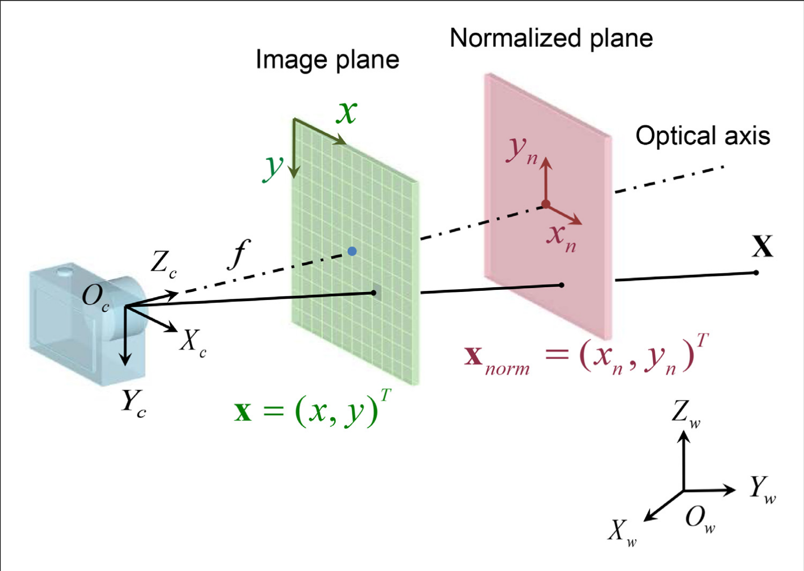
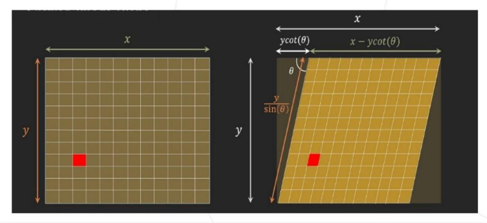
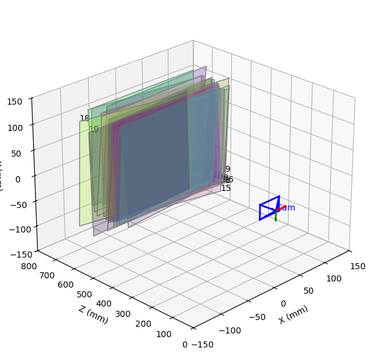
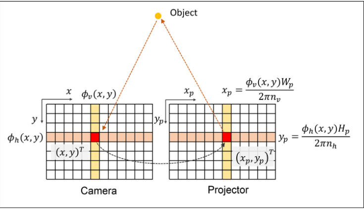
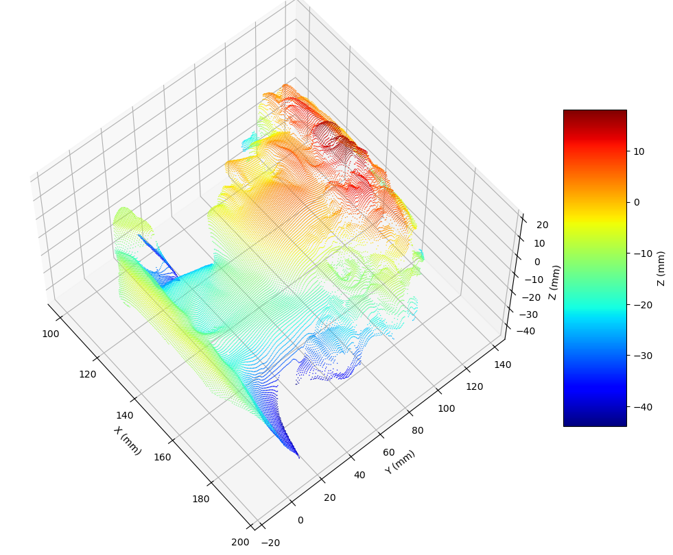

# 逆相机法

双目相机可以测量深度信息，其原理是在两个相机画面找到同名点，根据视差计算高度。难点是找到同名点。

投影仪可以看成逆相机模型，通过条纹编码可以方便地找到同名点。

## 成像原理

### 四大坐标系

一般用针孔模型来描述相机成像：



四个坐标系及转换关系如下：

**1. 世界坐标系 → 相机坐标系**

设点在世界坐标系的坐标为 $X_w=(x_w,y_w,z_w)^T$，在相机坐标系中为 $X_c=(x_c,y_c,z_c)^T$：

$$
X_c = R X_w + T
$$

其中 $R$ 是 $3\times 3$ 旋转矩阵，$T$ 是 $3\times 1$ 平移向量，合称外参。

用齐次坐标 $\widetilde{X_w}=(x_w,y_w,z_w,1)^T$，$\widetilde{X_c}=(x_c,y_c,z_c,1)^T$ 表示：

$$
\widetilde{X_c} = \begin{bmatrix}
 R & T\\
 0 & 1
\end{bmatrix}\widetilde{X_w}
$$

**2. 相机坐标系 → 图像坐标系**

由相似三角形，图像坐标与相机坐标满足缩放关系（$f$ 为焦距）：

$$
x_n = \frac{f}{z_c}x_c,\quad y_n = \frac{f}{z_c}y_c
$$

矩阵形式：

$$
\begin{bmatrix} x_n \\ y_n \\ 1 \end{bmatrix}
= \frac{1}{z_c}\begin{bmatrix}
f & 0 & 0 & 0\\
0 & f & 0 & 0\\
0 & 0 & 1 & 0
\end{bmatrix}\begin{bmatrix} x_c \\ y_c \\ z_c \\ 1 \end{bmatrix}
$$

> $\frac{1}{z_c}$ 称为缩放因子。

**3. 图像坐标系 → 像素坐标系**

两者共面，区别在于原点和单位不同（$dx,dy$ 为像元尺寸，$(u_0,v_0)$ 为主点）：

$$
u = \frac{x_n}{dx}+u_0,\quad v = \frac{y_n}{dy}+v_0
$$

$$
\begin{bmatrix} u \\ v \\ 1 \end{bmatrix}
= \begin{bmatrix}
\frac{1}{dx} & 0 & u_0\\
0 & \frac{1}{dy} & v_0\\
0 & 0 & 1
\end{bmatrix}\begin{bmatrix} x_n \\ y_n \\ 1 \end{bmatrix}
$$

若考虑坐标轴倾斜角 $\theta$：



$$
\begin{bmatrix} u \\ v \\ 1 \end{bmatrix}
= \begin{bmatrix}
\frac{1}{dx} & -\frac{\cot\theta}{dx} & u_0\\
0 & \frac{1}{dy\sin\theta} & v_0\\
0 & 0 & 1
\end{bmatrix}\begin{bmatrix} x_n \\ y_n \\ 1 \end{bmatrix}
$$

**4. 完整变换**

联立以上各式，得像素坐标与世界坐标的关系：

$$
\begin{bmatrix} u \\ v \\ 1 \end{bmatrix}
= \frac{1}{z_c}\begin{bmatrix}
\frac{1}{dx} & 0 & u_0\\
0 & \frac{1}{dy} & v_0\\
0 & 0 & 1
\end{bmatrix}
\begin{bmatrix}
f & 0 & 0 & 0\\
0 & f & 0 & 0\\
0 & 0 & 1 & 0
\end{bmatrix}
\begin{bmatrix} R & T\\ 0 & 1 \end{bmatrix}
\begin{bmatrix} x_w \\ y_w \\ z_w \\ 1 \end{bmatrix}
$$

其中 $R,T$ 为外参，其余为内参。

### 相机畸变

相机畸变主要分为径向畸变和切向畸变。

**径向畸变**（$(x,y)$ 为理想无畸变坐标，$(\hat{x},\hat{y})$ 为畸变坐标，$r^2=x^2+y^2$）：

$$
\begin{align*}
\hat{x} &= x(1+k_1r^2+k_2r^4+k_3r^6) \\
\hat{y} &= y(1+k_1r^2+k_2r^4+k_3r^6)
\end{align*}
$$

**切向畸变**：

$$
\begin{align*}
\hat{x} &= x + 2p_1 xy + p_2(r^2+2x^2) \\
\hat{y} &= y + p_1(r^2+2y^2) + 2p_2 xy
\end{align*}
$$

$k_1,k_2,k_3,p_1,p_2$ 可通过张正友标定法得到。

## 相机标定

将上文各变换联立，带畸变的完整成像模型为：

$$
\begin{bmatrix} u \\ v \\ 1 \end{bmatrix}
= \begin{bmatrix}
\frac{1}{dx} & 0 & u_0\\
0 & \frac{1}{dy} & v_0\\
0 & 0 & 1
\end{bmatrix}
\left(
\frac{1}{z_c}\begin{bmatrix}
f & 0 & 0 & 0\\
0 & f & 0 & 0\\
0 & 0 & 1 & 0
\end{bmatrix}
\begin{bmatrix} R & T\\ 0 & 1 \end{bmatrix}
\begin{bmatrix} x_w \\ y_w \\ z_w \\ 1 \end{bmatrix}
+ \delta_r + \delta_t
\right)
$$

其中径向畸变 $\delta_r$ 和切向畸变 $\delta_t$ 为：

$$
\delta_r = (k_1r^2+k_2r^4+k_3r^6)\begin{bmatrix} x_n \\ y_n \end{bmatrix}
$$

$$
\delta_t = \begin{bmatrix}
2p_1 x_n y_n + p_2(r^2+2x_n^2) \\
p_1(r^2+2y_n^2) + 2p_2 x_n y_n
\end{bmatrix}
$$

通过张正友标定法可求得上述参数。


```python
import scipy.io as sio
import numpy as np
import matplotlib.pyplot as plt
from mpl_toolkits.mplot3d.art3d import Poly3DCollection
import cv2

load_data = sio.loadmat('./data/camera_imagePoints.mat')
imagePoints = load_data['imagePoints']  # 99个点，20张图

num_x, num_y, dist_circ = 11, 9, 25
worldPoints = np.zeros((num_x * num_y, 3), np.float32)
y_coords, x_coords = np.meshgrid(np.arange(num_y) * dist_circ, np.arange(num_x) * dist_circ)
worldPoints[:, :2] = np.column_stack((x_coords.ravel(), y_coords.ravel()))

num_images = imagePoints.shape[2]
objectPoints = [worldPoints.astype(np.float32)] * num_images
imagePoints_list = [imagePoints[:, :, i].astype(np.float32) for i in range(num_images)]

ret, cameraMatrix, distCoeffs, rvecs, tvecs = cv2.calibrateCamera(
    objectPoints, imagePoints_list, (640, 480), None, None)
```

```python
# 与参考值比较
load_data = sio.loadmat('./data/CamCalibResult.mat')
KK = load_data['KK']
print('标定内参:\n', cameraMatrix)
print('二范数差异:', np.linalg.norm(KK - cameraMatrix, ord=2))
```

```python
def draw_plane(ax, rvecs, tvecs):
    W, H = 200, 200
    corners = np.array([[0, 0, 0], [W, 0, 0], [W, H, 0], [0, H, 0]])
    np.random.seed(42)
    for idx, (r, t) in enumerate(zip(rvecs, tvecs)):
        R, _ = cv2.Rodrigues(r)
        corners_world = (R @ corners.T).T + t.reshape(1, 3)
        corners_world[:, [1, 2]] = corners_world[:, [2, 1]]
        poly = Poly3DCollection([corners_world], facecolors=np.random.rand(3),
                                edgecolors='gray', alpha=0.25)
        ax.add_collection3d(poly)
        ax.text(corners_world[3, 0], corners_world[3, 1], corners_world[3, 2],
                f'{idx}', color='black', fontsize=10)

def draw_camera(ax, C, R=np.eye(3), scale=80, color='b', lw=2):
    C = np.asarray(C).reshape(3,)
    for axis, clr in zip([np.array([1,0,0]), np.array([0,1,0]), np.array([0,0,1])], ['r','g',color]):
        v = R @ axis * scale
        ax.quiver(*C, *v, color=clr, linewidth=lw)
    d, w, h = 1.5*scale, 0.9*scale, 0.7*scale
    P0 = C + (R @ np.array([0,0,1])) * d
    X, Y = R @ np.array([1,0,0])*w, R @ np.array([0,1,0])*h
    cam_corners = np.array([P0-X-Y, P0+X-Y, P0+X+Y, P0-X+Y])
    for k in range(4):
        for a, b in [(C, cam_corners[k]), (cam_corners[k], cam_corners[(k+1)%4])]:
            ax.plot([a[0],b[0]], [a[1],b[1]], [a[2],b[2]], color=color, linewidth=lw)
    ax.text(C[0], C[1], C[2], "Cam", color=color)
```

```python
fig = plt.figure(figsize=(8,6))
ax = fig.add_subplot(111, projection='3d')
draw_plane(ax, rvecs, tvecs)
R_cam = np.array([[0,0,1],[0,1,0],[-1,0,0]])  # 相机朝 +Z
draw_camera(ax, [0, 0, 0], R_cam, scale=20, color='b')
ax.set_xlim(-150, 150); ax.set_ylim(0, 800); ax.set_zlim(-150, 150)
ax.set_xlabel("X (mm)"); ax.set_ylabel("Z (mm)"); ax.set_zlabel("Y (mm)")
ax.view_init(elev=25, azim=-135)
plt.tight_layout()
plt.show()
```




```python
# 重投影误差
errors = []
for i in range(num_images):
    projected, _ = cv2.projectPoints(objectPoints[i], rvecs[i], tvecs[i],
                                     cameraMatrix, distCoeffs)
    diff = projected.reshape(-1, 2) - imagePoints_list[i]
    errors.extend(np.sqrt(np.sum(diff**2, axis=1)))
errors = np.array(errors)
print(f"重投影误差 — 平均: {errors.mean():.2f}, RMS: {np.sqrt(np.mean(errors**2)):.2f} 像素")
```

## 投影仪标定

投影仪可视为逆相机，成像模型与相机一致。关键是如何获得投影仪的像素坐标——通过投影横向和纵向条纹，利用相移算法得到绝对相位后即可反算：



$$
x_p = \frac{\phi_v(x,y)W_p}{2\pi n_v},\quad
y_p = \frac{\phi_h(x,y)H_p}{2\pi n_h}
$$

其中 $\phi$ 为绝对相位，$W_p,H_p$ 为投影仪分辨率，$n$ 为周期数。

获得投影仪像素坐标后，同样用张正友标定法得到投影仪内外参。使用联合标定精度更高。


```python
load_data = sio.loadmat('./data/projector_imagePoints.mat')
prjPoints = load_data['prjPoints']

num_images = prjPoints.shape[2]
objectPoints = [worldPoints.astype(np.float32)] * num_images
prjPoints_list = [prjPoints[:, :, i].astype(np.float32) for i in range(num_images)]

ret, prjMatrix, prjdistCoeffs, _, _ = cv2.calibrateCamera(
    objectPoints, prjPoints_list, (912, 1140), None, None)
```

```python
load_data = sio.loadmat('./data/PrjCalibResult.mat')
print('标定内参:\n', prjMatrix)
print('二范数差异:', np.linalg.norm(load_data['KK'] - prjMatrix, ord=2))
```

## 三维重建

已知相机和投影仪的内参和外参，可通过投影矩阵计算深度信息。记投影矩阵 $P^c = K_c[R_c|T_c]$，$P^p = K_p[R_p|T_p]$：

$$
\begin{bmatrix} x_c \\ y_c \\ 1 \end{bmatrix} = P^c \widetilde{X},\quad
\begin{bmatrix} x_p \\ y_p \\ 1 \end{bmatrix} = P^p \widetilde{X}
$$

其中 $\widetilde{X} = (x_w,y_w,z_w,1)^T$。重排为齐次线性方程组 $A\widetilde{X}=0$：

$$
A = \begin{bmatrix}
x_c P_c^3 - P_c^1 \\
y_c P_c^3 - P_c^2 \\
x_p P_p^3 - P_p^1 \\
y_p P_p^3 - P_p^2
\end{bmatrix}
$$

（$P^i$ 表示第 $i$ 行）。使用纵向条纹（$x_p$）时，只取 $A$ 的前三行，解得：

$$
\begin{bmatrix} x_w \\ y_w \\ z_w \end{bmatrix} = \begin{bmatrix}
p_{11}^c-p_{31}^c x_c & p_{12}^c-p_{32}^c x_c & p_{13}^c-p_{33}^c x_c\\
p_{21}^c-p_{31}^c y_c & p_{22}^c-p_{32}^c y_c & p_{23}^c-p_{33}^c y_c\\
p_{11}^p-p_{31}^p x_p & p_{12}^p-p_{32}^p x_p & p_{13}^p-p_{33}^p x_p
\end{bmatrix}^{-1}\begin{bmatrix}
p_{14}^c-p_{34}^c x_c \\
p_{24}^c-p_{34}^c y_c \\
p_{14}^p-p_{34}^p x_p
\end{bmatrix}
$$

若只用横向条纹（$y_p$），则取 $A$ 的第一、二、四行：

$$
\begin{bmatrix} x_w \\ y_w \\ z_w \end{bmatrix} = \begin{bmatrix}
p_{11}^c-p_{31}^c x_c & p_{12}^c-p_{32}^c x_c & p_{13}^c-p_{33}^c x_c\\
p_{21}^c-p_{31}^c y_c & p_{22}^c-p_{32}^c y_c & p_{23}^c-p_{33}^c y_c\\
p_{21}^p-p_{31}^p y_p & p_{22}^p-p_{32}^p y_p & p_{23}^p-p_{33}^p y_p
\end{bmatrix}^{-1}\begin{bmatrix}
p_{14}^c-p_{34}^c x_c \\
p_{24}^c-p_{34}^c y_c \\
p_{24}^p-p_{34}^p y_p
\end{bmatrix}
$$


```python
# 读取相机和投影仪标定结果
load_data = sio.loadmat('./data/CamCalibResult.mat')
Pc = load_data['KK'] @ np.hstack((load_data['Rc_1'], load_data['Tc_1'].reshape(3, 1)))

load_data = sio.loadmat('./data/PrjCalibResult.mat')
Pp = load_data['KK'] @ np.hstack((load_data['Rc_1'], load_data['Tc_1'].reshape(3, 1)))

width, height, prj_width, cycles = 640, 480, 912, 64
```

```python
load_data = sio.loadmat('./data/up_test_obj.mat')
up_test_obj = load_data['up_test_obj']
x_p = up_test_obj / (2 * np.pi * cycles) * prj_width

x_rec = np.full((height, width), np.nan)
y_rec = np.full((height, width), np.nan)
z_rec = np.full((height, width), np.nan)

for y in range(height):
    for x in range(width):
        if not np.isnan(up_test_obj[y, x]):
            x0, y0 = float(x), float(y)
            xp0 = float(x_p[y, x] - 1.0)
            A = np.array([[Pc[0,0]-Pc[2,0]*x0, Pc[0,1]-Pc[2,1]*x0, Pc[0,2]-Pc[2,2]*x0],
                          [Pc[1,0]-Pc[2,0]*y0, Pc[1,1]-Pc[2,1]*y0, Pc[1,2]-Pc[2,2]*y0],
                          [Pp[0,0]-Pp[2,0]*xp0, Pp[0,1]-Pp[2,1]*xp0, Pp[0,2]-Pp[2,2]*xp0]])
            b = np.array([Pc[2,3]*x0-Pc[0,3], Pc[2,3]*y0-Pc[1,3], Pp[2,3]*xp0-Pp[0,3]])
            try:
                X = np.linalg.solve(A, b)
            except np.linalg.LinAlgError:
                X, *_ = np.linalg.lstsq(A, b, rcond=None)
            x_rec[y, x], y_rec[y, x], z_rec[y, x] = X
```

```python
valid = ~np.isnan(x_rec)
fig = plt.figure(figsize=(10, 8))
ax = fig.add_subplot(111, projection='3d')
scatter = ax.scatter(x_rec[valid], y_rec[valid], -z_rec[valid],
                     c=-z_rec[valid], cmap='jet', s=1, edgecolor='none')
ax.set_xlabel('X (mm)'); ax.set_ylabel('Y (mm)'); ax.set_zlabel('Z (mm)')
fig.colorbar(scatter, ax=ax, shrink=0.6, aspect=5, label='Z (mm)')
ax.view_init(elev=60, azim=-40)
plt.tight_layout()
plt.show()
```



- 各模型精度比较详见原论文。

> Feng, Shijie, Chao Zuo, Liang Zhang, 等. 《Calibration of Fringe Projection Profilometry: A Comparative Review》. Optics and Lasers in Engineering 143 (2021年8月): 106622.