# 创建工程
## CubeMX配置
### 1. 配置烧录接口
首先,选择STM32H747XIHx.跳出是否生成MPU推荐配置,点击yes.
根据下图配置debug接口
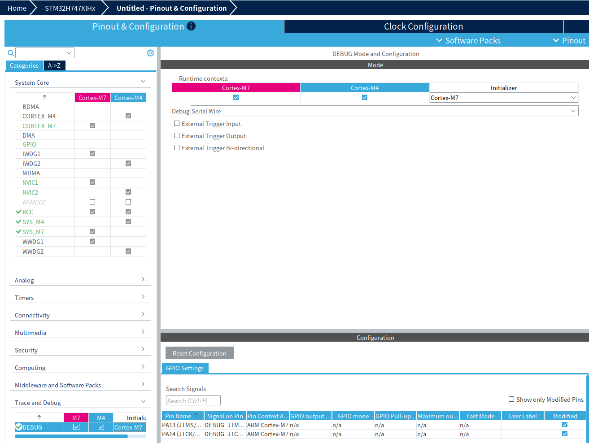
### 2. 配置时钟树
根据下图配置时钟,注意要先启用外部时钟输入,才能选择外部时钟.
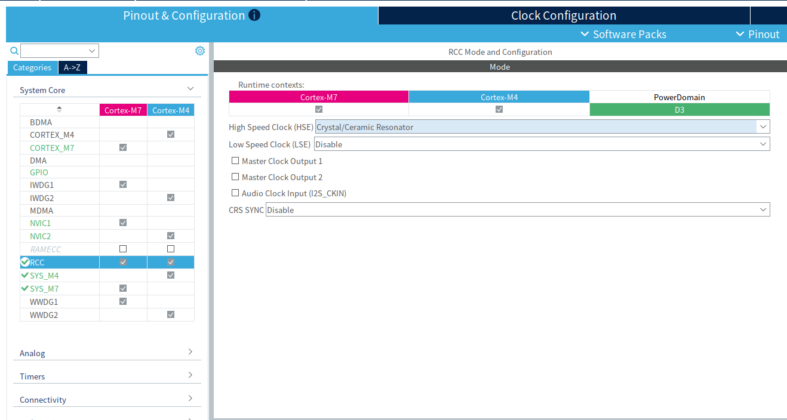
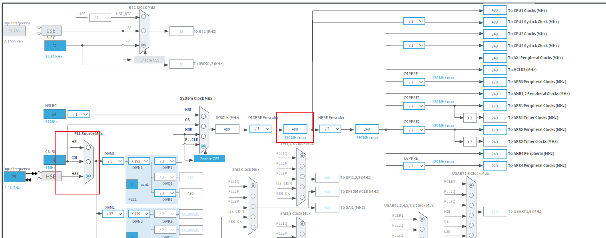
### 3. 配置工程生成路径和工具链
根据下图配置,工具链根据使用的工具链进行配置,我这里是用cmake.
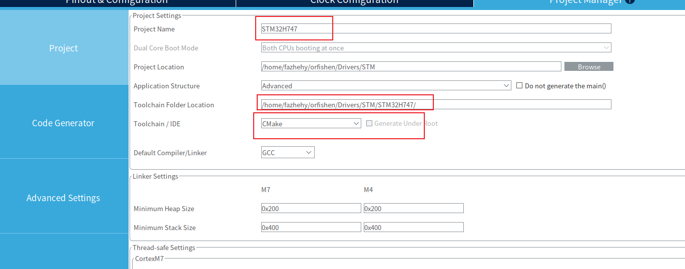
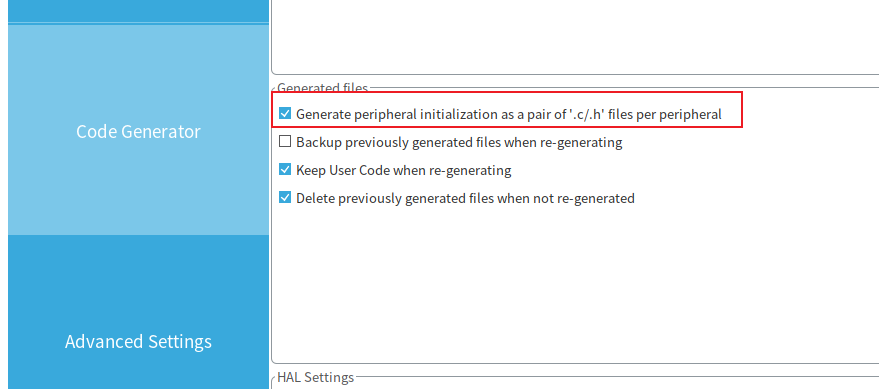
点击生成代码就行.

## 串口配置
配置串口一(PA9,PA10)作为日志打印输出.目前只使用M7核.使用默认参数,波特率是115200.
注意引脚是否正确.
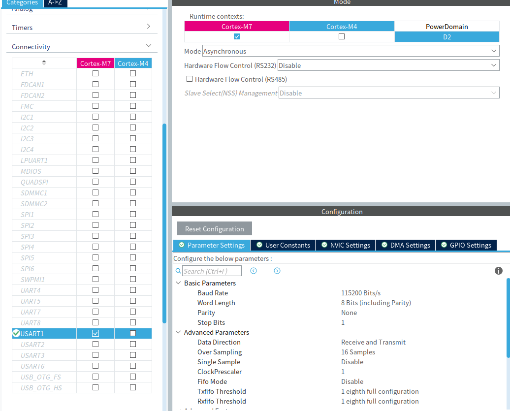

## 工程配置

### 1. 更改工程目录

添加BSP和User文件夹, BSP放驱动文件, User放置项目代码.在User文件创建四个文件.
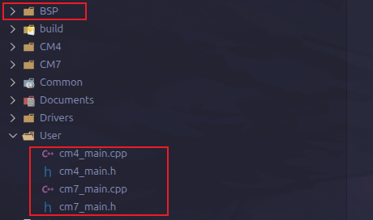


文件内容如下
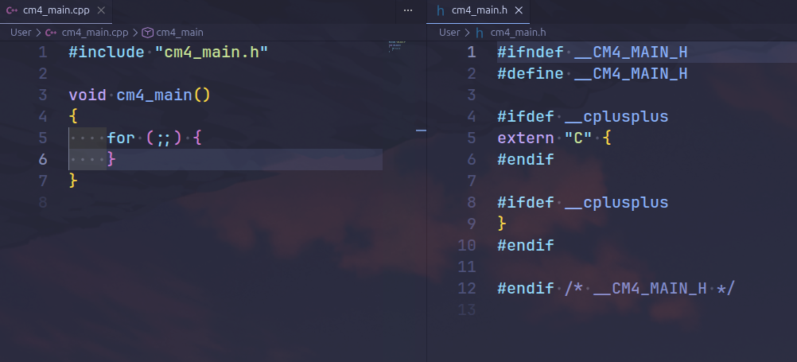

修改CMakeLists.txt文件.双核工程是用到什么文件就链接什么文件,不需要全部添加.
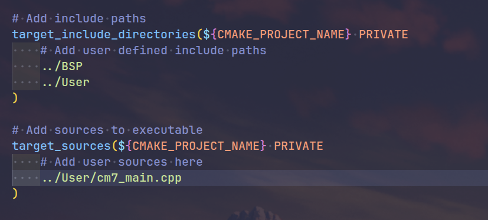


修改main文件.


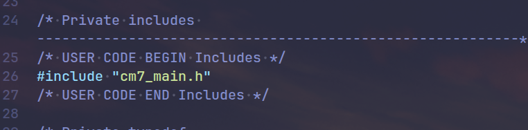
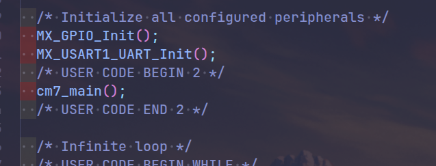


这里我只贴了一个核的,实际上两个核都要改.

### 2. 添加日志打印和延时

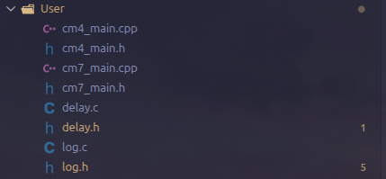

log.c
```c
#include "log.h"

#if USE_LOG

static char log_buf[LOG_BUF_LEN];

void log_output(const char* file, uint16_t line, const char* str, ...)
{
    char loc_buf[LOG_BUF_LEN - 16U];
    va_list arg;
    va_start(arg, str);
    vsnprintf(loc_buf, sizeof(loc_buf), str, arg);
    va_end(arg);
    // snprintf(log_buf, LOG_BUF_LEN, "[=LOG=]: %s (at %s:%d)\r\n", loc_buf, file, line);
    snprintf(log_buf, LOG_BUF_LEN, "[=LOG=]: %s\r\n", loc_buf);
    LOG_PRINT(log_buf, strlen(log_buf));
}

void log_error_output(const char* file, uint16_t line, const char* str, ...)
{
    char loc_buf[LOG_BUF_LEN - 16U];
    va_list arg;
    va_start(arg, str);
    vsnprintf(loc_buf, sizeof(loc_buf), str, arg);
    va_end(arg);
    // snprintf(log_buf, LOG_BUF_LEN, "[ERROR]: %s (at %s:%d)\r\n", loc_buf, file, line);
    snprintf(log_buf, LOG_BUF_LEN, "[ERROR]: %s\r\n", loc_buf);
    LOG_PRINT(log_buf, strlen(log_buf));
}

void log_printf_output(const char* str, ...)
{
    va_list arg;
    va_start(arg, str);
    vsnprintf(log_buf, LOG_BUF_LEN, str, arg);
    va_end(arg);
    LOG_PRINT(log_buf, strlen(log_buf));
}

void log_vofa_justfloat_output(const float* data, uint8_t count)
{
    static const uint8_t header[4] = {0x00, 0x00, 0x80, 0x7F};
    LOG_PRINT(header, sizeof(header));
    LOG_PRINT((const uint8_t*)data, count * sizeof(float));
}

#endif /* USE_LOG */

```
log.h
```c
#ifndef __LOG_H
#define __LOG_H

#ifdef __cplusplus
extern "C" {
#endif

#include <stdarg.h>
#include <stdbool.h>
#include <stdint.h>
#include <stdio.h>
#include <string.h>

#include "stm32h7xx_hal.h"
#include "usart.h"

/* ===================== 用户配置 ===================== */

#define USE_LOG (1)
#define LOG_BUF_LEN (256)
#define LOG_UART_HANDLE huart1

/* ===================== 内部宏 ======================== */

#define LOG_UART_TIMEOUT_MS 100U
#define LOG_PRINT(str, len) HAL_UART_Transmit(&LOG_UART_HANDLE, (uint8_t*)(str), (len), LOG_UART_TIMEOUT_MS)

/* ===================== API ========================== */

void log_output(const char* file, uint16_t line, const char* str, ...);
void log_error_output(const char* file, uint16_t line, const char* str, ...);
void log_printf_output(const char* str, ...);
void log_vofa_justfloat_output(const float* data, uint8_t count);

/* ===================== 用户宏 ======================== */

#if USE_LOG
    #define log_info(str, ...) (log_output(__FILE__, __LINE__, str, ##__VA_ARGS__))
    #define log_error(str, ...) (log_error_output(__FILE__, __LINE__, str, ##__VA_ARGS__))
    #define log_printf(str, ...) (log_printf_output(str, ##__VA_ARGS__))
    #define log_vofa(data, n) (log_vofa_justfloat_output(data, n))
#else
    #define log_info(str, ...) ((void)0)
    #define log_error(str, ...) ((void)0)
    #define log_printf(str, ...) ((void)0)
    #define log_vofa(data, n) ((void)0)
#endif

#ifdef __cplusplus
}
#endif

#endif /* __LOG_H */

```

delay.c
```c
/**
 ******************************************************************************
 * @file    delay.c
 * @brief   Common delay and tick helper functions.
 ******************************************************************************
 */

#include "delay.h"
#include <stdbool.h>

static bool dwt_initialized = false;

void delay_init(void)
{
    if (dwt_initialized) {
        return;
    }

    CoreDebug->DEMCR |= CoreDebug_DEMCR_TRCENA_Msk;
    DWT->CYCCNT = 0;
    DWT->CTRL |= DWT_CTRL_CYCCNTENA_Msk;
    dwt_initialized = true;
}

void delay_us(uint32_t us)
{
    uint32_t start;
    uint32_t ticks;

    delay_init();

    start = DWT->CYCCNT;
    ticks = us * (SystemCoreClock / 1000000U);

    while ((DWT->CYCCNT - start) < ticks) {
    }
}

void delay_ms(uint32_t ms)
{
    HAL_Delay(ms);
}

uint32_t delay_get_tick(void)
{
    return HAL_GetTick();
}
```
delay.h
```c
/**
 ******************************************************************************
 * @file    delay.h
 * @brief   Common delay and tick helper functions.
 ******************************************************************************
 */

#ifndef __DELAY_H
#define __DELAY_H

#ifdef __cplusplus
extern "C" {
#endif

#include "stm32h7xx_hal.h"
#include <stdint.h>

void delay_init(void);
void delay_us(uint32_t us);
void delay_ms(uint32_t ms);
uint32_t delay_get_tick(void);

#ifdef __cplusplus
}
#endif

#endif /* __DELAY_H */

```

要在CMakeLists链接.

### 3. 实现一键烧录

```bash
#!/bin/bash
# H747 双核编译+烧录 - 一键增量编译、显示进度、自动复位
# 用法: ./flash.sh [cm7|cm4|all]

PROG="/opt/st/stm32cubeclt_1.21.0/STM32CubeProgrammer/bin/STM32_Programmer_CLI"
FREQ=4000
CM7_ELF="CM7/build/STM32H747_CM7.elf"
CM4_ELF="CM4/build/STM32H747_CM4.elf"

SKIP_LINES="STMicroelectronics|ST-LINK|Board|Voltage|SWD freq|Connect mode|Reset mode|Device ID|Revision ID|Device name|NVM size|Device type|Device CPU|BL Version|Warning|Memory Read|Disabling|Time elapsed|^$"

do_build() {
    cube-cmake --build build/Debug || { echo "编译失败"; exit 1; }
    python3 -c "
import json
m=[]
for p in ['CM7/build/compile_commands.json','CM4/build/compile_commands.json']:
    with open(p) as f: m.extend(json.load(f))
with open('build/Debug/compile_commands.json','w') as f: json.dump(m,f,indent=2)
" 2>/dev/null
}

flash_core() {
    echo "[$1]"
    $PROG -c port=SWD freq=$FREQ -d "$2" 2>&1 | grep -vE "$SKIP_LINES"
}

do_build
case "${1:-all}" in
    cm7) flash_core "CM7" "$CM7_ELF"
         $PROG -c port=SWD freq=$FREQ -Rst 2>&1 >/dev/null ;;
    cm4) flash_core "CM4" "$CM4_ELF"
         $PROG -c port=SWD freq=$FREQ -Rst 2>&1 >/dev/null ;;
    all) flash_core "CM7" "$CM7_ELF"
         flash_core "CM4" "$CM4_ELF"
         $PROG -c port=SWD freq=$FREQ -Rst 2>&1 >/dev/null ;;
    *)   echo "用法: $0 cm7 | cm4 | all"; exit 1 ;;
esac
echo "完成"

```

工具链位置可能要更改一下.

工程模板[链接](https://github.com/fazhehy/STM32H747)
